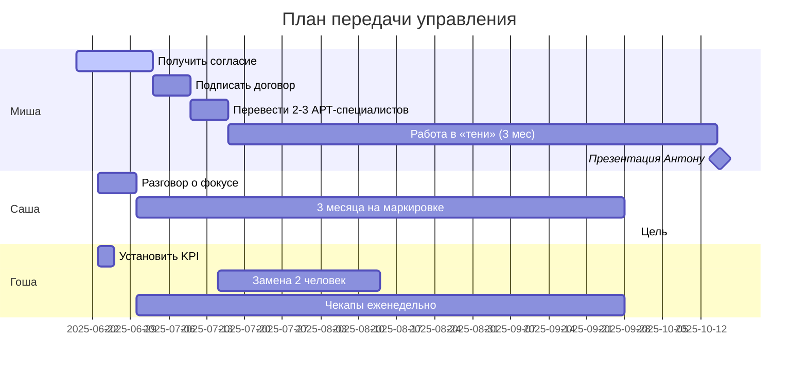

# План передачи управления (2025-06)

> **Источник:** `raw_imports/27_QW_Кадровые и операционные проблемы компании.md` (2025-06-19, 32 сообщения — самый длинный чат).
> **Это центральное решение 2025-2026**, вокруг которого строится работа департамента.

---

## Контекст

**Проблема:** Сергей устал от операционки. Хочет **передать продукт + дирекцию** вниз и выйти из оперативки.

**С кем обсуждалось:** с Антоном (CEO), в разговоре зафиксировано 4 ключевых направления.

---

## 4 ключевых решения

### 1. Нанять Мишу на роль руководителя маркетплейсов

**Должность:** «Руководитель отдела развития маркетплейсов и цифровых решений» в департаменте Сергея.

**Тактика «в тень»:** нанять **до того**, как Антон узнает. Цель — Антон не сможет перетянуть Мишу на ритейл (расстрельная позиция).

**Юридическая защита:** в договоре Миши — clause «100% времени — только маркетплейсы. Задачи вне департамента запрещены».

**KPI для «отчёта» Антону (если спросит):**
- Вовлечённость АРТ-клиентов в маркетплейсы: 15%
- Снижение издержек АРТ: 10%
- Покрытие АРТ-функций на маркетплейсах: 20%

**Таймлайн:** 3 месяца «в тени» → презентация Антону с результатом.

**Статус (на 2026-06):** «Миша ещё не дал согласия». Возможно, за год ситуация изменилась.

**См. подробнее:** [`../people/миша-рарус.md`](../people/миша-рарус.md)

---

### 2. Сфокусировать Сашу на маркировке

**Фрейм:** НЕ приказ «забирай всё кроме маркировки», а **эксперимент**:
> «Саша, давай на 3 месяца сфокусируемся на маркировке как на прорывном направлении. Остальные задачи временно передадим. Если покажем результат — масштабируем. Не покажем — вернём проекты/продажи».

**Цель:** «дойти до миллиарда» (1 млрд ₽ выручки по маркировке).

**Поддержка:** дать сильного РП-шника (если нужен для сложных внедрений). **Проблема:** сильного РП-шника нет («полуфабрикаты»).

**SLA:** если Саша лезет не в свою зону → лишить доступа к общим чатам.

**См. подробнее:** [`../people/саша-денисов.md`](../people/саша-денисов.md)

---

### 3. Гоша — KPI + замена 2 человек

**KPI на квартал:**
- 90% проектов в срок
- Маржинальность ≥ 25%

**Срок:** замена 2 сотрудников в команде до 15 июля 2025.

**Формат работы с Гошей:**
- Еженедельные чекапы (30 минут, только по KPI).
- Снять эмоциональное давление: «Ошибки — не критика тебя лично».
- Ультиматум: 2 недели не выполняет KPI → ищем нового.

**См. подробнее:** [`../people/гоша.md`](../people/гоша.md)

---

### 4. Арт (АРТ) — присоединить к маркетплейсам

**Что такое арт:** АРТ = Автоматизация Розничной Торговли (НЕ дизайн).

**Текущая ситуация:** Антон не закрывает арт, но и не знает, что с ним делать. После 2022 клиенты ушли.

**План:** интегрировать в маркетплейсы через Мишу. Перевести сотрудников арт-команды под Мишу.

**Обоснование для Антона:** «это часть реформы арта — мы его наконец перезапустим через маркетплейсы».

---

## Сводный таймлайн (на 2025-06-19)

---

## Что НЕ ясно из чата (на 2026-06-16)

- **Дал ли Миша согласие?** (на 2025-06-19 ещё нет).
- **Удалось ли сфокусировать Сашу?** (план был, результат не виден).
- **Заменил ли Гоша 2 человек?** (срок был до 15 июля 2025).
- **Как Антон отреагировал на интеграцию арт?**
- **Какой результат показал Миша через 3 месяца?**

**Это всё нужно уточнить у Сергея** (или найти в более свежих чатах, если они есть).

---

## Связь с другими решениями

- [`./промышленная-маркировка-2млрд.md`](./промышленная-маркировка-2млрд.md) (главный фокус 2026, опирается на фокус Саши)
- [`../people/антон-ceo.md`](../people/антон-ceo.md) (стратегия работы с Антоном)
