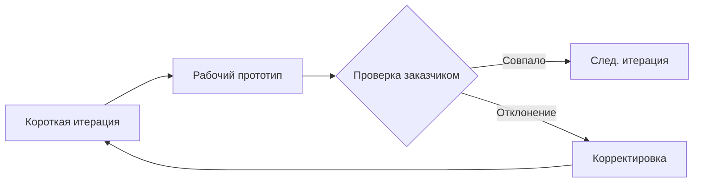

# Управление распределенными проектами: ключи успеха

Source: QW | Date: 2025-06-05 | Fragments: 2 | ID: 709356f2-0dcb-4275-b66b-53ea9481b185

---

## USER

[УЧАСТНИК_1] [4.30s - 39.39s]: Меня зовут Александр Белов, сейчас я занимаюсь управлением распределенными программными проектами и занимаюсь этим примерно десять лет. Свою карьеру начал достаточно давно, начиналась она еще до существования. Один. Сначала, когда ты работал в Академии наук, а по образованию я инженер, океанолог. Как это может быть, не смешно— А кто кто в курсе, что такое дистанционная работа— Я вот сейчас так.
[УЧАСТНИК_1] [42.29s - 57.59s]: На практике, в теории как угодно. Поднимите, пожалуйста, руки. так, кому интересна проекты дистанционной работы, как разработчику тестировщику, как исполнителю поднимите пожалуйста, руки.
[УЧАСТНИК_1] [60.29s - 67.85s]: Кому интересны проекты? Ну и вообще участие в распределенной работе в качестве заказчика.
[УЧАСТНИК_1] [70.81s - 80.08s]: Так некоторые, я смотрю, поднимают два раза руку, да? ха, ха! Логично. Кто постеснялся поднять руку?
[УЧАСТНИК_1] [82.45s - 98.13s]: Так есть такие даже. Ха, спасибо. Почему спросил? Потому что в принципе, я считаю себя гуру в этом деле, без ложной скромности. Но презентацию подготовил, да? Ха, ха.
[УЧАСТНИК_1] [102.38s - 218.52s]: Проблема в том. Да даже не проблема. Особенность распределенной разработки в том, что одинаковые слайды можно показывать для разных групп потребителей, также как распределенная— проекты распределенной программной разработки, они в них можно выступать в нескольких ролях. Я сам лично для себя являюсь заказчиком и заказываю проекты для ну, собственных нужд, также привлекаю распределенных разработчиков и также оказываю услуги другим заказчикам, помогаю решить свои проблемы автоматизации при помощи вот той системы, той технологии которую, собственно говоря, создал и эксплуатирую достаточно успешно. В том виде, в котором она сейчас, это уже примерно с две тысячи пятого года, она существует и развивается, но у нее еще есть потенциал, то есть каждый может в принципе принять участие в этой распределенной разработке. Начну с простой истории, которая была в анонсе доклада. Как вообще я пришел к этому? Сначала попал работать руководителем проекта в команду одного из системных интеграторов. Сложно сказать, команда. То есть сказали: вот у нас есть тут заказчик на один из предприятий, ты будешь руководителем проекта, но команды мы тебе не даем. Найди людей в Интернете и сделай вот этот проект. Это первый мой эксперимент, в две тысячи втором году это случилось. Как я поступил тогда? Семь семь широко. Сам я, в принципе, до этого год программировал лично. работал единственным программистом в достаточно крупном издательском холдинге и за год довольно много сделал, написал. А тут я. Значит, мне нужно сделать что то гораздо большее за более короткий срок.
[УЧАСТНИК_1] [221.67s - 222.91s]: Ну взял ворд!
[УЧАСТНИК_1] [224.95s - 230.79s]: Написал пять задач, разослал пятью специалистам, которых нашел в интернете на одном из форумов.
[УЧАСТНИК_1] [233.26s - 363.16s]: И сижу жду. Получил решение. Первое решение пришло, и в этот момент, когда я его увидел, мир для меня разделился на две категории: люди, которым я еще не посылал задания, и люди, которым я никогда больше не пошлю. В тот момент у меня чуть не опустились руки. Ну потому что я, когда увидел это решение, думаю: ну как же так, неужели я такое написал, ну вот такое хотел получить, сел немножко подумал посмотрел, что у меня написано в ворде. Ну да, в принципе функционально работает. То, что это внешне выглядит как то омерзительно, ну подумаешь. Да ладно. Переборол себя и думаю: ладно, вот этого человека мы учим, дай ка я ему еще раз пошлю это задание скажу, что меня не устраивает чуть чуть вот здесь не устраивает, так сказать ну, интерфейсная часть какая, то там поля разбросаны. может быть, он это поправит. Он сказал: Хорошо, плюс двадцать. минут к оплате. ну, я поправлю. В итоге он присылает поправленное. и практически это была вторая операция, которая чуть, чуть увеличила начальные затраты, о которых мы договаривались. Он, конечно, упирался в них ну, когда первую задачу задавал вот ну, когда понятно, что за две итерации, за две, три отерации можно прийти к нормальному, работающему решению и собственно люди, разделение мира вернулось на круги своя. С той поры я очень достаточно плотно заинтересовался именно интерационным подходом к распределенной разработке. Вообще, к разработке. Спиральный подход. кто то слышал, может быть, такой термин есть такой основатель тоже в организации программных проектов Бари Боем. Вот он предописал некую структуру именно спирального подхода к программированию, разработке программных проектов. Некоторые могут смеяться, что типа один С— это не программирование, не факт, в общем, то программирование— это лограммизирование плюс реализация в каком то, на каком то языке, не будем сейчас вдаваться. В эти подробности?
[УЧАСТНИК_1] [366.25s - 525.35s]: Ага. Вот здесь, собственно говоря, вторую историю расскажу. На том проекте, который мне поручили первым реализовать, я сам лично занимался созданием технического задания, которое сейчас в общепринятых понятиях— это такой томик, на котором должны подписаться консультанты, представители заказчика. То есть все надо согласовать: форма, входные выходные. примерно такой вот по толщине у меня было правда, пятая часть по толщении. такой томик. Сам лично этим занимался. через какое— то, когда занимался именно этим созданием этого технического задания, при общении с заказчиком выявил одну принципиальную вещь, о которых их им сообщил. Что говорю? Вот здесь вот нельзя делать так, потому что закладывайте практически в сам проект, закладываете бомбу, мину. У вас он перестанет работать. Вы это закладываете как в основу. Он перестанет работать сразу, как только случится ситуация, рушащая это это соотношение. Суть задачи в том, что они говорили, что у них всегда только один заказчик и только один. Покупатель— только один поставщик и покупатель, и это основа всего их бизнеса. Я еще говорю: смотрите, я не хочу писать это в техническое задание. Они говорят: Нет, мы настаиваем, это должно быть вообще основой там всего. Я говорю: Хорошо, я запишу себе в блокнот на последнюю страницу. Я вам говорил, они отказались подписывать задание, если я не включу этот. Ну как? в качестве этого. Ну, включил, в общем, ладно. Суть в том, что столько времени потратили на это вот техническое задание через, как положено там этап— анализ, технические задания, потом следующий этап— разработка и этап— опытная промышленной эксплуатация, передача решения. По сути, в одной руке— задание, в другой руке— решение. За те три месяца, которые мы вели разработку, случилась та ситуация, о которых я и предупреждал на этапе разработки, и бизнес у них полностью получается, поменялся. То есть у них может быть много поставщиков, много заказчиков, и никак они. Между собой не связаны. В результате получается, что да, техническое задание есть, его утверждали, долго им учить долго мучительно, над ним люди работали. Получается, что разработали и в принципе вот они, два решения и задания все друг другу соответствуют. А заказчика уже в этот момент не устраивает то состояние, а котор, которое было пять месяцев назад, у него бизнес поменялся.
[УЧАСТНИК_1] [527.98s - 686.69s]: За месяц примерно без всяких технических заданий мы сделали ему еще одно решение. решение, которое полностью ну, выкидываем вот это вот техническое задание. сделали, просто реализовали его схему работы в обычной конфигурации, и оно полностью, так сказать, закрывает все потребности, которые они называли ну, за исключением там ряда печатных всяких выходных форм, которые они там использовали в отчетности. То есть это еще было не сделано. Вот. Но в конечном итоге все равно удовлетворенность заказчика проектом оказалась нулевой. Я считаю этот проект, свой первый проект, который у меня в такой технологии был выполнен, я его считаю провальным. Стал анализировать причины. Ну, то есть провальный— это когда заказчик недоволен, я его считаю то, что там он заплатил какие то деньги— это деньги. Это восьмое наверное, в том, что лежит в основе распределенной разработки. Восьмое, не знаю, не первое, далеко первое. это в основу распределенной разработки была заложена конечно, удовлетворенность. заказчика. Я предположил, что. А зачем я эту схему нарисовал? Операционный подход: вот из точки А в точку Ц. это разработка технического задания, а нам надо прийти в точку Б. Идеально, если бы мы угадали маршрут движения к точке Б в плане автоматизации и прошли вот этой пунктивной линии от А до Б. Но мы сначала садимся и вдруг идем почему то вбок от проекта. Мы ничего, никакие конфигурации, ничего не изменяем в проекте, а что то какую то бумагу творим, что то там кто то читает, даже утверждают ее, несколько подписывают. И получается огромный труд, который никому потом не нужен. Итерационный подход, который заложен в основу нашей технологии управляемого внедрения, заключается в том, что мы делаем первый шаг в направлении точки Б, но мы не знаем точно, как идти, Поэтому этот первый шаг это обычный шаг, короткий: мы отклоняемся на какую то величину дельта и вот. Это отклонение получаем из уст заказчика, то есть даем очень короткие, проводим очень короткую результативную операцию, и отклонение от ожидания заказчика к результату устраняем на следующие операции: опять ошибаемся, но тоже не ошибаемся, а отклоняемся. То есть мы движемся в направлении точки б. И в конечном итоге, последовательно приближаясь к точке Б, мы устраняем все отклонения, которые возникают на очень коротких промежутках, результативных промежутках времени. В этом суть той технологии, которая была заложена в систему.
[УЧАСТНИК_1] [689.32s - 854.44s]: Следующая история, которую бы рассказал, это тоже связано с первой раздачей заданий. Заданий было роздано пять, каждый с примерно по четыре часа на задание, ну плюс там вот эти вот вторая операция десять— двадцать минут в зависимости от исполнителя. Некоторые очень качественно делали сразу пять заданий на по четыре часа, получилось двадцать часов люди приложили в достижение целей проекта, то е сделали свою за часть задач. Когда я получил первую, следом пришла вторая задача. Чтобы их объединить между собой, мне потребовалось, имея тот инструмент, который у меня был под руками, это типовые средства сравнения, объединения конфигураций на семь— семь, на платформе семь— семь. Мне потребовалось приличное количество времени. А потом пришло третья, четвертое и пятое задание, и оказалось, что внутри каждой задачи есть пересекающиеся элементы, например справочник валюты, который тоже в каждой задаче предполагалось использовать. Он, как оказалось, был в пяти задачах ну, в плане там постановки, но. Реализация. это оказалось пять разных реализаций одного справочника валюты. То есть чтобы объединить решения, мне потом потребовалось два своих полных рабочих дня на то, чтобы сесть и аккуратненько проверить, сложить все эти решения, устранить. Где ты начинаешь переименовывать справочник, меняешь соответствующие названия в этих самых в программных кодах подстановки. через время уже получается, сложно предъявить исполнителю, что его решение не работает, Ну, где то ошибается например, только по той простой причине, что уже к нему и я приложился. То есть там могла быть ошибка исполнителя, моя ошибка при объединении, ну и просто ошибка еще на этапе постановки задачи. Два дня потратил я лично, потом мы еще с напарником вдвоем, я не помню ну, по моему, мы рабочую неделю сидели и аккуратненько причесывали интерфейсы по всему этому решению. Потому что один сделал это форма списка, другой сделал это поле выбора по разному, и все это надо было. Как то уравнять? Получилось, что, чтобы мне сложить пять задач, потребовалось шестнадцать часов, мои лично плюс две рабочие недели. Это десять рабочих дней по восемь часов. десять по восемь. Бешеные деньги. Сколько? Восемьдесят часов. Правильно, восемьдесят часов и шестнадцать. Девяносто шесть часов ушло только на то, чтобы объединить результат, двадцатичасовой результат труда.
[УЧАСТНИК_1] [856.98s - 937.93s]: Через два месяца в нашу команду влился некий родоначальник применение средств коллективной разработки на платформе семь— семь Сергей Гуров, автор почившего проекта Метабилдер точка. ру, и были адаптированы значит, средства коллективной разработки как система управления версиями, и из опенсорс проекта было взято средство для управления задачами Реквест, трекер. Два этих решения адаптировали для использования в коллективной разработке, и в результате у нас получилось так что, чтобы объединить результат труда двадцатичасовой, на объединение результатов труда потратилось ноль часов. То есть мы устранили вот эту неэффективную, неэффективные накладные временные потери, то есть то, что теряется и не нужно заказчику. То есть те двадцать часов, которые непосредственно имели отношение к достижению целей проекта, они так двадцать часов и оставлялись в проекте. А вот эти девяносто шесть часов, которые мы потратили на все остальное, их не стало только за счет того, что внедрили систему управления версиями и. Система управления, контроля за дачами. То есть я ее пока не буду называть системой управления, это просто система контроля за исполнением задач.
[УЧАСТНИК_1] [940.89s - 1041.16s]: Это было до, объединение результатов труда, это стало после. Почему маленького оставил, такого человечка? Все таки там все таки работы какие. То есть особенно, к сожалению, эти работы появились, когда перешли на платформу восемь из за более сложной структуры, конфигурации. Все таки там трудозатраты по объединению результатов труда, есть некие параметры там отслеживания очереди, еще участия некоторых вспомогательных людей, разница между программными проектами и проектами, которые можно измерять. Почему я об этом говорю? Потому что я считаю, что обычно говорят: вот скажите, сколько это будет стоить? Я говорю: ну откуда мы знаем, сколько это будет стоить, когда мы сейчас находимся в том месте, когда у нас это все девяносто девять процентов неизвестно, как это оценить. Ну вот дом же строим. Можно сказать, сколько это будет строить дом, сколько будет стоить построение дома? Да, конечно можем, потому что дом измеряется: этажи годы, опыт проектов, толщина стен и Проче проче, проче. В нашем случае программные проекты— это такие которые, в которых отсутствует некий натуральный измеритель того, что должно быть, и постоянно приходится иметь дело с субъективными критериями. И я посчитал, что заказчику всего лишь нужно три вещи: результат для заказчика— это требуемая функциональность к ожидаемому сроку за приемлемую плату и картиночка Сфирический конь в вакууме— да?
[УЧАСТНИК_1] [1044.60s - 1106.51s]: Слова похожи на вот эту картинку. Ну, то есть можно подразумевать все что угодно, правильно? Хотя вроде бы да. кто то говорит этот треугольник, знаменитый треугольник: стоимость качество, там еще чего то нет. Здесь постановка именно такая: что ему нужно, а требуемую функциональность. Это стоит на первом месте. втором— КЖД— мосроку. оплата для заказчика является третьим критерием. Да, он имеет место быть, но плата, она в любом случае будет. Важно, чтобы она оказалась приемлемой, Так как эти вещи субъективные, какой смысл мне сейчас что— то гадать, сколько это будет стоить— Ну, можно конечно, сей сказать— А семь миллионов для вас будет приемлемой платой? Он скажет: да. В долларах или в евро— Да, это в долларах.
[УЧАСТНИК_1] [1109.80s - 1184.94s]: Как он может измерить, приемлема ли плата за то, что еще нет? Да никак. Поэтому вернемся на пару слайдов. Берем короткую терацию, даем действующий результат и проверяем. ожидания заказчика совпадают с этим результатом. Постовмы по стоимости и по срокам. Если да значит, плата приемлема, если нет значит, где то отклонились технологии либо где то пошли дорогим путем. Но я, когда выступаю сам заказчиком, много раз оказывался в ситуации что например, получил результат и заплатил за это десять тысяч рублей, ну какой то определенный. И мне тут вдруг говорят: да это можно было сделать за две тысячи рублей. Я говорю: между можно было сделать и сделано находится огромная площ огромная пропасть. Для меня более ценно наличие результата в руках. А вот вопрос стоимости. деньги это всего лишь некое средство, которое. восполнимый ресурс, будем так его говорить называть.
[УЧАСТНИК_1] [1187.62s - 1282.80s]: Что я буду там ждать эти, когда мне там кто то соизволит когда нибудь сделать, там за две тысячи? Нет, даже если решение более дорогое, результат важнее, чем стоимость, которая заплачена, потому что деньги восполняются. Как я уже сказал, что да, отсутствуют натуральные измерители и критерии принятия решения о готовности проекта, чаще всего субъективны. В типовом внедрении, которое было использовано мной впервые, практически я исследовал технологии Пейнбук, то есть там классическая схема с разработкой это проектного задания всех этих документов. Проект оказался плавальным, когда много раз ну, в смысле, когда анализирую, думаю: ну зачем я буду делать такую же ошибочку? И часто бывает, что проблема не в том, по какой технологии делаешь, а в том, что разные, разный уровень мотивации у людей. Например, те, кто разрабатывает техническое задание, они мотивированы от того, чтобы поставить подпись со стороны заказчика, со стороны исполнителя подпись под этим документом. И от факта соответствии подпись в техническом задании приходится идти на некие, как вот я пошел на некие уступки, которые могут привести к раху всего проекта. Сложность ее в том, что когда начинаешь гадать и описывать Сфирического коня в вакууме, как он будет выглядеть через шесть месяцев, а то и через год. Если и сейчас непонятно, как он выглядит, хотя там в кол бы его заснули, но.
[УЧАСТНИК_1] [1285.08s - 1295.60s]: Это надо осметить, придумать иерархическую структуру работ, то есть и множество, множество всяких разных околопроектных каких то дел провести.
[УЧАСТНИК_1] [1299.08s - 1312.18s]: Заложенная ошибка проектирования. А через полгода выясняется: меняется бизнес, меняется требования, меняется еще что. То динамика бизнеса как как не не парадоксальна, но все таки он изменяется довольно быстро.
[УЧАСТНИК_1] [1315.09s - 1347.76s]: И соответственно, завершается проект. Исполнитель говорит: Я все сделал. Заказчик говорит: А мне не хватает. Чего тут не хватает? Вот это, вот это, вот это, вот это, что то надо исправлять, что то надо дорабатывать, бюджет уже исчерпан. ну и начинается там как то: одним уже неинтересно, другим не то, что нужно. И все проиграли, да? проект загибается, как следствие все пожелания записываются в ТЗ, допускается какая то технологическая ошибка.
[УЧАСТНИК_1] [1349.88s - 1393.46s]: Вот пример ошибки приведу. Один из заказчиков пожелал видеть все обороты по разным видам деятельности раздельно, как вследствие втолкали во все проводки добавить аналитику по видам затрат. По видам деятельности, простите. Ну и следствие на том, что когда была взята за основу определенная конфигурация, затраты на то, чтобы это сделать в рамках всей конфигурации, слишком велики. А по сути, нужно было это требование реализовать совершенно другим способом. не надо было его писать в техническое задание, отдать именно те отчеты, которые. ну, то есть другим способом решают. Как факт в конце проекта у нас возрастает разработка относительно того, что мы закладывали в нее многократное увеличение разработки.
[УЧАСТНИК_1] [1396.70s - 1423.78s]: Изначально первый пример и второй пример приводил время на объединение результатов труда. такой критерий, который стараемся- То есть коллективная разработка это да. Раньше это был инструмент для одиночек. можно было что- то присесть у заказчика, прямо на ходу подправить показать, и оно уже работало долго. Потом потребовались усилия многих людей.
[УЧАСТНИК_1] [1427.44s - 1506.54s]: В теорию управления программными проектами. Если не использовать никаких средств коллективной разработки, то добавление участников в проект существенно снижает его сроки. тут увеличивает сроки самого проекта. И этому я нашел потом, когда то нашел объяснение, причем сделанное достаточно научно. Есть определенная концептуальная модель усилий, которую свои использовал в принципе вот Бари боем в своей технологии спиральной модели, так сказать, программных проектов. Концептуальную модель усилий. это есть произведение трех параметров: коллектив средство сложность, степень и процесс. Только здесь вот я слово процесс привел, это так в оригинале было у формуле, но чтобы не путать с понятием процесса, я бы предложил здесь называть это организация, а оставлю на слайде как есть процесс, то есть коллектив. Средства и сложность— это множители, а процесс— это в степени. Что такое усилие? Усилие— это либо часы, либо стоимость, кому как угодно. То есть то, за что мы проект реализуем, коллектив— это в принципе.
[УЧАСТНИК_1] [1508.89s - 1525.59s]: Ну, коллектив— само слово специалисты. Новшества в системе, то есть вот то, что в плане работы есть средства ну, это эффективность. Потерянное или приобретенное при наличии средств автоматизации. Сложность.
[УЧАСТНИК_1] [1528.21s - 1575.49s]: Сложность с проекта, ну кто- то усилия, которые когда то затратил на какой то аналогичный проект, в принципе понятия все такие. То есть если взять два, неважно два похожих проекта, хотя они все разные, но они все равно похожи, то есть коллектив примерно одинаковый, то есть люди все, все мы люди, средства примерно одинаковые. Сложность проектов ну, примерно одинаковая конечно, каждый может посчитать, что его проект самый сложный в мире, но не так, они все равно примерно одинаковую сложность имеют. А вот процесс, организация в моем случае это сложности или проблемы, или наоборот, вызванные именно взаимодействием среди участников этого проекта.
[УЧАСТНИК_1] [1578.77s - 1757.06s]: Когда участник действует самостоятельно, относительно самостоятельно принимает решение, процесс в этом случае равен единице, то есть никак это особо не влияет на усилия. Пример такой. Если для того, чтобы что то сделать, человеку нужно собрать какое то определенное собрание, то это процесс больше двух. Здесь два написано ну, степени два получается. То есть как только одному разработчику нужно решение руководителя, а еще и согласовать с каким то из финансовых директоров, так у нас усилия по проекту возрастают в степени два. А если специалист может использовать результаты труда другого специалиста, то процесс в этом случае меньше единицы. И с точки зрения организации самого взаимодействия в коллективе, используя эту формулу, если приложиться именно к оптимизации процесса, то окупается сразу, как только в коллективе специалисты начинают действовать относительно самостоятельно. Для этого например, не надо одному читать вот это техническое задание там или еще что, то где, то знакомиться целиком там, ну. То есть получает определенный фронд работы, который может выполнить относительно самостоятельно за разумный срок, за разумную плату, так сразу, А? И плюс еще может пользоваться результатами труда другого специалиста, то процесс меньше единицы. Это означает, что мы снижаем в обратной степени да, усилия по проекту. Это один из принципов, в котором. который положен в основу именно организации коллективного взаимодействия и использования инструментов, которые у нас используются в системе управления требованиями и в технологии управляемого внедрения. И некая все таки сторона общения, управления распределенной разработкой, программными проектами, это сторона заказчиков. Мы используем подход, некий процессный подход к проектной деятельности. Смешно сказал? Нет, мне смешно. Процессный, потому что у каждого ну, что есть там: где то мы взаимодействуем с поставщиком, с покупателем, с заказчиком, где то взаимодействуем с инженерами, с архитектором, где то мы должны что то задокументировать. И все процессы, которые у нас в системе используются, есть. Пять категорий процессов— это стандартная модель СИ май, достаточно стандартная. Пять групп: процесс— категория процессов; потребитель— поставщик; инженерная категория вспомогательная, управленческая и организационная.
[УЧАСТНИК_1] [1760.43s - 1765.38s]: Можно здесь познакомиться. В принципе успеваете читать?
[УЧАСТНИК_1] [1768.85s - 1777.22s]: Ладно, это потом. В общем, есть три группы: процесс— три большие группы процессов, пять категорий.
[УЧАСТНИК_1] [1780.65s - 1915.87s]: И у каждого процесса есть несколько степеней зрелости, точнее говоря, они имеют место быть в каждой организации по своему. В какой то организации процесс имеет уровень зрелости например выполняемый, в какой то— неопределен. В нашей организации есть ряд процессов, которые как минимум выполняемы, как максимум— устоявшиеся. То есть у меня пока еще нету процессов, которые предсказуемы и оптимизируемы. Ну, я так, может быть скромничаю, но это пока действительно так. То есть есть устоявшийся процесс, который приводит к одинаковому результату при одинаковых начальных условиях. Я это закладывал в систему. Сложности возникают с процессами, которые должны быть на стороне заказчика, если процесс неопределен или не полный. Здесь он не полный, написано: процесс. То есть вот у него результат может быть, может не быть. Например, процесс анализ процесс простите, выявления требований. заказчик может взять и поставить системного администратора между исполнителем, нами и своей организацией. И в этом случае. Требования, которые. бухгалтер например, говорит: Мне нужно то то, мне нужно то, то— они могут очень успешно похорониться на уровне этого специалиста, потому что ну, процесс имеет уровень зрелости, не полный. Мы берем в этом случае и бухгалтера напрямую включаем в систему управления требованиями и хотя бы добиваемся того, чтобы процесс выявление требований стал выполняемым. То есть у него всегда есть результат: бухгалтер что— то хочет, в системе появилось его требование. Дальше у нас включается процесс— анализ достижения, понимания требований, у которого должен быть результат. Мы его называем воспроизводимый пользовательский премьер, согласованный с заказчиком. Ну и как включаются другие процессы? Процесс— конкурс концепции сроков времени, процесс— разработка тестирование, передача. И у каждого процесса на выходе должен быть результат.
[УЧАСТНИК_1] [1918.92s - 1953.93s]: Если взять только инженерные процессы, мы получим примерно такую картину. То есть если мы супер инженеры да, мы все разрабатываем такие, но у нас нет процесса выведения требований например, отсутствует процесс неполный организации совместных проверок. Примерно такая ситуация может получиться. Программируй себе, ушли в глубокую отладку— и все. Если мы добавляем к инженерным процессам организационные, у нас уже есть движения поступательные, да— Ну а что, кто то против?
[УЧАСТНИК_1] [1957.78s - 1977.78s]: Да, было возможно. И тогда соответственно, добавляем все остальные группы процессов: процесс совместных проверок, совместных испытаний тестирования, валидация и прочее прочее, прочее. И получаем комплексный подход. То есть да и репка сыто, А? то есть и семья сыто, и репко цело, да?
[УЧАСТНИК_1] [1981.02s - 1989.65s]: Что такое управляемое внедрение? Это три компоненты: люди, программные средства и философия. Сколько?
[УЧАСТНИК_1] [1992.41s - 2070.98s]: А есть люди, которые хотят дальше послушать или на вопросы? На вопросы в том зале, да. Будет возможность, господин Белов, у Вас в Малом зале пообщаться. Просто тайминг уже Ваш. Разрешите тогда две минуты. Я тогда закончу. Да, да. люди программы средства, философия. Люди— это разработчики из числа внешних. руководители проектов— это тоже внешние. Внедрение работы с потребителями. штатные сотрудники, тестеры внешние. есть штатные. Со стороны заказчика хотя бы один представитель с навыками конструктивного письменного общения? Про навык я могу конкретно потом рассказать. Программные средства, которые мы используем— это Сивис, система управления— это мы. Система управления версиями. Мы ее как используем? Как систему управления изменениями. Средства сборки разборки, конфигурации для. семь— семь. мы использовали ЖИ комп. для восемь— используем собственную разработку В восемь— парсер и РМС. это написанная система, некий блок управления задачами с блоком— вступительное тестирование, блок работы с взаиморасчетами. Такая вот штука— философия. Вопрос. Сложный. Я постараюсь. Тридцать секунд. Кто смотрел фильм Игры разума?
[УЧАСТНИК_1] [2073.50s - 2075.29s]: Кто понял, в чем идея фильма?
[УЧАСТНИК_1] [2079.53s - 2350.88s]: Да, суть в том, что Джон форбс Нэш— это нобелевский лауреат по экономике, который много внимания уделил работе, точнее говоря теории, называется игр с ненулевой. игры с не нулевой суммой. Что такое игры с нулевой, с не нулевой суммой, когда? игры с нулевой суммой— это когда сумма выигрыша равняется сумма проигрыша. Садимся в дурачка играть: один выиграл, другой проиграл. В сумме получается одинаково, да? Ноль. Есть еще, в принципе, игры с отрицательной суммой. кто форексом занимался. Есть, да. Это игры ТЕО, Я их называю класс игр с отрицательной суммой, потому что сумма выигрыша не равна сумме проигрышей. В том смысле, что неважно, выиграл ты или проиграл, ты все равно платишь комиссию, да? Ну, класс игр я имею в виду. И есть игры так называемые с не нулевой суммой, то есть когда сумма выигрышей может быть больше, чем сумма проигрышей. И простейший пример этой теории— это забастовка. Например, профсоюзов с требованием повышения заработной платы специалистам. перед работодателем ситуация: если они не договорятся, проигрывают обе стороны: работодатель не получает наверное, адекватный результат, работники не получают повышения зарплаты. А вот если из этих двух групп каждый действует чуть чуть в интересах второй группы, то выигрывают все. Они могут договориться, да и это философия которая, как оказалось, заложена в РМС. Почему так говорю: как оказалось? потому что у меня сначала я делаю проверяю: работает, а потом где- то нахожу объяснение, почему это работает. Оказывается, все уже украдено до нас, все уже идеи давно объяснены математически и научно. Суть в том, что сотрудник, который выполняет определенные требования в системе управления требованиями, он действует да, в своих интересах, но прежде всего система построена в интересах заказчиков. А интерес заказчика я назвал вначале, это требуемая функциональность к ожидаемому сроку за приемную плату. И вот если сотрудник, сдавая свое решение, думает. Именно об этом. Успех выигрывают все: сотрудник руководитель заказчик ну, я. Если вдруг сотрудник начинает действовать только в своих интересах то увы, проигрывают все, потому что он например, не выполнил требования технологии по оформлению сдачи решения. В этом случае руководитель потерял много времени на анализ тестировщик, много времени на тестирование, заказчик прозевали сроки ив в конечном итоге результат не достигнут, проиграли все, заказчик не удовлетворен уходит, сотрудник не удовлетворен прощаемся, ну и сами тоже, так сказать, исправляем эти ошибки на будущих проектах. Ну и по сути я пожалуй, закончил детали, и у меня еще есть списочек вопросов, которые мне... спасибо Александру Кунташову, он их задавал еще на форуме, и у меня есть под них тоже готовые ответы. Спасибо. Извините, что задержал аплодисменты. Александр Белов. спасибо, что его решение не работает. Ну, где то ошибается например, только по той простой причине, что уже к нему и я. Приложился. То есть там могла быть ошибка исполнителя, моя ошибка при объединении, ну и просто ошибка еще на этапе по постановке задачи два дня потратил я лично, потом мы еще с напарником вдвоем, я не помню ну, по моему, мы рабочую неделю сидели и аккуратненько причесывали интерфейсы по всему этому решению, потому что один сделал это форма списка, другой сделал это поле выбора по разному, и все это надо было как то уравнять. Получилось, что, чтобы мне сложить пять задач, потребовалось шестнадцать часов, мои лично плюс две рабочие недели. это десять рабочих дней по восемь часов. Десять по восемь— бешеные деньги. Сколько? Восемьдесят часов, Правильно, восемьдесят часов и шестнадцать. Девяносто шесть часов ушло только на то, чтобы объединить результат, двадцатичасовой результат труда.
[УЧАСТНИК_1] [2353.42s - 2434.37s]: Через два месяца в нашу команду влился некий родоначальник применение средств коллективной разработки на платформе семь— семь Сергей Гуров, автор почившего проекта Метабилдер точка. ру, и были адаптированы значит, средства коллективной разработки как система управления версиями, и из опенсорс проекта было взято средство для управления задачами Реквест, трекер. Два этих решения адаптировали для использования в коллективной разработке, и в результате у нас получилось так что, чтобы объединить результат труда двадцатичасовой, на объединение результатов труда потратилось ноль часов. То есть мы устранили вот эту неэффективную, неэффективные накладные временные потери, то есть то, что теряется и не нужно заказчику. То есть те двадцать часов, которые непосредственно имели отношение к достижению целей проекта, они так двадцать часов и оставлялись в проекте. А вот эти девяносто шесть часов, которые мы потратили на все остальное, их не стало только за счет того, что внедрили систему управления версиями и. Система управления, контроля за дачами. То есть я ее пока не буду называть системой управления, это просто система контроля за исполнением задач.
[УЧАСТНИК_1] [2437.36s - 2537.60s]: Это было до, объединение результатов труда, это стало после. Почему маленького оставил, такого человечка? Все таки там все таки работы какие. То есть особенно, к сожалению, эти работы появились, когда перешли на платформу восемь из за более сложной структуры, конфигурации. Все таки там трудозатраты по объединению результатов труда, есть некие параметры там отслеживания очереди, еще участия некоторых вспомогательных людей, разница между программными проектами и проектами, которые можно измерять. Почему я об этом говорю? Потому что я считаю, что обычно говорят: вот скажите, сколько это будет стоить? Я говорю: ну откуда мы знаем, сколько это будет стоить, когда мы сейчас находимся в том месте, когда у нас это все девяносто девять процентов неизвестно, как это оценить. Ну вот дом же строим. Можно сказать, сколько это будет строить дом, сколько будет стоить построение дома? Да, конечно можем, потому что дом измеряется: этажи годы, опыт проектов, толщина стен и Проче проче, проче. В нашем случае программные проекты— это такие которые, в которых отсутствует некий натуральный измеритель того, что должно быть, и постоянно приходится иметь дело с субъективными критериями. И я посчитал, что заказчику всего лишь нужно три вещи: результат для заказчика— это требуемая функциональность к ожидаемому сроку за приемлемую плату и картиночка Сфирический конь в вакууме— да?
[УЧАСТНИК_1] [2541.04s - 2602.95s]: Слова похожи на вот эту картинку. Ну, то есть можно подразумевать все что угодно, правильно? Хотя вроде бы да. кто то говорит. это треугольник, знаменитый треугольник. стоимость качество, там еще чего то нет. Здесь постановка именно такая, что ему нужна требуемая функциональность. Это стоит на первом месте. втором— КЖД— мосроку. Оплата для заказчика является третьим критерием. Да, он имеет место быть, но плата, она в любом случае будет. Важно, чтобы она оказалась приемлемой, так как эти вещи субъективные, какой смысл мне сейчас что- то гадать, сколько это будет стоить? Ну, можно конечно, сей сказать: А семь миллионов для вас будет приемлемой платой? Он скажет: да. В долларах или в евро— Да, это в долларах.
[УЧАСТНИК_1] [2606.24s - 2681.38s]: Как он может измерить, приемлема ли плата за то, что еще нет? Да никак. Поэтому вернемся на пару слайдов. Берем короткую терацию, даем действующий результат и проверяем. ожидания заказчика совпадают с этим результатом. Постовмы по стоимости и по срокам. Если да значит, плата приемлема, если нет значит, где то отклонились технологии либо где то пошли дорогим путем. Но я, когда выступаю сам заказчиком, много раз оказывался в ситуации что например, получил результат и заплатил за это десять тысяч рублей, ну какой то определенный. И мне тут вдруг говорят: да это можно было сделать за две тысячи рублей. Я говорю: между можно было сделать и сделано находится огромная площ огромная пропасть. Для меня более ценно наличие результата в руках. А вот вопрос стоимости. деньги это всего лишь некое средство, которое. восполнимый ресурс, будем так его говорить называть.
[УЧАСТНИК_1] [2684.06s - 2779.23s]: Что я буду там ждать эти, когда мне там кто то соизволит когда нибудь сделать, там за две тысячи? Нет, даже если решение более дорогое, результат важнее, чем стоимость, которая заплачена, потому что деньги восполняются. Как я уже сказал, что да, отсутствуют натуральные измерители и критерии принятия решения о готовности проекта, чаще всего субъективны. В типовом внедрении, которое было использовано мной впервые, практически я исследовал технологии Пейнбук, то есть там классическая схема с разработкой это проектного задания всех этих документов. Проект оказался плавальным, когда много раз ну, в смысле, когда анализирую, думаю: ну зачем я буду делать такую же ошибочку? И часто бывает, что проблема не в том, по какой технологии делаешь, а в том, что разные, разный уровень мотивации у людей. Например, те, кто разрабатывает техническое задание, они мотивированы от того, чтобы поставить подпись со стороны заказчика, со стороны исполнителя подпись под этим документом. И от факта соответствие— подпись в техническом задании приходится идти на некие, как вот я пошел на некие уступки, которые могут привести к раху всего проекта. Сложность ее в том, что когда начинаешь гадать и описывать Сфирического коня в вакууме, как он будет выглядеть через шесть месяцев, а то и через год. Если и сейчас непонятно, как он выглядит, хотя там в кол бы его заснули, но.
[УЧАСТНИК_1] [2781.52s - 2792.04s]: Это надо осметить, придумать иерархическую структуру работ, то есть и множество, множество всяких разных околопроектных каких то дел провести.
[УЧАСТНИК_1] [2795.52s - 2808.62s]: Заложена ошибка проектирования, а через полгода выясняется: меняется бизнес, меняется требования, меняется еще что. То динамика бизнеса как как не не парадоксальна, но все таки он изменяется довольно быстро.
[УЧАСТНИК_1] [2811.53s - 2844.20s]: И соответственно, завершается проект. Исполнитель говорит: Я все сделал. Заказчик говорит: А мне не хватает. Чего тут не хватает? Вот это, вот это, вот это, вот это, что то надо исправлять, что то надо дорабатывать, бюджет уже исчерпан. ну и начинается там как то: одним уже неинтересно, другим не то, что нужно. И все проиграли, да? проект загибается, как следствие все пожелания записываются в ТЗ, допускается какая то технологическая ошибка.
[УЧАСТНИК_1] [2846.32s - 2889.90s]: Вот пример ошибки приведу: Один из заказчиков пожелал видеть все обороты по разным видам деятельности раздельно. Как следствие, втолкали во все проводки добавить аналитику по видам затрат. По видам деятельности, простите. Ну и следствие о том, что когда была взята за основу определенная конфигурация, затраты на то, чтобы это сделать в рамках всей конфигурации, слишком велики. А по сути, нужно было это требование реализовать совершенно другим способом. не надо было его писать в техническое задание, отдать именно те отчеты, которые. ну, то есть другим способом решать. Как факт, в конце проекта у нас возрастает разработка относительно того, что мы закладывали в нее многократное увеличение разработки.
[УЧАСТНИК_1] [2893.14s - 2920.22s]: Изначально первый пример и второй пример приводил время на объединение результатов труда. такой критерий, который стараемся- То есть коллективная разработка это да. Раньше это был инструмент для одиночек. можно было что- то присесть у заказчика, прямо на ходу подправить показать, и оно уже работало долго. Потом потребовались усилия многих людей.
[УЧАСТНИК_1] [2923.88s - 3002.98s]: В теорию управления программными проектами. Если не использовать никаких средств коллективной разработки, то добавление участников в проект существенно снижает его сроки. Тут увеличивают сроки самого проекта. И этому я нашел потом, когда то нашел объяснение, причем сделанное достаточно научно. Есть определенная концептуальная модель усилий, которую свои использовал в принципе вот Бари боем в своей технологии спиральной модели, так сказать, программных проектов. Концептуальную модель усилий. это есть произведение трех параметров: коллектив средство сложность, степень и процесс. Только здесь вот я слово процесс привел, это так в оригинале было у формуле, но чтобы не путать с понятием процесса, я бы предложил здесь называть это организация, а оставлю на слайде как есть процесс, то есть коллектив. Средства и сложность— это множители, а процесс— это в степени. Что такое усилие? Усилие— это либо часы, либо стоимость, кому как угодно. То есть то, за что мы проект реализуем, коллектив— это в принципе.
[УЧАСТНИК_1] [3005.33s - 3022.03s]: Ну, коллектив— само слово специалисты. Новшества в системе, то есть вот то, что в плане работы есть средства ну, это эффективность. Потерянное или приобретенное при наличии средств автоматизации. Сложность.
[УЧАСТНИК_1] [3024.65s - 3071.93s]: Сложность с проекта, ну кто- то усилия, которые когда то затратил на какой то аналогичный проект, в принципе понятия все такие. То есть если взять два, неважно два похожих проекта, хотя они все разные, но они все равно похожи, то есть коллектив примерно одинаковый, то есть люди все, все мы люди, средства примерно одинаковые. Сложность проектов ну, примерно одинаковая конечно, каждый может посчитать, что его проект самый сложный в мире, но не так, они все равно примерно одинаковую сложность имеют. А вот процесс, организация в моем случае это сложности или проблемы, или наоборот, вызванные именно взаимодействием среди участников этого проекта.
[УЧАСТНИК_1] [3075.21s - 3242.72s]: Когда участник действует самостоятельно, относительно самостоятельно принимает решение, процесс в этом случае равен единице, то есть никак это особо не влияет на усилия. Пример такой. Если для того, чтобы что то сделать, человеку нужно собрать какое то определенное собрание, то это процесс больше двух. Здесь два написано ну, степени два получается. То есть как только одному разработчику нужно решение руководителя, а еще и согласовать с каким то из финансовых директоров, так у нас усилия по проекту возрастают в степени два. А если специалист может использовать результаты труда другого специалиста, то процесс в этом случае меньше единицы. И с точки зрения организации самого взаимодействия в коллективе, используя эту формулу, если приложиться именно к оптимизации процесса, то окупается сразу, как только в коллективе специалисты начинают действовать относительно самостоятельно. Для этого например, не надо одному читать вот это техническое задание там или еще что, то где, то знакомиться целиком там, ну. То есть получает определенный фронд работы, который может выполнить относительно самостоятельно за разумный срок, за разумную плату, так сразу, А? И плюс еще может пользоваться результатами труда другого специалиста, то процесс меньше единицы. Это означает, что мы снижаем в обратной степени да, усилия по проекту. Это один из принципов, в котором. который положен в основу именно организации коллективного взаимодействия и использования инструментов, которые у нас используются в системе управления требованиями и в технологии управляемого внедрения. И некая все таки сторона общения, управления распределенной разработкой, программными проектами, это сторона заказчиков. Мы используем подход, некий процессный подход к проектной деятельности. Смешно сказал? Нет, мне смешно. Процессный, потому что у каждого ну, что есть там: где то мы взаимодействуем с поставщиком, с покупателем, с заказчиком, где то взаимодействуем с инженерами, с архитектором, где то мы должны что то задокументировать. И все процессы, которые у нас в системе используются, есть. Пять категорий процессов— это стандартная модель СИ.
[УЧАСТНИК_1] [3246.75s - 3253.42s]: Пять групп: процесс, категория процессов— потребитель, поставщик; инженерная категория вспомогательная, управленческая и организационная.
[УЧАСТНИК_1] [3256.87s - 3261.82s]: Можно здесь познакомиться. В принципе успеваете читать?
[УЧАСТНИК_1] [3265.29s - 3273.65s]: Ладно, это потом. В общем, есть три группы: процесс— три большие группы процессов, пять категорий.
[УЧАСТНИК_1] [3277.09s - 3412.30s]: И у каждого процесса есть несколько степеней зрелости, точнее говоря, они имеют место быть в каждой организации по своему. В какой то организации процесс имеет уровень зрелости например выполняемый, в какой то— неопределен. В нашей организации есть ряд процессов, которые как минимум выполняемы, как максимум— устоявшиеся. То есть у меня пока еще нету процессов, которые предсказуемы и оптимизируемы. Ну, я так, может быть скромничаю, но это пока действительно так. То есть есть устоявшийся процесс, который приводит к одинаковому результату при одинаковых начальных условиях. Я это закладывал в систему. Сложности возникают с процессами, которые должны быть на стороне заказчика, если процесс неопределен или не полный. Здесь он не полный, написано: процесс. То есть вот у него результат может быть, может не быть. Например, процесс анализ процесс простите, выявления требований. заказчик может взять и поставить системного администратора между исполнителем, нами и своей организацией. И в этом случае. Требования, которые. бухгалтер например, говорит: Мне нужно то то, мне нужно то, то— они могут очень успешно похорониться на уровне этого специалиста, потому что ну, процесс имеет уровень зрелости, не полный. Мы берем в этом случае и бухгалтера напрямую включаем в систему управления требованиями и хотя бы добиваемся того, чтобы процесс выявление требований стал выполняемым. То есть у него всегда есть результат: бухгалтер что— то хочет, в системе появилось его требование. Дальше у нас включается процесс— анализ достижения, понимания требований, у которого должен быть результат. Мы его называем воспроизводимый пользовательский премьер, согласованный с заказчиком. Ну и как включаются другие процессы? Процесс— конкурс концепции сроков времени, процесс— разработка тестирование, передача. И у каждого процесса на выходе должен быть результат.
[УЧАСТНИК_1] [3415.36s - 3450.37s]: Если взять только инженерные процессы, мы получим примерно такую картину. То есть если мы супер инженеры да, мы все разрабатываем такие, но у нас нет процесса выведения требований например, отсутствует процесс неполный организации совместных проверок. Примерно такая ситуация может получиться. Программируй себе, ушли в глубокую отладку— и все. Если мы добавляем к инженерным процессам организационные, у нас уже есть движения поступательные, да— Ну а что, кто то против?
[УЧАСТНИК_1] [3454.22s - 3474.22s]: Да, было возможно. И тогда соответственно, добавляем все остальные группы процессов: процесс совместных проверок, совместных испытаний тестирования, валидация и прочее прочее, прочее. И получаем комплексный подход. То есть да и репка сыто, А? то есть и семья сыто, и репко цело, да?
[УЧАСТНИК_1] [3477.46s - 3486.09s]: Что такое управляемое внедрение? Это три компоненты: люди, программные средства и философия. Сколько?
[УЧАСТНИК_1] [3488.85s - 3567.40s]: А есть люди, которые хотят дальше послушать или на вопросы? На вопросы в том зале, да. Будет возможность, господин Белов, у Вас в Малом зале пообщаться. Просто тайминг уже Ваш. Разрешите тогда две минуты. Я тогда закончу. Да, да. люди программы средства, философия. Люди— это разработчики из числа внешних. руководители проектов— это тоже внешние. Внедрение работы с потребителями. штатные сотрудники, тестеры внешние. есть штатные. Со стороны заказчика хотя бы один представитель с навыками конструктивного письменного общения? Про навык я могу конкретно потом рассказать. Программные средства, которые мы используем— это Сивис, система управления— это мы. Система управления версиями. Мы ее как используем? Как систему управления изменениями. Средства сборки разборки, конфигурации для. семь— семь. мы использовали ЖИ комп. для восемь— используем собственную разработку В восемь— парсер и РМС. это написанная система, некий блок управления задачами с блоком— вступительное тестирование, блок работы с взаиморасчетами. Такая вот штука— философия. Вопрос. Сложный. Я постараюсь. Тридцать секунд. Кто смотрел фильм Игры разума?
[УЧАСТНИК_1] [3569.94s - 3571.73s]: Кто понял, в чем идея фильма?
[УЧАСТНИК_1] [3575.97s - 3786.08s]: Да, суть в том, что Джон форбс Нэш— это нобелевский лауреат по экономике, который много внимания уделил работе, точнее говоря теории, называется игр с ненулевой. игры с не нулевой суммой. Что такое игры с нулевой, с не нулевой суммой, когда? игры с нулевой суммой— это когда сумма выигрыша равняется сумма проигрыша. Садимся в дурачка играть: один выиграл, другой проиграл. В сумме получается одинаково, да? Ноль. Есть еще, в принципе, игры с отрицательной суммой. кто форексом занимался. Есть, да. Это игры ТЕО, Я их называю класс игр с отрицательной суммой, потому что сумма выигрыша не равна сумме проигрышей. В том смысле, что неважно, выиграл ты или проиграл, ты все равно платишь комиссию, да? Ну, класс игр я имею в виду. И есть игры так называемые с не нулевой суммой, то есть когда сумма выигрышей может быть больше, чем сумма проигрышей. И простейший пример этой теории— это забастовка. Например, профсоюзов с требованием повышения заработной платы специалистам. перед работодателем ситуация: если они не договорятся, проигрывают обе стороны: работодатель не получает наверное, адекватный результат, работники не получают повышения зарплаты. А вот если из этих двух групп каждый действует чуть чуть в интересах второй группы, то выигрывают все. Они могут договориться, да и это философия которая, как оказалось, заложена в РМС. Почему так говорю: как оказалось? потому что у меня сначала я делаю проверяю: работает, а потом где- то нахожу объяснение, почему это работает. Оказывается, все уже украдено до нас, все уже идеи давно объяснены математически и научно. Суть в том, что сотрудник, который выполняет определенные требования в системе управления требованиями, он действует да, в своих интересах, но прежде всего система построена в интересах заказчиков. А интерес заказчика я назвал вначале, это требуемая функциональность к ожидаемому сроку за приемную плату. И вот если сотрудник, сдавая свое решение, думает. Именно об этом. Успех выигрывают все: сотрудник руководитель заказчик ну, я. Если вдруг сотрудник начинает действовать только в своих интересах то увы, проигрывают все, потому что он например, не выполнил требования технологии по оформлению сдачи решения. В этом случае руководитель потерял много времени на анализ тестировщик, много времени на тестирование, заказчик прозевали сроки ив в конечном итоге результат не достигнут, проиграли все, заказчик не удовлетворен уходит, сотрудник не удовлетворен прощаемся, ну и сами тоже, так сказать, исправляем эти ошибки на будущих проектах. Ну и по сути я пожалуй, закончил детали, и у меня еще есть списочек вопросов, которые мне... спасибо Александру Кунташову, он их задавал еще на форуме, и у меня есть под них тоже готовые ответы. Спасибо. Извините, что задержал аплодисменты. Александр Белов спасибо.

---

## AI

Вот ключевые идеи и выводы из выступления Александра Белова об управлении распределёнными программными проектами:

**Основные проблемы традиционного подхода:**
1. **Жёсткое ТЗ = ошибка:** Детальное техзадание устаревает ещё до завершения проекта из-за динамики бизнеса (пример с изменившейся логикой поставок).
2. **Нерациональные затраты:** До 80% времени уходит на интеграцию кода от разных исполнителей без систем контроля версий (пример: 96 часов на объединение 20 часов работы).
3. **Субъективность оценок:** Отсутствие объективных метрик для оценки сложности ПО ("Сферический конь в вакууме").

**Предложенные решения Белова:**
1. **Итеративная разработка:**
   - Короткие циклы (итерации) с рабочими результатами.
   - Быстрая обратная связь от заказчика → минимизация отклонений.
   - Принцип: "Делаем шаг → проверяем → корректируем".

2. **Технологический стек:**
   - Обязательное использование **систем контроля версий** (Git/SVN-аналоги).
   - **Issue-трекеры** (типа Jira) для управления задачами.
   - Автоматизированные инструменты сборки и тестирования.

3. **Философия "Win-Win" (из теории игр):**
   - Интересы всех участников (заказчик, разработчик, менеджер) должны совпадать.
   - Пример провала: разработчик нарушает процесс → проигрывают все (срывы сроков, бюджет, качество).

4. **Управление требованиями:**
   - Прямое включение конечных пользователей (напр., бухгалтера) в процесс постановки задач.
   - Четкие критерии приемки для каждой задачи.

5. **Формула эффективности:**
   **Усилия = (Коллектив × Средства × Сложность) ^ Процесс**  
   - Ключ к успеху: **оптимизация "Процесса"** (взаимодействия). 
   - Самостоятельность разработчиков + reuse кода → "Процесс" < 1 → сокращение усилий.

**Ключевые выводы:**
- **Главный приоритет:** Функциональность к нужному сроку за *приемлемую* цену (не минимальную!).
- **Деньги ≠ результат:** Лучше заплатить больше за готовое решение "здесь и сейчас", чем ждать дешёвого идеала.
- **Распределённая команда:** Возможна только при зрелых процессах (CMMI уровня 3+) и правильных инструментах.
- **Ошибка новичков:** Добавление людей в проект *без инструментов* увеличивает сроки (закон Брукса).

**Практические рекомендации:**

**Цитата-резюме:**  
> *"Успешный проект — это когда заказчик получает требуемую функциональность к ожидаемому сроку за приемлемую плату. Всё остальное — инструменты для достижения этой цели."*

Для углублённого изучения рекомендую изучить:  
- **Спиральную модель Боэма** (итеративная разработка)  
- **Теорию неантагонистических игр** Нэша  
- Практики **CMMI** (Capability Maturity Model Integration).

---

