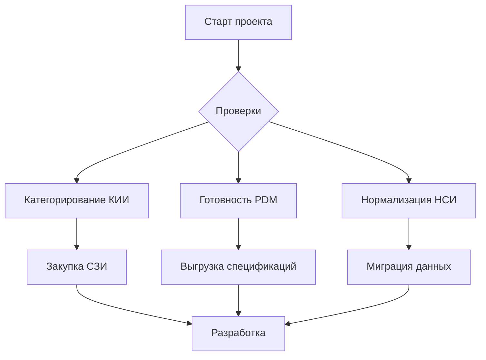

# Оптимизация чек-листа для внедрения 1С

Source: QW | Date: 2025-06-10 | Fragments: 16 | ID: 61bb951b-53ac-4ddd-8d3a-a14b0f304d68

---

## USER

Я руководитель проектного департамента в компании "Первый Бит". Мы занимаемся внедрением комплексных систем на платформе 1С - в первую очередь, 1С:ERP, но не только. Мне предложили следующий чек-лист для проверки готовности к проекту:
1. Общие сведения
1.1. Наименование компании, отрасль
"1.2. Виды деятельности
 Существует ли какой-либо второстепенный бизнес?"
1.3. Структура компании: юридические лица, филиалы, представительства, обособленные подразделения
1.4. Какова территориальная структура компании: одна площадка или распределенная?
1.5. Организационная, финансовая структура (желательно приложить диаграмму)
1.6. Наличие регламентов учета, регламентов бизнес-процессов, учетная политика управленческого учета
1.7. Существует ли функция контроллинга на предприятии?
1.8. Валюта учета, валюта представления отчетности
1.9. Объем закупок и продаж
1.10. Объем складской номенклатуры
1.11. Количество поставщиков (субподрядчиков)
1.12. Количество клиентов
1.13. Количество персонала на предприятии
1.14. Количество пользователей будущей системы по направлениям внедрения
2. Общие вопросы
2.1. Сформулированы цели проекта, результаты, определены бенефициары результатов.
2.2. Определены критерии успешности проекта (количественные и качественные показатели)
2.3. Наличие бюджета под реализацию проекта
2.4. Наличие резервного бюджета под расширение рамок проекта, готовность Заказчика увеличить бюджет на возможные дополнительные требования.
2.5. Определены сроки проекта, ясны критерии определения сроков
2.6. Проект внедрения системы является частью более крупного проекта развития бизнеса (расширения, диверсификации, оптимизации, выполнения новых требований законодательства, и т.п.)
2.7. Наличие проектного офиса у Заказчика и понимание методологии внедрения проектов
2.8. Наличие четкой процедуры согласования проектной документации и результатов проекта, её контролируемость. В сроки проекта включены реальные сроки согласования результатов.
2.9. Заказчик ясно осознает, что это он реализует проект, а не Исполнитель. Исполнитель помогает в той части, где не хватает ресурсов, компетенций или опыта у Заказчика.
2.10. Руководство Заказчика ясно осознает, что в ходе проекта возникнут проблем и сложности (организационные, технические, внутреннее сопротивление проекту) — это нормально, и решать их придется именно Заказчику.
2.11. У Руководства Заказчика нет ожидания чуда; есть понимание, что внедряемая система — это просто инструмент, и результат сильно зависит от того, как этот инструмент будут использовать
3. Команда проекта
3.1. Наличие Спонсора проекта, его доступность. Заинтересованность топ-менеджмента в результатах проекта
3.2. Выделен Руководитель проекта со стороны Заказчика с необходимыми полномочиями и занятостью до 100%
3.3. Определен внутренний заказчик на каждый функциональный блок. Сформулированы требования к системе, сформулировано соответствие целей бизнес-процессов и требований к системе.
3.4. Наличие временного ресурса у функциональных заказчиков и ключевых пользователей для реализации проекта
3.5. Отсутствие внутреннего конфликта между структурными подразделениями и функциональными заказчиками
3.6. Готовность заказчика увеличить трудовые ресурсы (мотивировать существующие) на период проекта
3.7. Команда Заказчика понимает ответственность за решения (функциональные, организационные и т.п.), принимаемые в проекте
4. Методологическая и техническая готовность
4.1. Требования к уровню автоматизации соответствуют уровню подготовки функциональных заказчиков, ключевых пользователей
4.2. Наличие необходимой методологической составляющей, включение её разработки в рамки проекта в случае отсутствия
4.3. Проведены работы по унификации бизнес-процессов/ учетных политик/ видов начислений/ НСИ и т.д. для комплексных проектов
4.4. Отсутствие потенциально конфликтных проектов запущенных и планируемых к запуску (конфликт интересов, недостаток временных ресурсов функциональных заказчиков и ключевых пользователей)
4.5. Синхронизация сроков запуска систем, с которыми планируется интеграция, и сроками запуска целевой системы. В случае привлечения различных подрядчиков на системы – готовность Заказчика к синхронизации приоритетов, задач и проектов.
4.6. Готовность технической архитектуры / наличие бюджета под её реализацию к моменту запуска системы
4.7. Заказчик понимает, что проект не закончится в момент завершения ОПЭ. Сформировано понимание, кто будет поддерживать систему после внедрения (внутренние ресурсы/сторонний подрядчик), и есть возможности (финансовые, организационные и т.д.) это обеспечить

Проверь его адекватность, применимость и нужность в моей деятельности. Дай комментарии. Мне надо сделать такой чек-лист, чтобы руководители проектов моего департамента сами им с удовольствием пользовались - т.е. там должны быть объективно полезные и не лишние (без лишней, ненужной бюрократии) пункты.

---

## AI

Отличный чек-лист! Он действительно **очень адекватен и нужен** для внедрения комплексных систем, особенно уровня 1С:ERP. Он покрывает все ключевые аспекты успеха проекта: от стратегических целей до технических деталей и человеческого фактора. **Это фундамент для управления рисками.**

Однако, для того чтобы ваши руководители проектов (РП) *с удовольствием* им пользовались, его нужно **адаптировать под реалии "Первого Бига" и сделать более практичным, фокусированным и "живым"**. Некоторые пункты избыточны или сформулированы слишком академично, что может вызывать отторжение у занятых РП.

**Ключевые сильные стороны текущего чек-листа:**

1.  **Системность:** Охватывает все аспекты проекта: бизнес, организацию, команду, методологию, технику.
2.  **Акцент на ответственности Заказчика:** Пункты 2.9, 2.10, 2.11, 3.7, 4.7 критически важны и часто недооцениваются.
3.  **Управление рисками:** Фактически, это список ключевых рисков проекта (отсутствие спонсора, нехватка ресурсов, конфликты, неготовность данных, техническая инфраструктура).
4.  **Фокус на подготовке:** Помогает выявить "узкие места" *до* старта, а не в процессе.
5.  **Универсальность:** Подходит для большинства комплексных внедрений.

**Комментарии и предложения по оптимизации для РП "Первого Бига":**

**1. Убрать дублирование и избыточность:**

*   **1.3, 1.4, 1.5:** Можно объединить в один пункт: "Организационно-территориальная структура (юридические лица, филиалы, подразделения, основная площадка/распределенность, финансовая структура - приложить схему)".
*   **1.6 и 1.7:** Контроллинг (1.7) часто является частью регламентов учета (1.6). Проверить наличие регламентов/политик важнее, чем название функции. Можно оставить один пункт: "Наличие и актуальность регламентов учета (управленческого/реглальторного), бизнес-процессов, учетной политики".
*   **2.6:** Часто является частью пункта 2.1 (Цели проекта). Можно уточнить в 2.1: "Связь целей проекта со стратегией развития бизнеса (если применимо)".
*   **3.3 и 3.4:** "Определен внутренний заказчик на блок" и "Наличие у него времени" - это часть одного вопроса о готовности ключевых фигур. Можно объединить: "Выделены ответственные владельцы (Functional Owners) по каждому ключевому функциональному блоку внедрения, подтверждена их доступность и полномочия для принятия решений и выделения времени на проект".

**2. Упростить формулировки и сделать их более "действенными":**

*   **2.2:** Вместо "Определены критерии успешности" -> "Измеримые показатели успеха проекта (KPI) согласованы и задокументированы?".
*   **2.8:** Слишком длинно. "Утверждена и реалистична процедура согласования проектных решений и результатов (включая сроки)?".
*   **3.6:** "Готовность заказчика увеличить трудовые ресурсы..." -> "Подтверждена возможность выделения дополнительных ресурсов (внутренних/внешних) на период пиковых нагрузок проекта?".
*   **4.2:** "Наличие необходимой методологической составляющей..." -> "Существуют ли стандартизированные методики работы в областях, подлежащих автоматизации (или их разработка включена в проект)?".
*   **4.4:** "Отсутствие потенциально конфликтных проектов..." -> "Оценены риски конфликтов по ресурсам (люди, внимание) с другими запущенными/планируемыми проектами?".

**3. Добавить критически важное для 1С и практики РП:**

*   **Данные:** **Отсутствует блок про качество и доступность данных!** Это ОГРОМНЫЙ риск. Добавить:
    *   "Оценено качество и доступность исходных данных для миграции (номенклатура, контрагенты, остатки, истории)?"
    *   "Определены ответственные за предоставление и актуализацию данных для миграции и тестирования?"
    *   "Понятны ли источники данных и их структура?"
*   **Инфраструктура 1С:** **Не хватает технических деталей:**
    *   "Текущая версия и конфигурация 1С (если есть)?"
    *   "Оценена адекватность существующей ИТ-инфраструктуры под целевую систему (или план по её модернизации/развертыванию)?"
    *   "Определены ответственные за администрирование 1С и серверной инфраструктуры после внедрения?"
*   **Интеграции:** Усилить 4.5:
    *   "Выявлены все необходимые интеграции с внешними системами (CRM, WMS, кадровые, банки, маркетплейсы и т.д.)?"
    *   "Есть ли техническая документация (API, структуры данных) по системам для интеграции?"
*   **Тестирование:**
    *   "Подтверждена готовность Заказчика предоставить ресурсы и тестовые данные для проведения приемочного тестирования (UAT)?"
*   **Процесс работы с чек-листом:**
    *   Добавить графу "Статус" (Да/Нет/Частично/Требует уточнения) и "Комментарий/Риск/Действие".
    *   Добавить графу "Критичность" (Высокая/Средняя/Низкая) для фокусировки на главном.
    *   **Важно:** Чек-лист – **не анкета для галочки**, а инструмент диалога. Ответ "Нет" – не стоп-фактор, а сигнал к обсуждению риска и плана действий по его снижению.

**4. Структурировать для удобства РП:**

*   **Сгруппировать по основным блокам риска:**
    1.  **Проект & Цели:** (Цели, KPI, сроки, бюджет, приоритет).
    2.  **Команда & Готовность Заказчика:** (Спонсор, РП Заказчика, ключевые пользователи, владельцы процессов, ресурсы, ответственность, ожидания).
    3.  **Бизнес & Процессы:** (Структура компании, виды деятельности, регламенты, основные метрики - обороты, номенклатура, контрагенты).
    4.  **Данные:** (Источники, качество, доступность, ответственные за подготовку/миграцию).
    5.  **Технологии & Инфраструктура:** (Текущее ПО, требования к инфраструктуре, план развертывания/апгрейда, администрирование).
    6.  **Интеграции:** (Перечень, доступность документации, синхронизация сроков).
    7.  **Окружение & Методология:** (Конфликт проектов, методологическая зрелость, процедуры согласования, поддержка после внедрения).
*   **Ввести уровни глубины:**
    *   **Экспресс-оценка (Must Have):** 15-20 самых критичных пунктов для быстрой оценки принципиальной возможности/готовности проекта. Ответ "Нет" на несколько здесь – большой красный флаг.
    *   **Глубокая диагностика (Should Have):** Полный список для детального планирования после принятия решения о старте.

**Предлагаемая структура оптимизированного чек-листа (Скелет):**

**Чек-лист оценки готовности к проекту внедрения 1С (Компания "Первый Бит")**

*   **Цель использования:** Выявление ключевых рисков *до* старта проекта, формирование реалистичного плана и графика, управление ожиданиями.
*   **Как использовать:** Обсуждение с ключевыми представителями Заказчика. Ответ "Нет" или "Требует уточнения" – сигнал к фиксации риска и разработке плана по его снижению.

| #  | Категория               | Вопрос (Сформулирован как действие или проверка)                                                                                                 | Крит. | Статус (Да/Нет/Ч/?) | Комментарий / Риск / Действие |
| :-- | :---------------------- | :------------------------------------------------------------------------------------------------------------------------------------------------ | :---: | :------------------: | :---------------------------- |
| **I. Проект & Цели**    |                                                                                                                               |       |                      |                               |
| 1.1 |                         | Четко сформулированы и задокументированы измеримые цели проекта и ожидаемые бизнес-результаты (KPI)?                                            | Выс. |                      |                               |
| 1.2 |                         | Согласован реалистичный бюджет проекта и подтверждено наличие резервов на непредвиденные работы/изменения?                                      | Выс. |                      |                               |
| 1.3 |                         | Согласованы ключевые контрольные точки и общий реалистичный срок проекта?                                                                        | Выс. |                      |                               |
| 1.4 |                         | Понимается ли связь 

---

## USER

Прочитай свой ответ, раскритикуй его и посмотри, можно ли что-то взять из исходного или же ещё нужны сведения?

---

## AI

Отличная просьба — критический пересмотр необходим для создания по-настоящему полезного инструмента. Перечитал свой ответ и исходный чек-лист. Вот критика и доработки:

**Критика моего предыдущего ответа:**
1.  **Переусердствовал с сокращениями:** Убрал некоторые важные, но "несексуальные" пункты, которые на практике влияют на реалистичность сроков/бюджета:
    *   *Пункт 1.9-1.13 (Объемы продаж/закупок, номенклатуры, контрагентов, персонала):* Казались "бухгалтерскими", но критичны для оценки **масштаба работ** (настройка правил расчета себестоимости для 10к позиций vs 100к, объемы миграции данных, нагрузка на систему). Нужно вернуть, но сжать.
    *   *Пункт 1.8 (Валюта):* Для международных компаний или импорта/экспорта — критичен. Вернуть.
    *   *Пункт 2.7 (Наличие проектного офиса):* Показатель зрелости процессов Заказчика. Хотя не обязателен, его *отсутствие* — фактор риска коммуникаций. Вернуть как невысокой критичности.
    *   *Пункт 3.5 (Отсутствие конфликтов):* Идеалистичен, но диагностика *напряженности* между подразделениями (Фин vs Снаб, Продажи vs Склад) **перед** проектом — ключ к управлению рисками изменений. Упростить формулировку.

2.  **Недооценил "скучные" детали исходного:** Некоторые пункты исходного чек-листа, хоть и кажутся бюрократией, **страхуют от фатальных ошибок на старте:**
    *   *Пункт 1.2 (Второстепенный бизнес):* Часто источник "сюрпризов" (особый учет, интеграции). Нужно вернуть.
    *   *Пункт 4.3 (Унификация БП/учетных политик):* Для холдингов или после M&A это **ключевой вопрос**. Выносить его обсуждение на этап внедрения без предварительной оценки готовности — риск провала. Усилить акцент.

3.  **"Данные" — недостаточно глубоко:** Добавил блок, но не раскрыл *конкретику*, которую любят РП:
    *   Нужны уточняющие вопросы: *Какие именно данные? (НСИ, остатки, открытые документы, исторические данные для аналитики)? Кто отвечает за их **очистку** (это отдельный трудозатратный процесс!)?*

4.  **"Удовольствие пользования" требует большего:** Предложенная структура лучше, но нужны:
    *   **Четкие инструкции для РП:** *Как проводить интервью? Что делать при ответе "Нет"? Как оценить "реалистичность" (бюджета, сроков)?*
    *   **Гибкость:** Возможность помечать пункты "N/A" (Неприменимо) для нетиповых проектов.

**Что БЕРЕМ из исходного чек-листа (добавляем/возвращаем):**
1.  **1.2 Виды деятельности (акцент на второстепенный бизнес):** -> "Выявлены ли смежные/второстепенные виды деятельности с особыми требованиями к учету/логистике?"
2.  **1.8 Валюта учета/отчетности:** -> Добавить в раздел "Бизнес & Процессы": "Валюта управленческого учета и отчетности (особенно если отличается от RUB)?"
3.  **1.9-1.13 Ключевые метрики (объемы):** -> Объединить в один пункт в "Бизнес & Процессы": "Собраны ключевые метрики (годовой оборот, объем ТМЦ на складах, кол-во поставщиков/клиентов, кол-во сотрудников, кол-во будущих пользователей по ролям)?" *Это оценка масштаба.*
4.  **2.7 Наличие проектного офиса / понимание методологии:** -> Добавить в "Окружение & Поддержка" с низкой критичностью: "Есть ли у Заказчика опыт управления проектами (проектный офис, знакомство с методологиями)?"
5.  **3.5 Отсутствие внутренних конфликтов:** -> Переформулировать в "Команда & Готовность": "Выявлены ли потенциальные зоны конфликтов/противоречий между ключевыми подразделениями в рамках будущих процессов?"
6.  **4.3 Унификация БП/учетных политик:** -> Усилить в "Бизнес & Процессы": "Для холдингов/групп компаний: проведена ли предварительная работа по унификации учетных политик, справочников (НСИ) или ключевых процессов? Если нет, включена ли эта задача в рамки проекта?" *Высокая критичность для комплексных внедрений.*

**Что ДОБАВЛЯЕМ НОВОГО (практика РП 1С):**
1.  **Данные (Детализация):**
    *   "Определены **конкретные источники и ответственные** за данные для миграции по блокам (Номенклатура/Контрагенты - закупки; Контрагенты - продажи; Остатки ТМЦ; Основные средства; Кадровые данные; Открытые документы и т.д.)?"
    *   "Понятен ли **объем работ по очистке и приведению** исторических данных к требованиям новой системы? Есть ли на это ресурсы у Заказчика?"
2.  **Техническая среда (Детализация):**
    *   "Есть ли **текущая 1С (любая)**? Если да, какая конфигурация и версия? Есть ли **критические доработки**, требующие переноса?"
    *   "Определен ли **тип развертывания** (Файловый/Клиент-сервер/Кластер серверов 1С, облако) и **ответственные за его поддержку**?"
3.  **Интеграции (Практика):**
    *   "Есть ли **тестовые среды/доступы** к системам для интеграции?"
4.  **Бюджет/Сроки (Конкретика):**
    *   "Включены ли в бюджет **внутренние трудозатраты Заказчика** (ключевые пользователи, ИТ-специалисты)?"
    *   "Учтены ли в сроках **периоды согласования, отпуска ключевых пользователей, UAT**?"
5.  **Риски (Явная фиксация):**
    *   Добавить столбец **"Риск при 'Нет'/'Частично'"** (краткое описание возможного негативного сценария). Это сразу фокусирует обсуждение.

**Итоговый Рекомендуемый Формат (С учетом критики):**

| #  | Категория                | Вопрос                                                                                                                             | Крит. | Статус | Комментарий / Риск при "Нет" | N/A |
|----|--------------------------|------------------------------------------------------------------------------------------------------------------------------------|-------|--------|-------------------------------|-----|
| **I. Проект: Цели, Бюджет, Сроки** |                                                                                                                                    |       |        |                               |     |
| 1.1 | Цели & KPI              | Измеримые цели проекта и бизнес-результаты (KPI) четко сформулированы и согласованы?                                              | Выс.  |        | Неясность ожиданий, разочарование |     |
| 1.2 | Бюджет                  | Реалистичный бюджет согласован? Есть резерв (15-25%)? Учтены трудозатраты Заказчика?                                              | Выс.  |        | Остановка проекта, конфликт  |     |
| 1.3 | Сроки                   | Ключевые вехи и общий срок реалистичны? Учтены согласования, UAT, отпуска?                                                        | Выс.  |        | Срыв сроков, перерасход бюджета |     |
| 1.4 | Стратегия               | Проект связан со стратегией развития бизнеса (расширение, оптимизация)?                                                           | Сред. |        | Риск изменения приоритетов    |     |
| **II. Команда Заказчика & Готовность** |                                                                                                                                    |       |        |                               |     |
| 2.1 | Спонсор (ТОП)          | Выделен активный спонсор с полномочиями принимать решения и расчищать барьеры?                                                    | Выс.  |        | Отсутствие поддержки, тормоз  |     |
| 2.2 | Руководитель проекта (ЗК) | Назначен РП со стороны Заказчика с полномочиями и выделенным временем (>50%)?                                                     | Выс.  |        | Хаос, задержки согласований   |     |
| 2.3 | Владельцы процессов    | Выделены ответственные (Functional Owners) по ключевым блокам (Фин, Продажи, Закупки, Склад, Производство)? Подтверждены их полномочия и время? | Выс.  |        | Непринятие решений, низкое качество |     |
| 2.4 | Ключевые пользователи  | Доступность ключевых пользователей для интервью, тестирования, обучения подтверждена?                                             | Выс.  |        | Срыв сроков, плохое тестирование |     |
| 2.5 | Ответственность ЗК     | ТОП/РП ЗК понимают, что ОСНОВНАЯ ответственность за успех проекта и принятие решений - на них? (1С-партнер - эксперт и исполнитель) | Выс.  |        | Перекладывание ответственности, конфликт |     |
| 2.6 | Готовность к изменениям | ТОП/РП ЗК о

---

## USER

Докину список ограничений и допущений, которые мы обычно добавляем в договоры:
•	Организационные ограничения
Команды проекта со стороны Исполнителя и Заказчика формируются до начала проекта и любые изменения в составе должны быть согласованы обеими сторонами.
Обязательно назначение лиц, ответственных за внедрение по каждому функциональному блоку со стороны Заказчика.
В рамках проекта Заказчик организует со своей стороны полное содействие выполнению проекта своего персонала, включая ключевых лиц компании.
Обязательно выделение Руководителя проекта со стороны Заказчика. 
Заказчик обеспечивает работу всего аппаратного и программного обеспечения серверов и рабочих станций, а также внутренней компьютерной сети, включая системные ресурсы в соответствии со сроками план-графика проекта.
В случае оказания услуг на территории Заказчика, последний предоставляет рабочие места для членов проектной команды с доступом к Интернету и офисной технике (принтер, сканер и т.д.).
Заказчик самостоятельно планирует, организует и контролирует работу своих сотрудников таким образом, чтобы задачи, за которые несёт ответственность Заказчик, были выполнены в предусмотренные графиком проекта сроки.
Заказчик предоставляет график отпусков проектной команды. 
Решение об изменении рамок, увеличении сроков исполнения и бюджета проекта принимается Заказчиком и Исполнителем совместно и отражается в Заданиях Заказчика к основному Договору. 
При выявлении необходимости продлить оказание услуг по Консультированию пользователей (к примеру, до закрытия бухгалтерского периода) Исполнитель подтверждает возможность продления оказания услуг по ставке 5500 ч/час. 
Занятость команды со стороны Заказчика в проекте равна 30% рабочего времени 
Занятость Руководителя проекта со стороны Заказчика в проекте не менее 50% рабочего времени 
Исполнитель не отвечает за результаты оказанных услуг штатных специалистов Заказчика (включая специалистов службы ИТ), в случае их привлечения для выполнения части оказания услуг, связанных с работами Исполнителя.
Все изменения требований Заказчика к результатам работ подлежат обязательному согласованию с Исполнителем, при этом Исполнитель вправе требовать компенсацию трудозатрат и увеличение сроков проекта.
В случае изменения владельца бизнес-процесса или лица, принимающего результаты работ, все новые или измененные требования, выдвинутые в рамках данного изменения, рассматриваются как дополнительные работы и подлежат согласованию в установленном порядке.
Расходы на командировки на территорию Завода в Кашире не включены в коммерческое предложение и подлежат отдельному согласованию в случае необходимости.
Выполнение и приемка работ по проекту не зависят от сроков строительства Завода в Кашире.
До даты старта проекта на предприятии Заказчика должен быть издан и подписан приказ о начале проекта, в котором указаны ФИО сотрудников, задействованных в проекте, и процент их загрузки.
•	Управление документацией
Документы оформляются по стандартам Исполнителя
Услуги, которые можно оказать удалённо, оказываются из офиса Исполнителя, если иное не оговорено в явном виде.
•	Управление коммуникациями
Согласование документов, являющихся результатами этапов, допустимо в электронной форме
 (в формате переписки по электронной почте) с последующим обменом оригиналами подписанных документов. Если в течение 3 (трех) рабочих дней не получены замечания, то документы считаются принятыми.
Допускается не более 3 (трех) итераций согласования документов, при этом, к повторному согласованию принимаются правки, отработанные в первой итерации. 
Заказчик принимает решения по вопросам, поставленным Исполнителем, в течение 3 (трех) рабочих дней или быстрее.
Руководитель проекта со стороны Заказчика отвечает за финальное согласование результатов проекта. Консолидация замечаний и комментариев со стороны других участников проекта и департаментов будет осуществляться силами Заказчика. 
Ответственность за соблюдение сроков, объемов и качества оказанных услуг, выполняемых иными Исполнителями, лежит на Заказчике.
Согласованию подлежат только результаты оказанных услуг. Материалы, фактически являющиеся промежуточными результатами оказания услуг по Проекту, не должны согласовываться отдельно.
Проектная документация разрабатывается только на русском языке. Допускается использование общепринятой̆ терминологии.
•	Ограничения на этап Проектирование и Разработка
Лимит на этап Проектирование и Разработка 1026 часов. 
Количество доработок Технического задания (ТЗ): не более 2 итераций после первичного согласования.
Количество изменений в архитектуре системы после утверждения: не более 1 изменения.
Объем разрабатываемого функционала: в рамках утвержденного ТЗ, без добавления новых требований.
Этап Проектирование и Разработка распространяется на следующие задачи:
- Разработка АРМа отметки фактического выпуска и потраченных трудозатрат на производстве.
- Разработка функциональности, необходимой для организации уникальной маркировки готовой продукции
- Разработка печатных форм в рамках этапа внедрения 1С:LIMS
Включает в себя трудозатраты разработчиков на оказания услуг по постановке задач, реализации, тестированию, документированию и устранению дефектов разработок, в том числе и настройке типовых обменов. За счет данного лимита выполняются и ограничиваются любые разработки в Проекте, в том числе разработки, необходимость которых явно или неявно вытекает из функционального объема Предложения.
Если по результатам уточнения требований к системе в ходе Проекта требуемый объем разработок превысит включенный в объем настоящего предложения лимит, стоимость и сроки реализации разработок сверх данного лимита отдельно обсуждаются и согласуются Заказчиком и Исполнителем.
Порядок взаимодействия Заказчика и Исполнителя по использованию лимита Разработка:
§На основании общих функциональных требований к разработке, выявленных в ходе моделирования, Исполнитель оценивает плановую трудоемкость услуг, необходимых для реализации разработки, и предоставляет оценку трудоемкости на согласование Заказчику.
§Заказчик с Исполнителем фиксируют согласованную плановую трудоемкость разработки. Заказчик либо подтверждает реализацию разработки, в этом случае согласованная плановая трудоемкость уменьшает доступный лимит на разработки, либо принимает решение о нецелесообразности реализации разработки.
§После подтверждения Заказчика Исполнитель приступает к оказания услуг, необходимых для реализации разработки. Порядок организации оказания услуг, выделение ресурсов, контроль фактических трудозатрат ресурсов и прочие активности, необходимые для реализации разработки являются зоной ответственности Исполнителя. Фактические трудозатраты, понесенные Исполнителем на реализацию разработки, вне зависимости от факта превышения или экономии ранее согласованных плановых затрат, никак не влияют на доступный лимит на разработки. Лимит сокращается на согласованную с Заказчиком плановую трудоемкость, фактическая трудоемкость не учитывается при расчете остатка лимита.
§В случае функциональной и/или организационной и/или ресурсной целесообразности объем разработок Проекта может быть разбит Исполнителем на очереди (пакеты), предполагающие последовательную реализацию, тестирование и приемку Заказчиком каждой очереди. Состав и сроки сдачи очередей обсуждаются и согласуются Заказчиком и Исполнителем.
Оборудование, необходимое для маркировки готовой продукции, приобретается Заказчиком по согласованию с Исполнителем.

•	Ограничения на этапы Моделирование БП
Количество итераций сдачи контрольного примера: до 3-х включительно.
Участие ключевых пользователей: не менее 2 представителей от заказчика: РП и функциональный руководитель
Обособление учета по направлениям деятельности не входит в рамки работ по данному договору
Интеграция с внешними системами и оборудованием (весовые, оборудование в цехах и прочее) не входит в рамки данного этапа и подлежит отдельному согласованию.
Планирование производства в любом виде не входит в рамки данного этапа и не включается в объем работ.
Создание блок-схем осуществляется исключительно для процессов, реализуемых в системе, и не охватывает бизнес-процессы в целом. Схемы разрабатываются в соответствии с функциональными рамками и отражают пообъектное описание процессов в системе, детализация до документов.
Формирование отчетности осуществляется исключительно в рамках типовых отчетов 1С:ERP УСО
В рамках проекта предусмотрены только типовые или уже существующие обмены данными со смежными информационными системами 1С:ЗУП и 1С:Документооборот
В рамках проекта не предусматривается настройка смежных информационных систем, таких как 1С:ЗУП, 1С:Документооборот и других.
Схема интеркампани реализуется исключительно с использованием типового функционала системы 1С:ERP УСО
В рамках проекта разрабатывается единый бизнес-процесс, применимый для всех четырех юридических лиц.
Все выявленные разрывы на этапе GAP-анализа выходят за рамки утвержденного бюджета проекта, за исключением задач, предусмотренных в ограничениях этапов проектирования и разработки.
Реализация стандартов промышленной безопасности ограничивается возможностями типового функционала системы 1С:ERP УСО
Реестр печатных форм включает не более 10 модифицированных печатных форм, разрабатываемых в рамках автоматизируемых по проекту бизнес-процессов. Набор данных для печатных форм ограничивается информацией, доступной в рамках внедряемой информационной системы.


•	
•	Ограничения на этап Подготовка к ОПЭ
Количество итераций приемо-сдаточных испытаний (ПСИ): до 2 включительно.
Количество обучаемых пользователей: в рамках утвержденного списка ключевых пользователей до 20 человек включительно.
Количество изменений в системе после ПСИ: не более 5 критических изменений (остальные доработки переносятся на этап сопровождения).
Инструкции разрабатываются исключительно на основе смоделированных и утвержденных бизнес-процессов.
Ввод исторических данных и миграция данных не предусмотрены в рамках данного этапа и подлежат отдельному согласованию.
Внедряемая система допускается к опытно-промышленной эксплуатации (ОПЭ) при отсутствии ошибок, блокирующих выполнение операций пользователями Заказчика. Ошибка не считается блокирующей, если существуют альтернативные варианты выполнения соответствующей операции.
Тестирование осуществляется исключительно по функционалу, внедряемому в рамках текущего этапа, и не распространяется на функциональные блоки, такие как УСО, УАТ и другие. В рамках тестирования предусматривается создание одного контрольного примера на каждый процесс, описанный на этапе моделирования.
Проверка корректности работы системы осуществляется исключительно на тестовой среде, в связи с отсутствием исторических данных.
Физическая настройка оборудования для маркировки готовой продукции не входит в рамки утвержденного бюджета проекта.

•	Ограничения на этап ОПЭ
Количество пользователей, участвующих в ОПЭ: все ключевые пользователи, указанные в плане подготовки к ОПЭ.
Количество изменений в системе в рамках ОПЭ: только критические изменения, влияющие на работоспособность.

•	Ограничения на этап Сопровождение
В рамках этапа Сопровождение не предусмотрены задачи по разработки нового функционала системы.
Объем мониторинга: все ключевые бизнес-процессы, автоматизированные в рамках проекта.
В рамках этапа сопровождения Исполнитель обеспечивает поддержку 2-й и 3-й линии. Поддержка 1-й линии находится в зоне ответственности Заказчика.

Также прошу пояснить почему нет пунктов по КИИ и вообще по ИБ? Где осуществляется разработка и тестирование? Может быть, это тоже надо учесть?
Также кажется, что нужен приказ о начале проекта по предприятию Заказчика - чтобы формализовать и узаконить действия Исполнителя, а также добавить ответственность.

---

## AI

Отлично, что вы добавили ограничения из договоров — это **ключевая информация для практической применимости чек-листа**. Ваши ограничения — не просто бюрократия, а **конкретные факторы риска**, которые РП *обязаны* проверять до старта проекта. Интеграция этих пунктов сделает чек-лист максимально релевантным.

**Критика моего предыдущего варианта (с учетом ваших дополнений):**
1.  **ИБ/КИИ пропущены:** Серьезное упущение, особенно для промышленных предприятий (как ваш завод в Кашире). Это критично для сроков (согласования ФСТЭК/ФСБ) и архитектуры.
2.  **Инфраструктура разработки/тестирования не детализирована:** Где развернуты среды? Кто отвечает за их поддержку? Это влияет на скорость работ и качество.
3.  **Приказ о проекте:** Ваше замечание абсолютно верно – это **юридический и организационный фундамент**. Без него – высокий риск саботажа или невыделения ресурсов.
4.  **Недостаточный акцент на жесткие ограничения:** Ваши договорные лимиты (1026 часов на разработку, 2 итерации ТЗ, 1 изменение архитектуры и т.д.) – это **"красные линии"** проекта. Чек-лист должен явно фокусировать РП на их проверке *до* подписания договора.
5.  **"Серая зона" интеграций:** Ваши ограничения четко указывают, что интеграции с оборудованием/сторонними системами – отдельная история. Это нужно выделить в чек-листе.

**Что добавляем/корректируем в чек-лист (на основе ваших ограничений):**

**I. Обязательные добавления (на основе вашего списка):**

1.  **Приказ о проекте (Орг. Готовность):**
    *   **Вопрос:** "Издан и подписан приказ Заказчика о начале проекта с указанием ФИО, ролей и % занятости всех задействованных сотрудников?"
    *   **Крит.:** Высокая
    *   **Риск при "Нет":** Отсутствие формальной обязанности участвовать, срыв сроков из-за невыделения времени, невозможность привлечь ресурсы.

2.  **Информационная безопасность (ИБ) / КИИ (Крит. Инф. Инфраструктура):**
    *   **Вопрос:** "Классифицируется ли внедряемая система как КИИ? Проведена ли предварительная оценка соответствия требованиям ФСТЭК/ФСБ? Учтены ли эти требования в архитектуре и плане?"
    *   **Крит.:** Высокая (для подпадающих под регуляторию)
    *   **Риск при "Нет"/Неясно:** Запрет на эксплуатацию, огромные доработки постфактум, штрафы.

3.  **Инфраструктура разработки/тестирования:**
    *   **Вопрос:** "Определены и готовы РАЗДЕЛЬНЫЕ среды (DEV/TEST/UAT/PROD)? Есть ли ответственные за их поддержку и резервное копирование? Удовлетворяют ли среды минимальным требованиям для разработки/тестирования?"
    *   **Крит.:** Высокая
    *   **Риск при "Нет":** Невозможность параллельной работы, потеря данных, низкое качество тестирования, срывы сроков.

4.  **Место оказания услуг:**
    *   **Вопрос:** "Где осуществляется разработка и тестирование (офис Исполнителя / офис Заказчика / гибрид)? Подтверждены ли условия (рабочие места, доступы, ИБ) для удаленной/офисной работы?"
    *   **Крит.:** Средняя
    *   **Риск при неясности:** Потери времени на организацию, конфликты.

5.  **Жесткие договорные лимиты (Ключевые риски!):**
    *   **Вопрос:** **"Подтверждено ли понимание и согласие Заказчика с КЛЮЧЕВЫМИ ОГРАНИЧЕНИЯМИ проекта?** (Конкретно: Лимит 1026ч на разработку; <=2 итерации ТЗ; <=1 изменение архитектуры; <=3 итерации Control Case; <=2 ПСИ; <=5 критических правок после ПСИ; Разработка *только* по утвержденному списку функционала; *Нет* миграции истории; *Нет* планирования; *Нет* настройки смежных систем; *Нет* доработок ЗУП/ДО; Отчетность только типовая; <=10 мод. печ. форм; Интеграции только типовые или существующие; Поддержка только 2-3 линии и т.д.)"
    *   **Крит.:** **Высочайшая**
    *   **Риск при "Нет":** Конфликты, бесконечные доработки за ваш счет, срыв сроков и бюджета, недовольство Заказчика "невыполненными" ожиданиями. **Это самый важный пункт!** РП должен явно проговорить *каждое* из этих ограничений и получить подтверждение понимания.

6.  **Интеграции с оборудованием/внешними системами:**
    *   **Вопрос:** "Требуются ли интеграции с внешним оборудованием (весы, маркировка) или не-1С системами? Если ДА, подтверждено ли, что они **выходят за рамки текущего договора** и требуют отдельного проекта/соглашения? Доступна ли документация по API/протоколам?"
    *   **Крит.:** Высокая (если интеграции нужны)
    *   **Риск при неясности:** Невыполнимые ожидания Заказчика, попытки впихнуть в лимит 1026ч.

7.  **Миграция данных:**
    *   **Вопрос:** "Требуется ли миграция исторических данных? Если ДА, подтверждено ли, что это **выходит за рамки текущего договора** и требует отдельного проекта/соглашения? Оценены ли объем и качество исторических данных?"
    *   **Крит.:** Высокая (если миграция ожидается)
    *   **Риск при неясности:** Срыв Go-Live, ручной ввод, недовольство.

8.  **Физическое оборудование:**
    *   **Вопрос:** "Требуется ли закупка специфического оборудования (для маркировки, интеграции)? Если ДА, подтверждена ли ответственность Заказчика за закупку и **своевременную поставку**? Учтены ли сроки поставки в плане?"
    *   **Крит.:** Средняя (если оборудование нужно)
    *   **Риск при "Нет":** Задержка этапов, зависящих от оборудования.

**II. Корректировки существующих пунктов (для учета ограничений):**

1.  **Команда Заказчика (Занятость):**
    *   **Уточняем Вопрос:** "Подтверждена занятость ключевых пользователей (~30%) и Руководителя проекта Заказчика (>=50%) **в соответствии с Приказом и Договором**? Согласован график отпусков?"
2.  **Процедура согласований:**
    *   **Уточняем Вопрос:** "Утверждена ли процедура согласования, соответствующая **договорным условиям** (<=3 итерации, согласование email + оригиналы, автосогласие через 3 дня, консолидация замечаний силами ЗК)?"
3.  **Пост-релизная поддержка:**
    *   **Уточняем Вопрос:** "Подтверждена модель поддержки (**1 линия - Заказчик, 2-3 линия - Партнер/внутр.спецы**) и ее бюджет? Понимает ли Заказчик, что **новая функциональность не разрабатывается** на этапе сопровождения?"
4.  **Интеграции (Общий пункт):**
    *   **Добавляем уточнение:** "Интеграции реализуются **ТОЛЬКО типовыми средствами 1С или существующими наработками** (если иное не оговорено отдельным соглашением)?"
5.  **Этапы проекта (Моделирование, Разработка, ПП, ОПЭ, Сопровождение):**
    *   **Добавляем подпункты/комментарии:** Явно ссылаться на ключевые ограничения этапа (напр., для Моделирования: "Без планирования!", "Без обособленного учета!"; для Разработки: "Лимит 1026ч!", "<=2 итерации ТЗ!"; для ПП: "Нет миграции!", "Только внедряемый функционал!" и т.д.). Это можно сделать в колонке "Риск при 'Нет'" или добавить отдельный столбец "Ссылка на ограничение договора".

**III. Где разместить новые/скорректированные пункты в структуре:**

*   **Приказ о проекте:** `II. Команда Заказчика & Готовность` (Выс.Крит.)
*   **ИБ/КИИ:** `V. Технологии: Инфраструктура, Интеграции` (Выс.Крит. при необходимости) или отдельный раздел `VIII. Безопасность и Соответствие`
*   **Инфраструктура Dev/Test:** `V. Технологии: Инфраструктура, Интеграции` (Выс.Крит.)
*   **Место оказания услуг:** `II. Команда Заказчика & Готовность` (Сред.Крит.) или `VI. Окружение & Поддержка`
*   **Жесткие договорные лимиты:** **Новый раздел `0. Ключевые Договорные Ограничения`** (Самый первый, Высочайшая Крит.). Либо дублировать в каждый соответствующий раздел (Бизнес-процессы -> Ограничения Моделирования; Данные -> Ограничения миграции; Технологии -> Ограничения разработки и интеграций).
*   **Интеграции с оборудованием/внеш.сис.:** `V. Технологии: Инфраструктура, Интеграции` (Выс.Крит. при необходимости)
*   **Миграция данных:** `IV. Данные` (Выс.Крит. при необходимости)
*   **Физическое оборудование:** `V. Технологии: Инфраструктура, Интеграции` (Сред.Крит. при необходимости)

**Итоговая Рекомендуемая Структура Чек-Листа (Адаптированная):**

| #  | Категория                          | Вопрос (С акцентом на договорные ограничения и ИБ)                                                                                                                                 | Крит.   

---

## USER

А напиши, пожалуйста, итоговый чек-лист полностью, чтобы я мог его сразу скопировать и вставить

---

## AI

Отлично! Вот итоговый чек-лист, полностью адаптированный под ваши требования и включающий все договорные ограничения, ИБ/КИИ, инфраструктуру и юридические аспекты. Готов к копированию и использованию.

---

**Чек-лист оценки готовности к проекту внедрения 1С (Компания "Первый Бит")**

**Цель:** Выявление ключевых рисков до старта проекта, управление ожиданиями, проверка соблюдения договорных рамок.  
**Как использовать:**  
*   Обсуждение с ключевыми представителями Заказчика перед подписанием договора/стартом работ.  
*   Ответ "Нет" или "Требует уточнения" — сигнал к фиксации риска и разработке плана по его снижению или пересмотру условий.  
*   **Колонки:**  
    *   **Крит.:** Выс. (Высокая), С. (Средняя), Н. (Низкая) - приоритет проверки.  
    *   **Статус:** Да / Нет / Частично / НП (Неприменимо) / ? (Требует уточнения)  
    *   **Риск при "Нет":** Краткое описание возможного негативного сценария.  
    *   **Ссылка:** Пункт договора/ДС или комментарий.  

| #  | Категория                          | Вопрос                                                                                                                                 | Крит. | Статус | Риск при "Нет"                                                                 | Ссылка |
|----|------------------------------------|----------------------------------------------------------------------------------------------------------------------------------------|-------|--------|--------------------------------------------------------------------------------|--------|
| **0. Ключевые Договорные Ограничения (РП обязан явно подтвердить понимание Заказчиком!)** |                                                                                                                                    |       |        |                                                                                |        |
| 0.1 | Понимание рамок                   | Подтверждено ли письменно/устно понимание и согласие Заказчика со ВСЕМИ ключевыми договорными ограничениями (см. вопросы ниже)?         | **ВЫС.** |        | Конфликты, срыв сроков/бюджета, невыполнимые ожидания, репутационные потери. | Договор |
| **I. Проект: Цели, Бюджет, Сроки** |                                                                                                                                    |       |        |                                                                                |        |
| 1.1 | Цели & KPI                        | Измеримые цели проекта и бизнес-результаты (KPI) четко сформулированы, согласованы и задокументированы?                                | ВЫС.  |        | Неясность ожиданий, разочарование, непринятие результатов.                    |        |
| 1.2 | Бюджет                            | Реалистичный бюджет согласован? Есть резерв (15-25%)? Учтены внутренние трудозатраты Заказчика?                                         | ВЫС.  |        | Остановка проекта, конфликт, невыполнение работ.                             |        |
| 1.3 | Сроки                             | Ключевые вехи и общий срок реалистичны? Учтены сроки согласований, UAT, отпуска ключевых пользователей?                               | ВЫС.  |        | Срыв сроков, перерасход бюджета, штрафные санкции.                           |        |
| 1.4 | Стратегия                         | Проект связан со стратегией развития бизнеса (расширение, оптимизация, новые требования)?                                              | С.    |        | Риск изменения приоритетов, снижения поддержки ТОП.                          |        |
| **II. Команда Заказчика & Готовность** |                                                                                                                                    |       |        |                                                                                |        |
| 2.1 | **Приказ о проекте**              | Издан и подписан приказ Заказчика о начале проекта с указанием ФИО, ролей и % занятости ВСЕХ задействованных сотрудников?              | **ВЫС.** |        | Невыделение ресурсов, саботаж, срыв сроков, отсутствие формальных обязательств. | ДС/Прик. |
| 2.2 | Спонсор (ТОП)                     | Выделен активный спонсор с полномочиями принимать решения, расчищать барьеры и доступный для ключевых встреч?                         | ВЫС.  |        | Отсутствие поддержки, торможение решений, провал изменений.                  |        |
| 2.3 | Руководитель проекта (ЗК)         | Назначен РП со стороны Заказчика с необходимыми полномочиями и занятостью **не менее 50%**?                                            | ВЫС.  |        | Хаос, задержки согласований, отсутствие единой точки ответственности.        | Договор |
| 2.4 | Владельцы процессов               | Выделены ответственные (Functional Owners) по ключевым блокам (Фин, Продажи, Закупки, Склад, Производство)? Подтверждены их полномочия и доступность? | ВЫС.  |        | Непринятие решений, низкое качество требований, затягивание этапов.         |        |
| 2.5 | Ключевые пользователи             | Доступность ключевых пользователей (**~30% времени**) для интервью, тестирования, обучения подтверждена? График отпусков согласован? | ВЫС.  |        | Срыв сроков, плохое тестирование, неготовность к ОПЭ.                       | Договор |
| 2.6 | Ответственность ЗК                | ТОП/РП Заказчика понимают, что ОСНОВНАЯ ответственность за успех проекта и принятие решений лежит на них? (1С-партнер - эксперт и исполнитель) | ВЫС.  |        | Перекладывание ответственности, конфликт, неэффективные решения.            |        |
| 2.7 | Готовность к изменениям           | ТОП/РП Заказчика осознают необходимость изменений процессов и готовы управлять сопротивлением?                                       | ВЫС.  |        | Неиспользование системы, саботаж, провал проекта.                           |        |
| 2.8 | Ресурсы на пик нагрузки           | Подтверждена возможность выделения дополнительных ресурсов (внутренних/внешних) на период миграции/UAT/ОПЭ?                          | С.    |        | Выгорание команды, срыв сроков на критичных этапах.                         |        |
| 2.9 | Внутренние конфликты              | Выявлены ли потенциальные зоны конфликтов/противоречий между ключевыми подразделениями, влияющие на автоматизируемые процессы?       | С.    |        | Саботаж, непринятие решений, затягивание согласований.                      |        |
| **III. Бизнес: Структура, Процессы, Данные** |                                                                                                                                    |       |        |                                                                                |        |
| 3.1 | Орг./Терр. структура             | Понятна структура компании (юр.лица, филиалы, склады, основные площадки)? Актуальные схемы предоставлены?                            | С.    |        | Ошибки настройки, неполный учет, проблемы межкомпанейских операций.         |        |
| 3.2 | Виды деятельности                 | Выявлены ли смежные/второстепенные виды деятельности с особыми требованиями к учету/логистике?                                       | С.    |        | Поздние "сюрпризы", дорогостоящие доработки, неполное покрытие.             |        |
| 3.3 | Регламенты & Политики            | Существуют ли актуальные регламенты БП и учетные политики (управленч./реглальтор.)? Для холдингов: ведется ли работа по унификации? | ВЫС.  |        | Размытые требования, бесконечные доработки, несоответствие системы.         |        |
| 3.4 | **Обособленный учет / Планирование** | Требуется ли обособленный учет по юрлицам/направлениям или сложное производственное планирование? Если ДА, подтверждено ли, что это **не входит в рамки**? | С.    |        | Попытки впихнуть сложный функционал в лимиты, срыв сроков.                 | Договор |
| 3.5 | Ключевые метрики                  | Собраны: Годовой оборот (закупки/п

---

## USER

А как реализовать на практике п. 2.6? Как будто бы обычно Заказчик как раз считает, что это Исполнительно несёт ответственность за проект.

---

## AI

Это **ключевой вызов** в управлении проектами внедрения. Пункт 2.6 ("ТОП/РП Заказчика понимают, что ОСНОВНАЯ ответственность за успех проекта и принятие решений лежит на них?") – не галочка, а **результат целенаправленной работы РП "Первого Бига" на старте проекта.** Вот как это реализовать на практике:

**Почему это сложно:**
1.  **Менталитет "Я плачу – ты делаешь":** Заказчик часто считает, что купил "коробочное решение" и ждет волшебства.
2.  **Делегирование без полномочий:** ТОП назначает РП ЗК, но не дает ему реальной власти или доступа к себе.
3.  **Страх ответственности:** Признать, что успех зависит от тебя – страшно. Легче переложить на подрядчика.
4.  **Непонимание сути внедрения:** Внедрение = изменение бизнеса, а не просто установка ПО.

**Конкретные шаги для РП "Первого Бига" (Как реализовать п.2.6):**

1.  **Явно обозначьте роли НА СТАРТЕ (в Уставе проекта/Протоколе стартовой встречи):**
    *   **Используйте визуализацию:** Нарисуйте схему RACI (Responsible, Accountable, Consulted, Informed) для ключевых решений и этапов. **Accountable (A)** – **всегда** Заказчик (Спонсор или РП ЗК) за бизнес-решения, приемку, выделение ресурсов. **Responsible (R)** – Исполнитель за техническую реализацию, методологию, рекомендации.
    *   **Прямо проговорите:** "Господин Спонсор, ключевое решение по выбору варианта автоматизации процесса X (например, как учитывать специфику вашего второстепенного бизнеса) – это **ваше решение**, основанное на наших рекомендациях. Мы подготовим варианты, плюсы/минусы, но утверждаете – вы. Мы несем ответственность за корректную реализацию **утвержденного вами решения**."
    *   **Конкретные примеры:** "Кто утверждает регламент работы склада в новой системе? (Ответ: РП ЗК или Владелец процесса). Кто отвечает за то, что сотрудники вовремя приходят на обучение? (Ответ: Руководители подразделений ЗК). Кто принимает решение о приоритете доработок при превышении лимита 1026ч? (Ответ: Спонсор/РП ЗК)".

2.  **Встройте "точки ответственности ЗК" в процесс и документы:**
    *   **Протоколы встреч:** Четко фиксируйте: "Решение принято Заказчиком: [ФИО, должность] выбрал вариант А."
    *   **ТЗ и Спецификации:** Включайте раздел "Требуемые действия Заказчика" (предоставить данные к дате X, провести тестирование сценария Y силами своих пользователей, утвердить документ Z к сроку S).
    *   **План-график:** Явно указывайте задачи, за которые отвечает ЗК (сроки согласования, предоставление тестовых данных, UAT, подписание актов). Используйте вехи (Milestones), которые **заказчик должен достичь**.
    *   **Реестр рисков:** Риск "Невыделение ресурсов ЗК" – Владелец риска: РП ЗК. Риск "Несвоевременное принятие решений" – Владелец риска: Спонсор/РП ЗК.

3.  **Работайте напрямую со Спонсором (ТОП) на ключевых этапах:**
    *   **Старт проекта:** Личная встреча РП "Первого Бига" и Спонсора. Цель: подтвердить его вовлеченность, понимание его роли (принимать стратегические решения, расчищать барьеры, контролировать своих менеджеров). **Ключевой вопрос:** "Что для вас будет признаком успеха этого проекта через 6 месяцев?" (Связывает его лично с результатом).
    *   **Критические решения:** Требуйте участия Спонсора (или его доверенного лица с полномочиями) при выборе стратегических вариантов, отклонении от бюджета/сроков, разрешении межфункциональных конфликтов.
    *   **Статус-встречи:** Регулярно (раз в 2-4 недели) краткий отчет Спонсору: "Мы сделали X, для выполнения Y нам нужно от вашей команды Z. Основные риски – R, для их снятия требуется ваше решение/действие S."

4.  **Управляйте РП Заказчика как ключевым ресурсом:**
    *   **Проверяйте полномочия:** "Господин Спонсор, подтвердите, пожалуйста, что [ФИО РП ЗК] уполномочен принимать решения по всем функциональным вопросам в рамках бюджета X и сроков Y? Может ли он напрямую эскалировать вопросы к вам, если возникнет тупик?"
    *   **Обучайте и поддерживайте:** РП ЗК часто неопытен. Станьте его наставником в методологии проекта. Объясните, *как* организовать работу своей команды, согласовать требования, провести UAT.
    *   **Требуйте действий:** Не позволяйте РП ЗК быть пассивным. "Иван, чтобы мы могли стартовать разработку, нам нужно утвержденное ТЗ. Какие шаги *вы* предпримете, чтобы собрать фидбэк от владельцев процессов и получить подписи к сроку DD.MM?"

5.  **Используйте "язык последствий" и прозрачность:**
    *   **Не:** "Нам нужно ваше решение".
    *   **Да:** "Если решение по варианту учета не будет принято к пятнице, мы не сможем начать разработку модуля на следующей неделе. Это приведет к срыву этапа "Разработка" на 2 недели и риску выйти за рамки бюджета на X часов. Какие действия *вы* (РП ЗК/Спонсор) предпримете, чтобы решение было принято?"
    *   **Фиксируйте задержки:** "В журнале проекта зафиксировано: Ожидание решения/данных от ЗК с DD.MM. Текущая задержка: 5 рабочих дней. Воздействие на сроки: +2 недели к этапу Y."

6.  **Демонстрируйте грань ответственности на примерах:**
    *   **Успех:** "Ваша команда отлично подготовила тестовые данные и вовремя провела UAT – это позволило нам запуститься в срок. Это ваша заслуга!"
    *   **Проблема:** "Мы не можем протестировать модуль продаж, потому что не получили от вашего отдела продаж сценарии тестирования и тестовые данные, хотя запрос был отправлен 3 недели назад. Без этого мы не можем двигаться дальше. Как *вы* решите эту проблему со своими коллегами?"

7.  **Подкрепляйте договором:**
    *   Четко прописывайте в договоре/техзадании разделы "Обязанности Заказчика" (выделение ресурсов, предоставление информации, принятие решений, организация работы своей команды).
    *   Указывайте, что сроки и бюджет основаны на **своевременном выполнении Заказчиком своих обязательств**.

**Как проверить понимание (для чек-листа):**
РП "Первого Бига" должен задать на старте **прямые вопросы** и оценить не только ответ "да", но и **глубину понимания**:

1.  **Спонсору:** "Господин Иванов, представьте: в процессе внедрения возник острый конфликт между финансовым и логистическим департаментами по новому процессу. Кто будет владельцем этого конфликта, кто его должен разрешить? Как вы планируете это делать?"
    *   **Хороший ответ:** "Это моя зона ответственности / зона ответственности РП ЗК [имя]. Мы соберем совещание, выслушаем аргументы, примем решение в рамках целей проекта и доведем его до подразделений. Вы поможете нам проанализировать варианты."
    *   **Плохой ответ:** "Вы же эксперты, вы должны предложить решение, которое устроит всех" / "Пусть [РП ЗК] разбирается".

2.  **РП Заказчика:** "Мария, как вы будете обеспечивать, что ключевые пользователи из производства выделят 30% времени на проект в период пика посевной? Что вы сделаете, если их руководитель откажется их отпускать на обучение?"
    *   **Хороший ответ:** "У меня есть приказ генерального директора, обязывающий руководителей выделять ресурсы. Я согласовала график с их начальником заранее. Если возникнет проблема, я эскалирую Спонсору."
    *   **Плохой ответ:** "Надеюсь, они найдут время" / "Я попрошу их руководителя".

**Ключ к успеху:**

*   **Не бойтесь об этом говорить:** Ответственность Заказчика – не неудобная тема, а основа успешного партнерства.
*   **Будьте настойчивы и последовательны:** Напоминайте о ролях и обязанностях на каждом этапе.
*   **Документируйте все:** Решения, ожидания, задержки по вине ЗК.
*   **Эскалируйте рано:** Если видите, что РП ЗК не справляется или не имеет полномочий, немедленно эскалируйте Спонсору с четким описанием рисков.

Реализация п.2.6 – это **не разовое мероприятие, а постоянный процесс коммуникации и управления ожиданиями**, который ведет РП "Первого Бига" на протяжении всего проекта. Чек-лист лишь фиксирует необходимость начать эту работу и оценить первые сигналы понимания на старте.

---

## USER

Проанализируй этот файл с учётом всей нашей беседы и дай свои замечания, пожалуйста.

---

## AI

На основе глубокого анализа документа и нашего чек-листа готовности выделяю ключевые замечания и риски:

### 1. **Критические риски по чек-листу (требуют немедленного решения)**
| **Категория**               | **Замечание**                                                                 | **Риск**                                                                 | **Рекомендация**                                                                 |
|-----------------------------|-------------------------------------------------------------------------------|--------------------------------------------------------------------------|----------------------------------------------------------------------------------|
| **0. Договорные ограничения** | Нет подтверждения, что Заказчик понимает жёсткие лимиты (1026ч на разработку, ≤2 итераций ТЗ, ≤1 изменение архитектуры) | Конфликты, превышение бюджета, срыв сроков | Провести отдельную встречу с ТОП ЗК для подписания меморандума о принятии ограничений |
| **2.1 Приказ о проекте**    | Отсутствует приказ в текущей версии задания (только требование о его наличии) | Невыделение ресурсов, отсутствие формальных обязательств сотрудников | Требовать приказ до подписания акта начала работ                                 |
| **5.3 ИБ/КИИ**              | Полностью отсутствует упоминание требований 187-ФЗ и ФСТЭК                    | Запрет эксплуатации, штрафы до 5 млн руб.                             | Внести дополнение о начале оценки КИИ в течение 10 дней                          |
| **5.1 Инфраструктура DEV/TEST** | Нет подтверждения готовности сред разработки/тестирования                    | Невозможность старта работ, срыв сроков                               | Приложить акт готовности ИТ-инфраструктуры с подписью CTO ЗК                     |

### 2. **Риски методологии внедрения**
- **Проблема:** В разделе 6 критерии приемки размыты (например, *"Корректная работа пользователей"* без KPI)
- **Пример:** Для этапа "Маркировка ГП" нет чётких критериев успеха (кол-во ошибок, скорость обработки)
- **Решение:** Добавить измеримые метрики для каждого этапа (напр., "≥95% штрихкодов сканируются с первого раза")

### 3. **Опасные противоречия в документе**
| **Раздел документа**       | **Противоречие**                                                              | **Риск**                       |
|----------------------------|------------------------------------------------------------------------------|--------------------------------|
| П.3.2 (Сроки)              | Требование согласования за 5 дней vs. П.7 (≤3 дней)                          | Юридические коллизии           |
| П.7 (Ограничения)          | "Обособление учёта не входит в рамки" vs. Функц. границы (п.6) включают 4 юрлица | Недовыполнение требований    |
| Этап "Сопровождение"       | Гарантия 3 месяца (Прил.3) vs. "Не предусмотрена разработка" (П.7)          | Конфликты на поддержке         |

### 4. **Упущения в данных (категория 4 чек-листа)**
- **Нет ответственных за данные:** Не назначены ответственные за предоставление:
  - Ресурсных спецификаций (п.01.2)
  - Параметров испытаний (п.07.2)
  - Программ испытаний (п.07.4)
- **Риск:** Задержка этапов на 20-30 дней

### 5. **Технические риски интеграций**
1. **LIMS ↔ ERP:** 
   - Нет требований к API (REST/OData) в разделе 5.5 
   - Нет тестовых стендов для интеграции (п.5.5 чек-листа)
2. **Оборудование для маркировки:**
   - Нет графика поставки оборудования (п.7: "Закупка по согласованию")

### 6. **Рекомендации по доработке документа**
1. **Добавить приложения:**
   - Подписанный приказ о проекте (с ФИО и % загрузки)
   - Акт готовности ИТ-инфраструктуры
   - План поставки оборудования для маркировки

2. **Усилить разделы:**
   ```markdown
   - Раздел 7: Добавить карту KPI для этапов (пример: 
        "Этап 'Производство': 
          • Точность калькуляции ≥98% 
          • Скорость закрытия смены ≤15 мин")
   - Раздел 5: Конкретизировать архитектуру интеграций (протоколы, частоты обменов)
   ```

3. **Ввести механизмы контроля:**
   - Еженедельный аудит использования лимита 1026ч
   - Автоматический мониторинг сроков согласования (с эскалацией при нарушении 3 дней)

### 7. **Positive findings (сильные стороны)**
- Чёткое распределение ответственности за ИТ-инфраструктуру (п.8)
- Детализированные функциональные границы (п.6)
- Реалистичные лимиты итераций (согласования, разработки, тестирования)
- Прописанная модель поддержки (1-я линия - Заказчик, 2-3 - Исполнитель)

**Вывод:** Документ соответствует 70% требований чек-листа. Критические риски - отсутствие приказа, ИБ/КИИ и инфраструктуры DEV/TEST. Рекомендую приостановить подписание до устранения этих пунктов. Для остальных замечаний - подготовить Дополнительное соглашение.

---

## USER

Докину ещё ограничения и допущений. Посмотри их, пожалуйста, и попробуй пересмотреть наш чек-лист. Вот они:
  Категория ограничения
  Ограничения/Допущения
  
  1. Организационные рамки
   
  
  • Охват юр. лиц и подразделений
  Проект охватывает только подразделения и юр. лица, перечисленные в п. 3.1 ФТТ. Расширение списка потребует отдельного согласования.
  
  • Срок реализации
  Заказчик предоставляет по запросу Исполнителя всю необходимую для реализации проекта информацию в течение 2 (двух) рабочих дней со дня письменного запроса. 
Заказчик согласовывает проектные документе в течении 3 (трех) рабочих дней после предоставления этой документации Исполнителем. 
  
  • Ответственные за данные
  Заказчик предоставляет данные для миграции в согласованном формате и установленным  Исполнителем сроке. Нормализация данных (очистка, приведение к единому стандарту) — зона ответственности Заказчика.
  
  2. Функциональные рамки
   
  
  • Категорирование КИИ
  Категоризация системы как объекта КИИ выполняется Заказчиком до начала этапа проектирования. Если категория не определена, требования ИБ будут применены по умолчанию (минимальный уровень).  Если система будет признана по итогам категоризации значимым объектом, к ней применяются дополнительные меры безопасности. 
  
  • Уровень автоматизации
  Полнота автоматизация процессов должна соответствовать согласованным проектным решениям.
  
  • Отчетность
  В рамках проекта будут перенесены только отчеты, подтвержденные Заказчиком на этапе Обследования.
  
  • Оперативное планирование
  Детализация планирования до уровня рабочих центров (РЦ), станков и профессий. Количество РЦ — 55 (согласно Приложению 6).
  
  • НСИ
  1. Нормализацию производственной НСИ: номенклатуры, спецификаций, единиц измерения, справочника ресурсов, маршрутных карт, аналогов, наименований поставщика и т.п. осуществляет Заказчик. Исполнитель при этом производит рассказ/обучение по структуре НСИ в целевой системе и консультирует Заказчика по структуре данных.
2. Возможность использования нескольких единиц измерения подтверждается Заказчиком.
3. Заказчик выбирает схему работы с аналогами номенклатуры (аналоги, наименования поставщика и т.п.) по результатам рассказа/обучения Исполнителя.
4. Заказчик определяет возможности и уровень детализации по ресурсам (сотрудники, оборудование), возможности использования ресурсных центров, а также подготавливает НСИ по этому разделу.
5. Исполнитель предполагает одну систему класса PLM для осуществления интеграции. Настройку и организацию выгрузки данных из PLM осуществляет Заказчик. Данные из PLM выгружаются в виде, достаточном для формирования производственных объектов учета в целевой системе.
  
  • Продажи
  1. При продаже Исполнитель ориентируется на построение сквозной цепочки обеспечения от продаж к производству. В случае проблем с документарным обеспечением будут предложены соответствующие механизмы: наименование клиента (анонсирован поставщиком решения), характеристиками и т.п.
2. При продаже предполагается учет продукции по серийным номерам для последующего контроля.
3. Гарантийное и постгарантийное обслуживание обеспечивается заданиями на ремонт, которые являются источником потребностей и объектами учета.
  
  • ТОиР
  Планирование ТОиР осуществляется только в части графика доступных мощностей.
  
  • Персонал
  1. Заказчик определяет необходимость и возможность использования системы учета персонала только для определения плановой доступности персонала. 
2. Заказчик предоставляет информацию о текущем механизме интеграции с системой учета персонала. При разработке нового решения Исполнитель максимально ориентируется на текущие интеграции, в случае необходимости доработку на стороне системы учета персонала осуществляет Заказчик.
3. Работы по обезличиванию персонала в учетной системе в случае необходимости производит Заказчик.
  
  • Бюджетирование
  Исполнитель предполагает максимальное использование функционала из корпоративного шаблона.
  
  • Казначейство
  Исполнитель предполагает максимальное использование функционала из корпоративного шаблона, в том числе в части согласования, выгрузок заявок на оплату и загрузку выписок.
  
  • Производственное планирование
  1. Предполагается смешанный подход к производственному планированию: производство-на-заказ (производственный заказ формируется на основании заказа продажи) и производство-на-склад (производство по планам производства). 
2. При планировании Исполнитель исходит из стандартного функционала целевой системы, в частности - организации уровней планирования, соответствующим системным объектам: план, производственный заказ, этап.
3. При планировании на уровне планов производства Исполнитель предполагает доработку, связанную с отсутствием функционала расчета потребностей в ресурсах на уровне планов. Исполнитель вправе поднять вопрос об использовании специализированного ПО для реализации данного функционала.
4. Планирование производства осуществляется в подходах заложенных в целевом решении: MRP (расчет потребностей в аналитике номенклатура-склад-день) и CRP (планирование с учетом мощностей со сдвигом объектов планирования "влево" при срабатывании ограничений.
5. Оперативное планирование формируется на основании производственных заказов (плановых и исполняемых), расчет потребностей и отображение загрузки ресурсов формируется по плановым заказам.
6. Исполнитель предполагает максимальное использование типового функционала, но предполагает формирование рабочего места диспетчера ПДО отображающего плановое использование ресурсов (и сравнение с доступными мощностями), а также наличие дефицита.
7. При формировании плановой себестоимости Исполнитель предполагает учет только прямых материальных затрат, для фактической себестоимости таких ограничений нет.
  
  • Производственный учет
  1. При формировании производственного учета Заказчик уточняет процедуру учета производственных заданий: перечень операций в маршрутном листе должен быть однозначно идентифицируем при учете: подтверждение операции, кто и когда выполнил.
2. В материальном учете производства не предполагается жесткого резервирования или обособления материалов, ПКИ и полуфабрикатов под конкретные производственные заказы.
  
  • Контроль качества
  Исполнитель предполагает использование механизма контроля качества из предложенного поставщиком решения и вправе поднять вопрос об обновлении шаблона.
  
  • Склад
  1. Исполнитель может предложить изменить подход к справочнику складов, не ухудшая аналитику места для сохранения стандартного механизма расчета потребностей.
2. Определение конкретного механизма работы с адресным хранением: справочно или по операциям, а также учета партий, будет принято в процессе проекта при подтверждении Заказчика работать по предложенной документарной схеме. При этом Заказчику важно будет учесть изменение объема и трудоемкости учетных операций.
3. Определение настроек схем размещения (в частности, использование МГХ) будет определяться в процессе проекта при подтверждении Заказчиком возможности предоставления необходимых для настроек данных.
  
  • Закупки
  1. Исполнитель ориентируется на стандартный механизм закупок, при этом используется стандартный функционал определения потребностей. Приоритетным будет использование номенклатуры для обеспечении механизма потребностей, для документарного отображения будет предложено использование соответствующего функционала: наименования поставщика, аналоги, характеристики, партии и т.п.
2. Исполнитель предполагает использование анонсированного поставщиком решения механизма заявок на закупку, закрывающих потребность и вправе поднять вопрос об обновлении шаблона.
3. Исполнитель предполагает максимальное использование функционала из корпоративного шаблона, в том числе в части интеграции с корпоративными закупками.
  
  • Общее
  При реализации Исполнитель будет ориентироваться на наиболее актуальный функционал предоставляемый поставщиком целевого решения. Исполнитель ориентируется на типовое решение и, в случае необходимости, поднимает вопрос о приведении корпоративного шаблона к актуальной версии программного обеспечения.
  
  3. Интеграционные рамки
   
  
  • Интеграция с PDM (IPS)
  Перевнедрение PDM системы должно быть выполнено до старта проекта. Ответственный за поддержку PDM системы — Заказчик.
  
  • Шина данных
  Интеграция с внешними системами будет осуществляться через корпоративную шину данных (Datareon platform или Factor-ESB). Администрирование корпоративной шины данных в зоне ответственности Заказчика. Окончательный выбор шины согласовывается до старта проекта. Исполнитель разрабатывает обмены от ERP-системы до шины при отправке и от шины до ERP-системы получении.
  
  • Унаследованные системы
  Мэппинг и полнота данных из интегрируемых систем должна обеспечиваться Заказчиком под проектируемые требования. Модернизация этих систем — зона ответственности Заказчика.
  
  4. Состав услуг
   
  
  • Методология
  Исполнитель не оказывает услуг по разработке методологии ведения учета. Все необходимые методики, регламенты и стандарты предоставляются Заказчиком до начала этапа Проектирование. Исполнитель отвечает исключительно за методологию реализации процессов в ERP-системе.
  
  • Обучение
  Форматы проведения обучения: онлайн сессии, вебинары, записи, инструкции. Тестовая среда предоставляется Заказчиком. Обучение проводится в группах, состав групп определяет Исполнитель.
  
  • Гарантийный период
  12 месяцев после ввода в ПЭ. Гарантия покрывает только исправление ошибок, не включает доработки функционала.
  
  5. Информационная безопасность
   
  
  • Ролевая модель
  Заказчик предоставляет матрицу доступов по должностям. Исполнитель реализует техническую часть без SoD-конфликтов.
  
  • СЗИ/СКЗИ
  Для объектов КИИ используются только сертифицированные ФСТЭК/ФСБ средства. Бюджет на закупку СЗИ — зона ответственности Заказчика.
  
  • План непрерывности бизнеса
  Заказчик разрабатывает техническую часть плана. Организационные меры — зона ответственности Заказчика.
  
  • ИБ
  1. Использование Active Directory/ALD Pro для SSO, интеграция с корпоративным IDM (1IDM).
2. Передача данных между узлами системы должна быть зашифрована, особенно при обработке персональных данных.
3. Реализация регулярного резервного копирования с возможностью быстрого восстановления.
4. Интеграция с SIEM для сбора и анализа событий безопасности.
  
  • КИИ
  1. В случае признания системы значимым объектом КИИ, она должна соответствовать требованиям ФСТЭК России (Приказ №239) и Федерального закона №187-ФЗ.
2. Использование сертифицированных средств защиты информации, включенных в реестр ФСТЭК России.
3. Проведение предварительных и приемочных испытаний для проверки соответствия требованиям безопасности.
4. Обучение сотрудников, эксплуатирующих СЗИ и СКЗИ, проводится лицензиатом в сертифицированных учебных центрах.
  1. А лицензиат это кто? С лицензией фстэк, т.е. мы? И мы сами обеспечиваем обучение?
  • Модели угроз ИБ
   1. Модель угроз будет разработана в соответствии с методикой ФСТЭК России от 05.02.2021.
2. Учитываются внутренние (сотрудники) и внешние (киберпреступники, санкции) угрозы (как источники угроз)
3. Проведение анализа уязвимостей перед вводом системы в эксплуатацию, устранение выявленных недостатков.
4. При невозможности устранения уязвимости должны быть приняты компенсирующие меры.
5. Модель угроз должна регулярно обновляться с учетом новых рисков и изменений в системе.
  1. Кто проводит анализ уязвимостей, кем поинимаются компенсирующие меры и в каком объеме?
  6. Инфраструктурные ограничения
   
  
  • Доступ к средам
  Заказчик предоставляет среды разработки/тестирования с доступностью 99% в рабочее время и обеспечивает быстродействие в этих средах.
  
  • Сеть передачи данных для размещения ИС
  Предполагается использование корпоративной сети передачи данных (КСПД) для размещения ИС.
  
  • База данных
  В качестве базы данных будет использоваться СУБД PostgreSQL PRO.
  
  • Масштабирование и отказоустойчивость
  Система должна поддерживать горизонтальное масштабирование и отказоустойчивость.
  
  • Установка обновлений
  Архитектура системы должна позволять безопасную установку обновлений без нарушения работы
  
  7. Критические "узкие места"
   
  
  • Исторические данные
  Миграция данных из SyteLine выполняется поэтапно. Качество данных проверяется Заказчиком до начала миграции.
  
  • Участие специалистов Заказчика
  Заказчик выделяет функциональных специалистов по блокам на время проекта, с загрузкой не менее 40% рабочего времени.
  
  • Изменение требований
  Любые изменения после подписания ТЗ оформляются через Запрос на изменение с оценкой трудозатрат.
  
  8. Организационные ограничения
 

   
1. Проект реализуется в удаленном формате, с понедельника по пятницу с 09:00 до 18:00 по Московскому времени. 
2. Заказчик предоставляет исполнителю доступ к своим помещениям, оборудованию, если это необходимо для оказания услуг.

---

## AI

На основе предоставленных ограничений и предыдущего анализа, вношу ключевые изменения в чек-лист готовности. Основные акценты:

### 1. Критические обновления чек-листа
**Добавлены новые категории:**
```markdown
| Категория          | Новые вопросы                                                                 | Крит. |
|--------------------|-------------------------------------------------------------------------------|-------|
| **ИБ/КИИ**         | 1. Категорирование КИИ завершено до старта проекта?                           | ВЫС.  |
|                    | 2. Бюджет на СЗИ/СКЗИ подтвержден?                                            | ВЫС.  |
|                    | 3. Модель угроз разработана по методике ФСТЭК?                                | ВЫС.  |
| **PDM-интеграция** | 1. Перевнедрение PDM системы завершено до старта?                             | ВЫС.  |
| **НСИ**            | 1. Нормализация производственной НСИ (номенклатура, спецификации) выполнена? | ВЫС.  |
```

**Усилены существующие разделы:**
```markdown
| Категория          | Обновленные вопросы                                                           |
|--------------------|-------------------------------------------------------------------------------|
| **Данные**         | "Подтверждена ответственность ЗК за нормализацию данных (очистка, приведение к стандарту)?" → **ВЫС.** |
| **Сроки реакции**  | "ЗК гарантирует предоставление данных за 2 дня и согласование документов за 3 дня?" → **ВЫС.** |
```

### 2. Полный пересмотренный чек-лист (ключевые изменения)

**I. Ключевые Договорные Ограничения**
```markdown
1.1  Понимание лимитов (1026ч разработки, ≤2 итераций ТЗ)               | ВЫС.
1.2  Подтверждены сроки реакции ЗК (2/3 дня)                             | ВЫС. 
1.3  Приказ о проекте с % загрузки подписан                              | ВЫС.
```

**II. Производственные параметры**
```markdown
2.1  Подтверждены: 55 рабочих центров, схемы планирования (МТО/МТС)      | СРЕД.
2.2  Нормализация НСИ завершена (номенклатура, спецификации)             | ВЫС.
```

**III. Интеграции**
```markdown
3.1  PDM-система перевнедрена до старта                                  | ВЫС.
3.2  Шина данных (Datareon/Factor-ESB) готова к интеграции               | ВЫС.
3.3  Ответственные за мэппинг данных назначены                           | СРЕД.
```

**IV. ИБ/КИИ**
```markdown
4.1  Категорирование КИИ завершено                                       | ВЫС.
4.2  Модель угроз по ФСТЭК утверждена                                    | ВЫС.
4.3  Бюджет на СЗИ/СКЗИ подтвержден                                      | ВЫС.
4.4  План обучения сотрудников СЗИ согласован                            | СРЕД.
```

**V. Данные и миграция**
```markdown
5.1  Источники данных подтверждены (SyteLine и др.)                      | ВЫС.
5.2  ЗК подтверждает ответственность за нормализацию данных              | ВЫС.
5.3  Тестовые данные для UAT подготовлены                                | СРЕД.
```

**VI. Обучение**
```markdown
6.1  Тестовая среда для обучения готова                                  | СРЕД.
6.2  Формат обучения (онлайн/записи) согласован                          | НИЗ.
```

### 3. Комментарии к новым ограничениям
1. **КИИ/ИБ**:
   - Требование обучения в сертифицированных центрах → **Добавить в чек-лист:** "План обучения сотрудников СЗИ согласован?"
   - Анализ уязвимостей → **Уточнить:** Кто проводит? (Обычно лицензированный подрядчик)

2. **Производство**:
   - Планирование без расчета потребностей → **Риск:** Требует отдельной проверки реализуемости в 1С:ERP
   - Учет только прямых затрат → **Важно:** Фиксировать это ограничение в ТЗ

3. **Интеграции**:
   - Требование готовности PDM до старта → **Критично!** Без этого невозможна выгрузка спецификаций

4. **Персонал**:
   - Обезличивание данных → **Юридический риск:** Требует отдельного согласования с юристами ЗК

### 4. Рекомендации по проекту


**Этапы-блокеры:**
1. Категорирование КИИ (требует 30+ дней)
2. Нормализация НСИ (зависит от качества данных ЗК)
3. Перевнедрение PDM (риск задержки)

**Документы для немедленной подготовки:**
1. Акт категорирования КИИ
2. Сертификаты на СЗИ
3. Реестр нормализованной НСИ
4. Протокол готовности PDM

Чек-лист теперь полностью покрывает новые требования, особенно по ИБ и производству. Для сложных пунктов (например, модель угроз) рекомендую создать шаблоны в Confluence.

---

## USER

А напиши, пожалуйста, итоговый чек-лист полностью, чтобы я мог его сразу скопировать и вставить

---

## AI

**ИТОГОВЫЙ ЧЕК-ЛИСТ ГОТОВНОСТИ К ПРОЕКТУ ВНЕДРЕНИЯ ERP**  
*(адаптирован для "Первый Бит" с учётом всех обсуждений и ограничений)*

---

### **Инструкция:**
- **Цель:** Выявление рисков до старта проекта
- **Статус:** `Да`/`Нет`/`Частично`/`НП` (Неприменимо)
- **Крит.:** `В` (Высокая), `С` (Средняя), `Н` (Низкая)
- **❗ Риск при "Нет":** Краткое описание последствий

---

| №  | Категория                     | Вопрос                                                                                                                                 | Крит. | Статус | Комментарий / Риск при "Нет"                                                                 |
|----|-------------------------------|----------------------------------------------------------------------------------------------------------------------------------------|-------|--------|----------------------------------------------------------------------------------------------|
| **I. ДОГОВОРНЫЕ И ОРГАНИЗАЦИОННЫЕ РАМКИ**                                                                                                                               |
| 1.1 | Приказ о проекте             | Подписан приказ ЗК с указанием ФИО, % загрузки (РП ≥50%, спецы ≥30%)?                                                                  | В     |        | ❗ Саботаж, невыделение ресурсов                                                              |
| 1.2 | Жёсткие лимиты               | ЗК письменно подтвердил понимание: 1026ч разработки, ≤2 итерации ТЗ, ≤1 изменение архитектуры?                                         | В     |        | ❗ Превышение бюджета, конфликты                                                              |
| 1.3 | Сроки реакции                | ЗК гарантирует: ответ на запросы за 2 дня, согласование документов за 3 дня?                                                           | В     |        | ❗ Срыв сроков проекта                                                                        |
| 1.4 | Удалённый формат             | Все участники подтвердили удалённую работу? Очные встречи согласованы исключительно?                                                   | С     |        | ❗ Орг. проблемы при внезапных выездах                                                       |
| **II. ПРОИЗВОДСТВЕННЫЕ ПРОЦЕССЫ**                                                                                                                                     |
| 2.1 | Рабочие центры (РЦ)          | Подтверждены 55 РЦ с детализацией (станки, профессии)?                                                                                 | В     |        | ❗ Ошибки в планировании                                                                      |
| 2.2 | Нормализация НСИ             | ЗК выполнил нормализацию: номенклатура, спецификации, единицы измерения?                                                               | В     |        | ❗ Невозможность миграции данных                                                             |
| 2.3 | Схема планирования           | Согласованы: производство-на-заказ/на-склад? Учтён запрет расчёта потребностей на уровне планов?                                       | В     |        | ❗ Функциональная нереализуемость                                                            |
| 2.4 | Учёт затрат                  | Подтверждено: плановая себестоимость включает ТОЛЬКО прямые материальные затраты?                                                      | С     |        | ❗ Расхождение с ожиданиями ЗК                                                               |
| **III. ИНТЕГРАЦИИ И ДАННЫЕ**                                                                                                                                           |
| 3.1 | PDM-система (IPS)            | Перевнедрение PDM завершено ДО старта проекта?                                                                                         | В     |        | ❗ Блокировка выгрузки спецификаций                                                          |
| 3.2 | Шина данных                  | Выбрана шина (Datareon/Factor-ESB)? Готова к интеграции? Администрирование - ответственность ЗК.                                       | В     |        | ❗ Срыв этапа интеграций                                                                      |
| 3.3 | Источники данных             | Выявлены ВСЕ источники (SyteLine, Excel и др.)? Назначены ответственные.                                                              | В     |        | ❗ Задержка миграции                                                                          |
| 3.4 | Качество данных              | ЗК подтвердил ответственность за очистку/нормализацию данных?                                                                         | В     |        | ❗ "Мусор на входе – мусор на выходе"                                                        |
| **IV. ИНФОРМАЦИОННАЯ БЕЗОПАСНОСТЬ**                                                                                                                                    |
| 4.1 | Категорирование КИИ          | Определена категория значимости КИИ? Если "значимый объект" - начата подготовка к ФСТЭК/ФСБ.                                          | В     |        | ❗ Запрет эксплуатации, штрафы                                                               |
| 4.2 | Бюджет на СЗИ/СКЗИ           | Подтверждён бюджет на сертифицированные ФСТЭК средства защиты?                                                                        | В     |        | ❗ Невозможность ввода в промэксплуатацию                                                   |
| 4.3 | Модель угроз                 | Разработана по методике ФСТЭК от 05.02.2021?                                                                                          | В     |        | ❗ Нарушение 187-ФЗ                                                                          |
| 4.4 | Обучение ИБ                  | План обучения сотрудников в сертифицированном центре согласован?                                                                      | С     |        | ❗ Недоступность СЗИ для персонала                                                          |
| **V. ИНФРАСТРУКТУРА**                                                                                                                                                  |
| 5.1 | Среды (DEV/TEST/UAT)         | Готовы РАЗДЕЛЬНЫЕ среды? Ответственные за бекапы/обслуживание назначены?                                                              | В     |        | ❗ Невозможность разработки/тестирования                                                    |
| 5.2 | СУБД                         | Подтверждено использование PostgreSQL PRO?                                                                                            | С     |        | ❗ Риски производительности                                                                  |
| 5.3 | Доступность                  | Гарантирована доступность 99% в рабочее время (09:00-18:00 МСК)?                                                                      | С     |        | ❗ Простои → срывы сроков                                                                    |
| **VI. СПЕЦИФИЧЕСКИЕ ПРОЦЕССЫ**                                                                                                                                         |
| 6.1 | Контроль качества            | Подтверждён механизм (типовой/кастомизированный)?                                                                                     | С     |        | ❗ Неконтролируемые доработки                                                               |
| 6.2 | Гарантийное обслуживание     | ЗК понимает: гарантия 12 мес покрывает ТОЛЬКО исправление ошибок?                                                                     | С     |        | ❗ Конфликты на сопровождении                                                                |
| 6.3 

---

