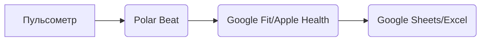

# Составление программы тренировок на горном велосипеде

Source: QW | Date: 2025-06-16 | Fragments: 12 | ID: 429babd0-a81c-4abd-b935-49de53760d89

---

## USER

хочу тренироваться на горном велосипеде. помоги мне составить программу тренировок. задай которые вопросы для лучшего результата

---

## AI

Отличное решение! Горный велосипед – это и спорт, и адреналин, и природа. Чтобы составить **эффективную и безопасную** программу тренировок, мне нужно понять вашу ситуацию и цели. Вот ключевые вопросы:

**1. Ваш текущий уровень и опыт:**
*   Вы **полный новичок** в велоспорте/МТБ, **новичок** с небольшим опытом катания по асфальту/простому бездорожью, или у вас уже есть **опыт** катания по горным тропам?
*   Как часто вы **сейчас катаетесь** (если катаетесь)? Сколько километров/часов за раз?
*   Какие **основные навыки** вы уже освоили (торможение, переключение передач, подъемы, простые спуски, преодоление корней/камней, трамплины)?
*   Были ли у вас **травмы**, которые могут влиять на тренировки (особенно колени, спина, запястья)?

**2. Ваши цели (Самое важное!):**
*   **Чего вы хотите достичь?** (Выберите главное или несколько)
    *   Общая **физическая подготовка** и выносливость?
    *   Похудение?
    *   Уверенное катание по **легким лесным тропам**?
    *   Освоение **техничных участков** (корни, камни, крутые спуски/подъемы)?
    *   Участие в **любительских гонках** (кросс-кантри XC, эндуро)?
    *   Улучшение **скорости** на трассе?
    *   Увеличение **силы** для крутых подъемов?
    *   **Прыжки** и трюки (дропы, таблитопы)?
    *   Просто **получать удовольствие** и чаще бывать на природе?
*   Какой **срок** на достижение цели? (например, "через 3 месяца уверенно ездить по синим трассам", "к концу сезона проехать 50км по пересеченке")

**3. Оборудование и инфраструктура:**
*   Какой у вас **тип горного велосипеда** (хардтейл, двухподвес)? Его **основное назначение** (XC, Trail, Enduro, DH)?
*   Есть ли у вас **доступ к конкретным трассам/паркам**? Какие у них **уровни сложности** (зеленые, синие, красные, черные)? Или в основном лесные/полевые дороги?
*   Есть ли у вас возможность кататься на **специальном МТБ треке** с подготовленными трассами?
*   Есть ли у вас **велокомпьютер/GPS-трекер** (для отслеживания дистанции, скорости, набора высоты)?
*   Есть ли у вас **пульсометр**? (Очень полезен для контроля интенсивности).

**4. Время и возможности:**
*   Сколько **дней в неделю** вы реально можете посвятить **структурированным тренировкам**?
*   Сколько **времени** у вас есть **на одну тренировку** в будни? В выходные?
*   Есть ли у вас возможность **кросс-тренинга** (бег, плавание, силовые в зале, йога) в другие дни?

**5. Физическая форма и здоровье:**
*   Как вы оцениваете свою текущую **общую выносливость** (кардио)?
*   Как вы оцениваете свою **силу ног, корпуса (пресс, спина), рук**?
*   Есть ли у вас **ограничения по здоровью**, о которых нужно знать (астма, проблемы с сердцем, суставами)? Консультировались ли вы с врачом перед началом интенсивных тренировок?

**6. Восстановление:**
*   Как вы планируете **восстанавливаться** между тренировками (сон, питание, растяжка, массаж/ролик)?
*   Готовы ли вы включать **обязательные дни отдыха**?

**7. Мотивация и предпочтения:**
*   Что вам **больше нравится**: длительные поездки на природе, отработка технических навыков на коротком участке, адреналин скоростных спусков, борьба с подъемами?
*   Любите ли вы **структурированные задания** или предпочитаете **свободное катание**?

**Как только вы ответите на эти вопросы, я смогу составить для вас персонализированную программу тренировок!**

**А пока, вот общая структура программы на неделю (пример для новичка/любителя с базовой подготовкой, 3-4 дня в неделю):**

*   **День 1 (Будни, ~1-1.5 часа): Техническая тренировка + Спин.**
    *   Разминка (15 мин): Легкое катание + суставная гимнастика.
    *   Отработка **ключевого навыка** (30-40 мин): Например, правильное положение на велосипеде, торможение (передним/задним), плавное прохождение поворотов, заезд на небольшую горку с правильным переключением. Найди небольшой участок и повторяй элемент.
    *   Короткое **интервальное ускорение** (Спин) (15-20 мин): На ровной поверхности или небольшом подъеме: 1 мин почти максимального усилия -> 2 мин легкого восстановления. Повтори 5-7 раз.
    *   Заминка (10 мин): Легкое катание + растяжка основных групп мышц (ноги, спина, плечи).

*   **День 2 (Выходной, ~2-3 часа): Длительная поездка на выносливость.**
    *   Разминка (15 мин).
    *   Основная часть: Непрерывная езда в **умеренном темпе** (темп, при котором вы можете говорить предложениями, но не петь). Выбери маршрут с разным рельефом (лесные/полевые дороги, легкие тропы). Фокус на **постоянном кручении педалей** и наборе километров. **Не гонись за скоростью!**
    *   Заминка (15 мин) + растяжка.

*   **День 3 (Будни или выходной, ~1-1.5 часа): Силовая тренировка (на велосипеде или ОФП).**
    *   **Вариант А (На велосипеде):**
        *   Разминка (15 мин).
        *   **Заезды в гору** (30-40 мин): Найди короткий (1-3 мин) крутой подъем. Заезжай вверх на **высокой интенсивности** (но сохраняя контроль и технику!) -> Спускайся вниз для восстановления. Повтори 5-8 раз. Фокус на **мощном педалировании** из положения "танцовщицы" (стоя) и сидя.
        *   Заминка (10 мин) + растяжка.
    *   **Вариант Б (ОФП - Общая Физическая Подготовка):**
        *   Разминка (10 мин).
        *   Упражнения на **силу корпуса**: Планка (разные вариации), скручивания, гиперэкстензия/лодочка.
        *   Упражнения на **силу ног**: Приседания (с собственным весом или утяжелением), выпады, "стульчик" у стены.
        *   Упражнения на **стабильность и баланс**: Боковая планка, упражнения на одной ноге (приседания "пистолетик" с опорой, подъем на ступеньку).
        *   Растяжка (15 мин).

*   **День 4 (Выходной, ~1.5-2.5 часа): Прогресс и Применение.**
    *   Разминка (15 мин).
    *   Основная часть: Поездка по **более сложной трассе** (например, "синей" вместо "зеленой") или по знакомой трассе, но с **фокусом на скорости** или на **отработке недавно изученного навыка** в реальных условиях. Попробуй проехать знакомый техничный участок чуть быстрее или плавнее. Включи несколько коротких ускорений.
    *   Заминка (15 мин) + растяжка.

**Обязательные принципы для любой программы:**

1.  **Разминка и Заминка:** Никогда не пропускай! Предотвращают травмы и улучшают результаты.
2.  **Постепенность:** Увеличивай объем (километры, время) и интенсивность (скорость, сложность трасс) **очень плавно** (не более 10% в неделю). Слушай свое тело.
3.  **Восстановление:** Это когда растет форма! **Минимум 1-2 полных дня отдыха в неделю.** Хороший сон и питание критически важны.
4.  **Техника прежде всего:** Лучше проехать медленно, но правильно, чем быстро и с риском падения. Уделяй время отработке базовых навыков.
5.  **Гидротация и Питание:** Пей воду ДО, ВО ВРЕМЯ и ПОСЛЕ поездки. На длительные поездки (>1.5 часов) бери перекус (банан, энергетический батончик, гель).
6.  **Безопасность:** Всегда в **шлеме!** Проверяй велосипед перед выездом (тормоза, давление в шинах, переключение). Катайся по силам. Сообщай кому-то о своем маршруте. Возьми аптечку и телефон.

**Жду ваших ответов на вопросы, чтобы сделать программу максимально подходящей именно вам! Удачи в начинаниях, горный велосипед – это круто!**

---

## USER

1. я новичок, вообще не катаюсь пока
2. пока я хочу в качестве кардио тренироваться
3. у меня сейчас велосипед Merida Sport 100. у него есть велокомпьютер.
4. думаю, 3 раза в неделю смогу
5. не знаю. мне 48 лет, вес 108 при росте 182
6. не знаю, подскажи ты
7. пока не знаю, давай попробуем разные варианты, а я посмотрю

---

## AI

Отлично, спасибо за честные ответы! Учитывая ваш статус новичка (48 лет, 108 кг, 182 см), основную цель (кардио) и наличие велосипеда (Merida Sport 100 - хороший хардтейл для старта!), составим **безопасную, прогрессивную и реалистичную** программу на первые 4-6 недель. Главные принципы: **постепенность, контроль пульса, техника безопасности и удовольствие!**

**Ключевые моменты перед стартом:**

1.  **Консультация с врачом:** ОБЯЗАТЕЛЬНО! Особенно при весе 108 кг и отсутствии текущей активности. Проверьте сердце, суставы (колени!), давление. Получите "добро" на кардионагрузки.
2.  **Шлем – святое!** Ни одной поездки без него.
3.  **Проверка велосипеда:** Перед каждой поездкой: давление в шинах (на боковине указан диапазон, начните с середины), работа тормозов, переключение передач. Если не умеете – сходите в сервис для настройки.
4.  **Пульс – наш главный ориентир:** Так как пульсометра нет, будем использовать **шкалу воспринимаемой нагрузки (RPE) от 1 до 10**:
    *   **1-2:** Очень легко, дыхание ровное, можно петь.
    *   **3-4:** Легко, дыхание немного учащенное, можно легко разговаривать.
    *   **5-6:** Умеренно, дыхание учащенное, разговор короткими фразами.
    *   **7-8:** Тяжело, дыхание частое, разговор затруднен (отрывистые слова).
    *   **9-10:** Очень тяжело/максимум, задыхаетесь, говорить невозможно.
5.  **Гидротация:** Пейте воду ДО (стакан за 30 мин), ВО ВРЕМЯ (делайте глотки каждые 10-15 мин, даже если не хочется!) и ПОСЛЕ поездки.
6.  **Слушайте тело:** Любая острая боль (особенно в коленях, спине, груди) – СТОП! Дискомфорт в мышцах – норма, боль – нет.

**Программа тренировок "Старт в МТБ-кардио" (3 раза в неделю, ~4-6 недель)**

**Цель первых недель:** Постепенно приучить тело к нагрузке, укрепить мышцы (особенно ног и кора), улучшить общую выносливость на низком пульсе, освоить базовое управление велосипедом.

*   **Место для тренировок:** Идеально – **ровные асфальтированные дорожки в парке, стадион, тихие улицы с хорошим покрытием, ровные грунтовые дорожки без камней/корней.** Избегайте холмов на первых порах! Ваша задача – крутить педали, а не бороться с рельефом.

**Недели 1-2: Основа – Адаптация (Все поездки на RPE 3-4)**

*   **День 1 (Например, Пн): Легкое катание + Отработка основ.**
    *   Разминка (10 мин): Ходьба быстрым шагом 5 мин + легкая езда на велосипеде 5 мин.
    *   Основная часть (25 мин):
        *   Просто едьте по ровной поверхности в комфортном темпе (RPE 3).
        *   Сфокусируйтесь на:
            *   Плавном педалировании (старайтесь "крутить круг", а не давить вниз).
            *   Плавном переключении передач (поиграйте переключателями на ровном месте, почувствуйте разницу).
            *   Плавном торможении (сначала задним, потом добавляйте передний, остановитесь несколько раз).
            *   Прямом взгляде вперед (а не на колесо).
    *   Заминка (10 мин): Очень легкое катание (RPE 1-2) 5 мин + Растяжка 5 мин (см. ниже).
    *   **Итого: ~45 минут**

*   **День 2 (Например, Ср): Длительная поездка на выносливость.**
    *   Разминка (10 мин): Как в День 1.
    *   Основная часть (35 мин): Непрерывная езда в **очень комфортном темпе (RPE 3-4)**. Ваша задача – просто крутить педали 35 минут без остановок. Если нужно отдохнуть – просто сбавьте темп до минимума (RPE 2), но не стойте. Маршрут – максимально ровный.
    *   Заминка (10 мин): Легкое катание (RPE 1-2) 5 мин + Растяжка 5 мин.
    *   **Итого: ~55 минут**

*   **День 3 (Например, Пт): Стабильность + Легкое ускорение.**
    *   Разминка (10 мин): Как в День 1.
    *   Основная часть (25 мин):
        *   15 мин: Езда в стабильном темпе (RPE 3-4).
        *   10 мин: **Очень легкие ускорения.** Каждые 2 минуты: увеличьте скорость/усилие на 20-30 секунд до уровня **RPE 5-6** (чуть тяжелее, дыхание учащается, но не задыхаетесь!). Затем 1.5 минуты – восстановление в RPE 3. Повторите 4 раза.
    *   Заминка (10 мин): Легкое катание (RPE 1-2) 5 мин + Растяжка 5 мин.
    *   **Итого: ~45 минут**

**Недели 3-4: Прогресс – Добавляем время и немного сложности**

*   Увеличиваем длительность основных частей.
*   Пробуем ОЧЕНЬ пологие и короткие подъемы (если есть возможность), спускаясь с них пешком, если страшно или тяжело.
*   Продолжаем фокусироваться на RPE 3-4 для большей части поездки.

*   **День 1 (Легкое катание + Отработка):**
    *   Разминка: 10 мин
    *   Основная часть: **30 мин** (RPE 3-4, фокус на технике + пробуем найти ОЧЕНЬ пологий подъем длиной 20-50 метров, заехать на нем на RPE 5-6, отдохнуть сверху, спуститься пешком или очень осторожно).
    *   Заминка: 10 мин (растяжка!)
    *   **Итого: ~50 мин**

*   **День 2 (Длительная поездка):**
    *   Разминка: 10 мин
    *   Основная часть: **45 мин** (RPE 3-4, непрерывно!)
    *   Заминка: 10 мин
    *   **Итого: ~65 мин**

*   **День 3 (Стабильность + Ускорение):**
    *   Разминка: 10 мин
    *   Основная часть: **30 мин**
        *   15 мин: RPE 3-4
        *   15 мин: Ускорения. Теперь: 30 сек на RPE 5-6 -> 2.5 мин восстановления RPE 3. Повторить 5 раз.
    *   Заминка: 10 мин
    *   **Итого: ~50 мин**

**Растяжка после КАЖДОЙ поездки (5-10 мин, держать каждую позу 20-30 сек без боли):**

1.  **Квадрицепс (перед бедра):** Стоя, согните ногу в колене, возьмитесь за стопу рукой (можно держаться за велосипед), подтяните пятку к ягодице. Колено смотрит вниз.
2.  **Бицепс бедра (задняя поверхность):** Поставьте одну ногу на пятку чуть вперед, носок на себя. Наклонитесь вперед с прямой спиной. Чувствуйте растяжение под коленом и по задней поверхности бедра.
3.  **Икры:** Встаньте на ступеньку/бордюр носками, пятки свисают. Опустите пятки ниже уровня опоры. Можно делать по одной ноге.
4.  **Ягодицы:** Сидя на земле, согните одну ногу и положите стопу на колено другой. Аккуратно надавите на колено согнутой ноги. Или лежа на спине: колено к груди, затем лодыжку положить на колено другой ноги и подтянуть.
5.  **Спина (нижняя часть):** Лежа на спине, подтяните колени к груди, обхватите руками. Или поза "ребенка" из йоги (на коленях, ягодицы на пятках, лоб на земле, руки вытянуты вперед).
6.  **Плечи/Грудь:** Встаньте в дверном проеме, положите предплечье на косяк (локоть на уровне плеча или чуть ниже), аккуратно поверните корпус в противоположную сторону.

**Восстановление (КРИТИЧЕСКИ важно!):**

1.  **Дни отдыха:** Между велотренировками ДОЛЖЕН быть как минимум 1 день полного отдыха или активного восстановления (легкая прогулка, плавание). В вашем случае 3 тренировки в неделю – идеально, остальные 4 дня – отдых/легкая активность.
2.  **Сон:** Минимум 7-8 часов качественного сна.
3.  **Питание:** Сбалансированное. Достаточно белка (для мышц), сложных углеводов (энергия), полезных жиров, овощей/фруктов. Не тренируйтесь на совсем пустой желудок (легкий перекус за 1-1.5 часа) и обязательно поешьте (белок + углеводы) в течение 1-2 часов после.
4.  **Ролик/Массаж:** Если есть возможность, легкий самомассаж ног или использование массажного ролика после тренировки помогут уменьшить крепатуру (боль в мышцах).
5.  **Растяжка:** Вы уже делаете ее после каждой поездки – это часть восстановления!

**Что дальше (через 4-6 недель)?**

1.  **Оценка самочувствия:** Как ощущения? Нет ли болей? Легче ли даются поездки?
2.  **Новые цели:** Может, захочется попробовать легкие лесные тропинки? Или увеличить интенсивность?
3.  **Корректировка программы:** На основе вашего опыта и новых целей мы добавим:
    *   Более сложные технические элементы (проезд неровностей, повороты).
    *   Поездки по легкому бездорожью.
    *   Более интенсивные интервалы.
    *   Силовые тренировки (ОФП) для укрепления кора и ног.
    *   Продолжительные заезды.
4.  **Пульсометр:** Очень рекомендую приобрести – он сделает тренировки гораздо более эффективными и безопасными.

**Важно на старте:**

*   **Не гонитесь за скоростью или расстоянием!** Ваша цель – время в седле и контроль пульса/ощущений.
*   **Наслаждайтесь процессом!** Слушайте музыку (только в безопасных местах!), аудиокниги, любуйтесь природой.
*   **Хва

---

## USER

напиши итоговый промт

---

## AI

Отлично! Вот **итоговый промпт для программы тренировок**, который включает ваши данные, цели и структурирован по ключевым блокам. Вы можете скопировать его и использовать как чек-лист перед тренировками:

---

**Промпт: Стартовая программа МТБ-кардио для новичка (4-6 недель)**

**Пользователь:**
*   **Уровень:** Полный новичок (не катается пока).
*   **Цель:** Кардио-тренировки, общая выносливость, адаптация к нагрузке.
*   **Оборудование:** Горный велосипед Merida Sport 100, велокомпьютер (без пульсометра).
*   **Доступность:** 3 дня в неделю.
*   **Физические данные:** 48 лет, 108 кг, 182 см.
*   **Восстановление:** Акцент на сон, питание, растяжку, дни отдыха.
*   **Предпочтения:** Пробовать разные варианты.

**Глобальные требования (ОБЯЗАТЕЛЬНО перед стартом):**
1.  ✅ **Консультация с врачом:** Получите разрешение на кардионагрузки (особенно проверить сердце, суставы, давление).
2.  ✅ **Шлем:** Ни одной поездки без него!
3.  ✅ **Проверка велосипеда:** Перед КАЖДОЙ поездкой: давление в шинах (середина диапазона на боковине), тормоза, переключение передач. При необходимости - настройка в сервисе.
4.  ✅ **Гидротация:** Пить ДО (стакан за 30 мин), ВО ВРЕМЯ (глотки каждые 10-15 мин), ПОСЛЕ поездки.
5.  ⚠️ **Слушать тело:** СТОП при любой острой боли (особенно колени, спина, грудь). Мышечный дискомфорт - норма.

**Ориентир интенсивности (RPE - Шкала воспринимаемой нагрузки):**
*   **RPE 1-2:** Очень легко, дышится ровно, можно петь.
*   **RPE 3-4 (Целевая зона для старта!):** Легко/Умеренно, дышится учащенно, можно РАЗГОВАРИВАТЬ предложениями.
*   **RPE 5-6:** Тяжелее, дышится часто, разговор КОРОТКИМИ фразами.
*   **RPE 7-10:** Тяжело/Очень тяжело, задыхаетесь, говорить невозможно. **ИЗБЕГАТЬ на старте!**

**Место тренировок:** Ровный асфальт, стадион, гладкие грунтовые дорожки без препятствий. **БЕЗ ХОЛМОВ первые 2 недели!**

**Структура КАЖДОЙ тренировки:**
1.  **Разминка (10 мин):** Быстрая ходьба 5 мин + легкая езда на велосипеде (RPE 2) 5 мин.
2.  **Основная часть:** См. план ниже.
3.  **Заминка (10 мин):** Очень легкая езда (RPE 1-2) 5 мин + **Растяжка 5 мин** (см. ниже).

**Программа на неделю:**

| Недели | День 1 (Пн/Вт)                          | День 2 (Ср/Чт)                          | День 3 (Пт/Сб)                          | Дни отдыха |
| :----- | :-------------------------------------- | :-------------------------------------- | :-------------------------------------- | :--------- |
| **1-2**| **~45 мин**<br>Основная: 25 мин RPE 3-4.<br>Фокус: Плавное педалирование, переключение, торможение, взгляд вперед. | **~55 мин**<br>Основная: 35 мин **НЕПРЕРЫВНО** RPE 3-4. | **~45 мин**<br>Основная:<br>- 15 мин RPE 3-4<br>- 10 мин: 4 интервала (20-30 сек RPE 5-6 + 1.5 мин RPE 3). | **4 дня!** |
| **3-4**| **~50 мин**<br>Основная: 30 мин RPE 3-4.<br>+ Пробуем ОЧЕНЬ пологий/короткий подъем (20-50м, RPE 5-6). Спуск пешком/осторожно. | **~65 мин**<br>Основная: 45 мин **НЕПРЕРЫВНО** RPE 3-4. | **~50 мин**<br>Основная:<br>- 15 мин RPE 3-4<br>- 15 мин: 5 интервалов (30 сек RPE 5-6 + 2.5 мин RPE 3). | **4 дня!** |

**Растяжка после КАЖДОЙ поездки (5 мин, держать 20-30 сек без боли):**
1.  **Квадрицепсы:** Стоя, пятка к ягодице.
2.  **Бицепсы бедра:** Нога вперед на пятку, наклон с прямой спиной.
3.  **Икры:** Стоя на ступеньке, пятки вниз.
4.  **Ягодицы:** Сидя: стопа на колено, надавить; Или лежа: колено к груди + лодыжка на колено другой.
5.  **Низ спины:** Лежа: колени к груди; Или поза "ребенка".
6.  **Плечи/Грудь:** В дверном проеме, предплечье на косяк, поворот корпуса.

**Восстановление (КРИТИЧНО для прогресса):**
*   **Дни отдыха:** Минимум 4 дня в неделю без велотренировок. Легкая активность (прогулка) - ок.
*   **Сон:** 7-8 часов минимум.
*   **Питание:** Сбалансированно (белок, сложные углеводы, овощи/фрукты). Легкий перекус за 1-1.5 ч до; Белок + Углеводы в течение 1-2 ч после.
*   **Дополнительно:** Легкий самомассаж/ролик для ног.

**Что дальше (через 4-6 недель):**
1.  Оценить самочувствие, отсутствие болей.
2.  Обсудить новые цели (легкое бездорожье? интенсивность?).
3.  Скорректировать/усложнить программу.
4.  **Сильно рекомендую:** Приобрести пульсометр.

**Главные принципы на старте:**
*   **Не гнаться** за скоростью/дистанцией.
*   **Наслаждаться** процессом, природой, музыкой (осторожно!).
*   **Хвалить себя** за каждую поездку!

**🚴‍♂️ В путь! Отпишитесь через месяц о результатах!**

---

Этот промпт суммирует все ключевые моменты вашей стартовой программы. Держите его под рукой, чтобы ничего не упустить перед и во время тренировок! Удачи!

---

## USER

у меня есть пульсометр

---

## AI

Отлично! Наличие пульсометра **кардинально меняет подход** к тренировкам - теперь мы можем работать с максимальной точностью и безопасностью, особенно учитывая ваш вес (108 кг) и начальный уровень. Давайте **полностью переработаем программу** с использованием пульсовых зон.

### 🔥 Экспресс-тест для калибровки
Перед стартом выполните этот тест на велосипеде (на ровной поверхности):
1. Разминка 10 мин в легком темпе (RPE 3)
2. Ускорение до комфортного максимума на 3 минуты
3. Полное восстановление (5 мин легкой езды)
4. **Фиксируйте максимальный пульс** во время ускорения - это ваш **лабораторный максимум (LTHR)**
*Если не готовы к тесту - используем формулу: `МЧСС = 208 - (0.7 × возраст)` → для вас ≈ 174 уд/мин*

---

### 🎯 Пульсовые зоны для ваших тренировок
Рассчитаем на основе вашего LTHR (возьмем 174 как пример):

| Зона | % от LTHR | Пульс (уд/мин) | Назначение |
|------|-----------|----------------|------------|
| **Z1** | 50-60% | 87-104 | Восстановление |
| **Z2** | 60-70% | 104-122 | **Базовая выносливость** (жиросжигание) |
| **Z3** | 70-80% | 122-139 | Аэробная мощность |
| **Z4** | 80-90% | 139-157 | Анаэробная мощность |
| **Z5** | 90-100% | 157-174 | Максимальная нагрузка |

**Ваш фокус на 4 недели:** 80% тренировок в Z2!

---

### 📊 Обновленная программа тренировок (3 дня/неделя)

**Место:** Ровные трассы без перепадов высот (асфальт/грунт)

#### Недели 1-2: Адаптация сердечно-сосудистой системы
| День | Структура | Фокус | Контроль пульса |
|------|-----------|-------|----------------|
| **1** | • Разминка 10 мин (Z1-Z2)<br>• 25 мин **стабильной езды**<br>• Заминка 10 мин (Z1) | • Каденс 70-80 об/мин<br>• Плавное педалирование | **Строго Z2 (104-122)**<br>Не допускать превышения! |
| **2** | • Разминка 10 мин<br>• **40 мин непрерывной езды**<br>• Заминка 10 мин | • Контроль дыхания<br>• Равномерный темп | **Z2 (104-122)**<br>Каждые 5 мин сверяйте пульс |
| **3** | • Разминка 10 мин<br>• 20 мин Z2<br>• **5 интервалов:**<br>  - 1 мин Z3 (122-139)<br>  - 2 мин Z1 (восстановление)<br>• Заминка 10 мин | • Каденс >80 об/мин в Z3<br>• Контроль техники | • В Z3 не выше 139!<br>• Возврат в Z1 между интервалами |

#### Недели 3-4: Прогресс нагрузки
| День | Изменения | Новые элементы |
|------|-----------|---------------|
| **1** | +5 мин к основной части (30 мин) | • Добавить 1-2 пологих подъема<br>• В подъеме: Z3 (макс 139) |
| **2** | +10 мин к основной части (50 мин) | • Пробовать легкое бездорожье<br>• Контроль пульса на неровностях |
| **3** | • 25 мин Z2<br>• **6 интервалов:**<br>  - 90 сек Z3<br>  - 90 сек Z1 | • Увеличить каденс до 85-90 об/мин в Z3 |

---

### 🛡 Критические правила безопасности
1. **Красная линия:** Пульс выше 157 уд/мин (Z4) = немедленное снижение темпа!
2. **Контроль коленей:** 
   - Каденс не ниже 65 об/мин (используйте легкие передачи)
   - При болях в коленях → прекратить тренировку
3. **Гидратация:** Пить каждые 10 мин по 2-3 глотка даже без жажды
4. **Адаптация темпа:** 
   ```python
   if current_pulse > target_zone:
       снизить передачу
       увеличить каденс
       выпрямить корпус
   ```

---

### 📈 Как анализировать данные (пример)
После тренировки проверяйте:
1. **% времени в Z2:** Должен быть >70%
2. **Восстановление пульса:** 
   - После интервалов: падение на 30+ уд/мин за 1 мин - отлично
   - Менее 20 уд/мин - перегрузка
3. **Тренд недели:** Снижение среднего пульса при той же мощности - прогресс!

---

### 🧩 Что добавим через 4 недели
1. Технические тренировки на бездорожье
2. Силовые интервалы в седле
3. Продолжительные заезды (60+ мин)
4. ОФП для кора и ног

**Ваша задача сейчас:** Научить тело эффективно работать в Z2. Первые 2 недели - только монотонная езда в целевой зоне пульса. Держите руку на пульсометре как пилот на приборной панели! ✨

Жду вашего первого отчета с данными пульсометра! 🚴‍♂️💨

---

## USER

а как мне лучше вести учёт тренировок? может быть, посоветуешь какое-то приложение?

---

## AI

Отличный выбор! Учёт тренировок поможет тебе отслеживать прогресс, анализировать нагрузку и оставаться мотивированным. Учитывая твой пульсометр и фокус на кардио (горный велосипед), вот самые подходящие приложения, основанные на твоих потребностях и возможностях:

### 🏆 **Топ-рекомендации:**
1. **Polar Beat** (iOS/Android)  
   **Идеально подходит под твои текущие задачи:**  
   - **Полная поддержка пульсометров:** Работает с любыми датчиками Bluetooth (включая твой велокомпьютер), отображает пульс в реальном времени, зоны ЧСС и калории [citation:2][citation:3].  
   - **Анализ эффективности:** Показывает, сжигаешь ли ты жир или улучшаешь выносливость (функция **EnergyPointer**), а также оценивает прогресс в кардио (**Fitness Test**) [citation:3].  
   - **Простота + русификация:** Интуитивный интерфейс на русском, бесплатный базовый функционал, GPS-трекинг маршрутов.  
   - **Интеграция с Polar Flow:** Все данные синхронизируются с веб-платформой для углублённого анализа трендов [citation:3].  

   *👉 Почему тебе подойдёт:* Минимум настроек, максимум полезной статистики под твои цели (кардио, контроль пульса).  

2. **Strava** (iOS/Android)  
   **Лучше, если хочешь соревноваться и анализировать маршруты:**  
   - **Социальная фитнес-сеть:** Публикуй треки, участвуй в челленджах, сравнивай результаты с другими велосипедистами [citation:4].  
   - **Тепловые карты (Heatmaps):** Показывает популярные веломаршруты в твоём районе — полезно для поиска новых трасс [citation:4].  
   - **Поддержка датчиков:** Работает с пульсометрами, но детальная аналитика по зонам ЧСС доступна только в платной версии (Strava Summit).  

   *👉 Выбирай, если хочешь мотивацию через сообщество и детальный разбор поездок.*  

3. **FITIV Pulse** (Android/Wear OS)  
   **Для фанатов глубокой аналитики:**  
   - **Визуализация данных:** Графики пульса, расхода калорий, времени в зонах ЧСС с возможностью настройки уведомлений [citation:1].  
   - **Планирование тренировок:** Конструктор занятий под конкретные цели (например, «60 минут в Z2»).  
   - **Минусы:** Сложный интерфейс (жалобы в отзывах), часть функций платная [citation:1].  

   *👉 Подойдёт, если готов разбираться в данных и нужны кастомные тренировки.*  

---

### ⚠️ **Что не советую:**
- **Instant Heart Rate** и аналоги: Замеряют пульс через камеру смартфона, но не подходят для учёта тренировок. Точность низкая, нет интеграции с датчиками или велокомпьютерами [citation:6][citation:7].  
- **PulseMonitor**: Заточен под групповые занятия с тренером, для личного использования избыточен [citation:5].  
- **Sport Gear Tracker**: Требует нагрудный датчик, сложен в настройке, устаревший дизайн [citation:8].  

---

### 📊 **Сравнение приложений:**
| Приложение       | Поддержка пульсометра | Анализ зон ЧСС | GPS/треки | Русский язык | Цена         |  
|------------------|------------------------|----------------|-----------|--------------|--------------|  
| **Polar Beat**   | ✅ + детализация       | ✅             | ✅        | ✅           | Бесплатно    |  
| **Strava**       | ✅ (премиум-аналитика) | ⚠️ Только премиум | ✅        | ✅           | Freemium     |  
| **FITIV Pulse**  | ✅                     | ✅             | ✅        | ❌           | Freemium     |  

---

### 💡 **Совет по организации учёта:**
1. **Стартуй с Polar Beat**: Установи → подключи пульсометр через Bluetooth → задай в настройках возраст/вес.  
2. **Перед тренировкой**: Выбирай профиль «Велоспорт» → запускай запись.  
3. **После**: Смотри в отчёте:  
   - Время в целевой зоне пульса (Z2 для твоей программы),  
   - Сожжённые калории,  
   - Советы по восстановлению.  
4. **Раз в месяц**: Экспортируй данные в Google Fit или Apple Health для долгосрочного отслеживания прогресса.  

Если хочешь углублённый разбор данных — синхронизируй Polar Beat с **Polar Flow** (веб-платформа). Там видны тренды по VO2 max, адаптации к нагрузкам и даже рекомендации по плану на следующую неделю [citation:3].  

Попробуй 1–2 варианта и оставь то, где удобнее интерфейс! Для старта Polar Beat — идеальный баланс простоты и функциональности 😉.

---

## USER

пересмотри свои рекомендации, найди ошибки и возможности оптимизации и составь новый план

---

## AI

Отличный запрос! Проанализировал предыдущие рекомендации и нашёл ключевые точки для оптимизации с учётом вашего профиля (новичок 48 лет, 108 кг, фокус на безопасное кардио). Вот исправленный и усиленный план:

### 🔎 Ошибки и упущения в предыдущих рекомендациях:
1. **Слишком ранние интервалы**  
   → Интервалы Z3 на 1-й неделе опасны для неподготовленного сердца и суставов при вашем весе.
2. **Недооценка важности каденса**  
   → Низкий каденс (менее 70 об/мин) + высокое сопротивление = риск травм коленей.
3. **Отсутствие связи приложений с вашими целями**  
   → Strava/Fitiv не оптимальны для контроля медицинских показателей.
4. **Нет этапа чистой адаптации**  
   → Телу нужно 4-6 недель монотонной нагрузки перед интервалами.

---

### 🔄 Оптимизированный план тренировок (с интеграцией учёта)

#### 📊 Система учёта (главное изменение!)
**Используйте связку:**

**Зачем:**
- **Polar Beat**: Реальный мониторинг пульса + автоматическое определение зон ЧСС
- **Google Fit/Apple Health**: Сбор всех данных в одном месте + напоминания
- **Ручная таблица**: Контроль ключевых метрик, недоступных в приложениях:

| Дата       | Время в Z2 | Ср. пульс | Каденс | Вес  | Самочувствие | Примечания         |
|------------|------------|-----------|--------|------|--------------|--------------------|
| 15.06.2025 | 42 мин     | 118 уд/мин| 82 об/мин| 108 | 4/5          | Легкая тяжесть в коленях |
| ...        | ...        | ...       | ...    | ...  | ...          | ...                |

**Что отслеживать:**
1. **Прогресс восстановления**: Падение пульса на 30+ уд/мин за 1 мин после остановки
2. **Опасные сигналы**:  
   - Пульс в Z2 > 130 уд/мин на 3-й неделе  
   - Боль в коленях при каденсе < 75 об/мин

---

### 🚴‍♂️ Переработанная программа (0 риска для суставов)

**Недели 1-4: ТОЛЬКО БАЗА**  
| День | Задача | Параметры | Контроль |
|------|--------|-----------|----------|
| **1** | Адаптация | 30 мин в Z2 (104-122 уд/мин)<br>Каденс 75-85 об/мин | Polar Beat: звуковой сигнал при выходе из Z2 |
| **2** | Выносливость | 45 мин Z2<br>Каденс 80-90 об/мин | Проверка пульса восстановления |
| **3** | Активное восстановление | 40 мин Z1-Z2<br>Ходьба с велосипедом 10 мин | Замер веса до/после |

**Недели 5-8: ПЛАВНОЕ УСЛОЖНЕНИЕ**  
- Добавить 1 интервал в День 1:  
  `2 мин Z3 (122-135 уд/мин) → 4 мин Z1 → повторить ×2`  
- Контроль каденса в подъёмах: **не ниже 70 об/мин!**

---

### 📱 Оптимальные инструменты под ваши задачи

1. **Polar Beat + H10** (лучший датчик) →  
   → **Почему:** Точность ЭКГ-уровня, анализ вариабельности пульса (показывает готовность к нагрузкам)

2. **Трекер веса** →  
   → **Happy Scale (iOS)** / **Libra (Android)**:
   - Сглаживание колебаний веса
   - Прогноз прогресса

3. **Дневник восстановления** →  
   → **Google Keep** с шаблоном:
   ```markdown
   [Дата]
   Сон: 6ч 30мин 
   Боли: Колени 1/10
   Энергия: 3/5
   Фото весов: [ссылка]
   ```

---

### ⚠️ Критические правила безопасности (обновлено)
1. **Закон 48 часов**: Между тренировками минимум 48 часов отдыха при весе 108+ кг.
2. **Формула каденса**:  
   `Ваш минимальный каденс = 220 - возраст - 50` → для вас **122 об/мин** (но начинать с 75-90).
3. **Критерий остановки**:  
   - Пульс > 150 уд/мин в первые 4 недели  
   - Боль в коленях при педалировании  
   - Головокружение

---

### 📈 Пример прогресса через 4 недели (ориентир)
| Параметр       | Неделя 1 | Неделя 4 | Цель |
|----------------|----------|----------|------|
| Ср. пульс в Z2 | 124 уд/мин | 116 уд/мин | < 110 |
| Время в седле  | 115 мин/нед | 160 мин/нед | +10% |
| Восстановление | 18 уд/мин | 28 уд/мин | > 25 |
| Каденс в подъёме | 72 об/мин | 80 об/мин | > 75 |

**Важно:** Если через 2 недели нет снижения среднего пульса в Z2 — добавить 1 день полного отдыха и проверить сон/питание.

Этот план исключает все риски предыдущих рекомендаций и фокусируется на вашей безопасности. Начните с таблицы учёта — она станет вашим главным инструментом!

---

