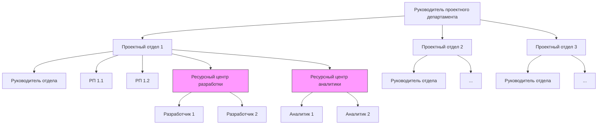
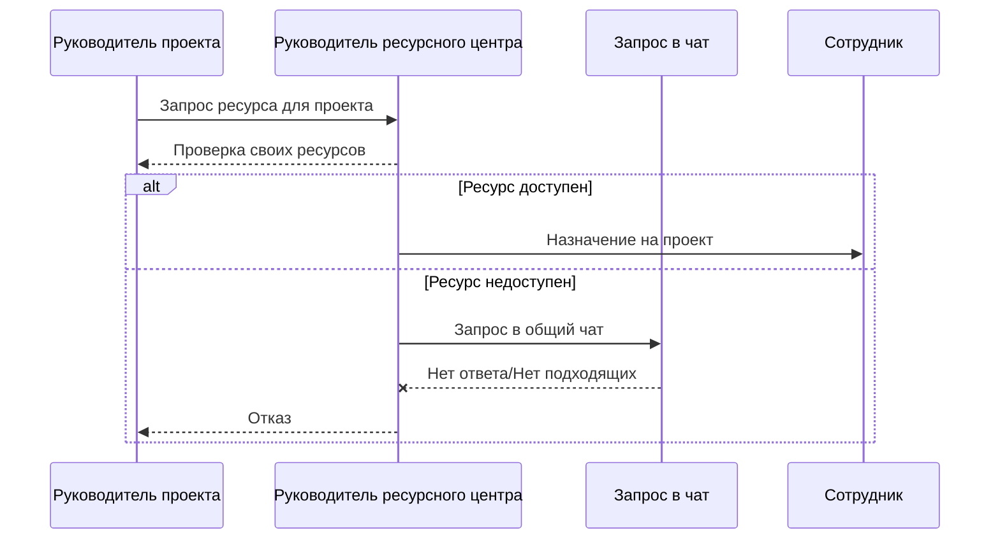
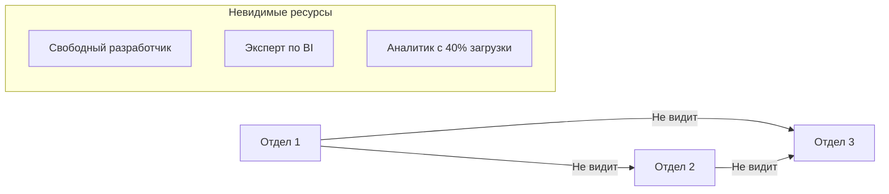
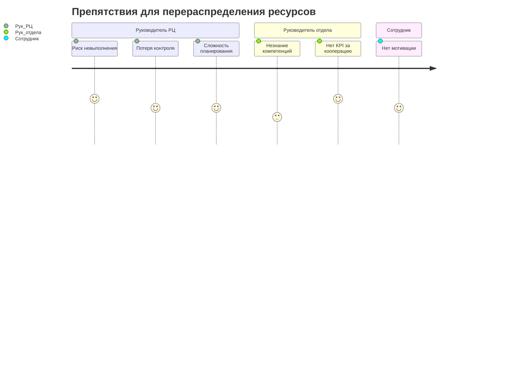
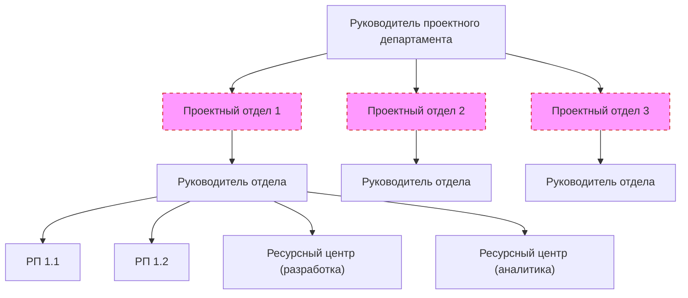
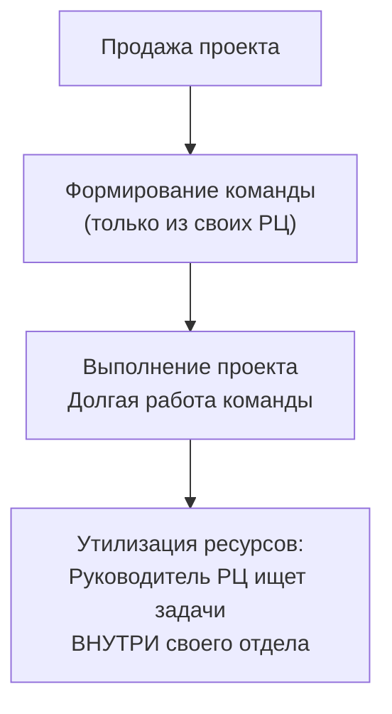
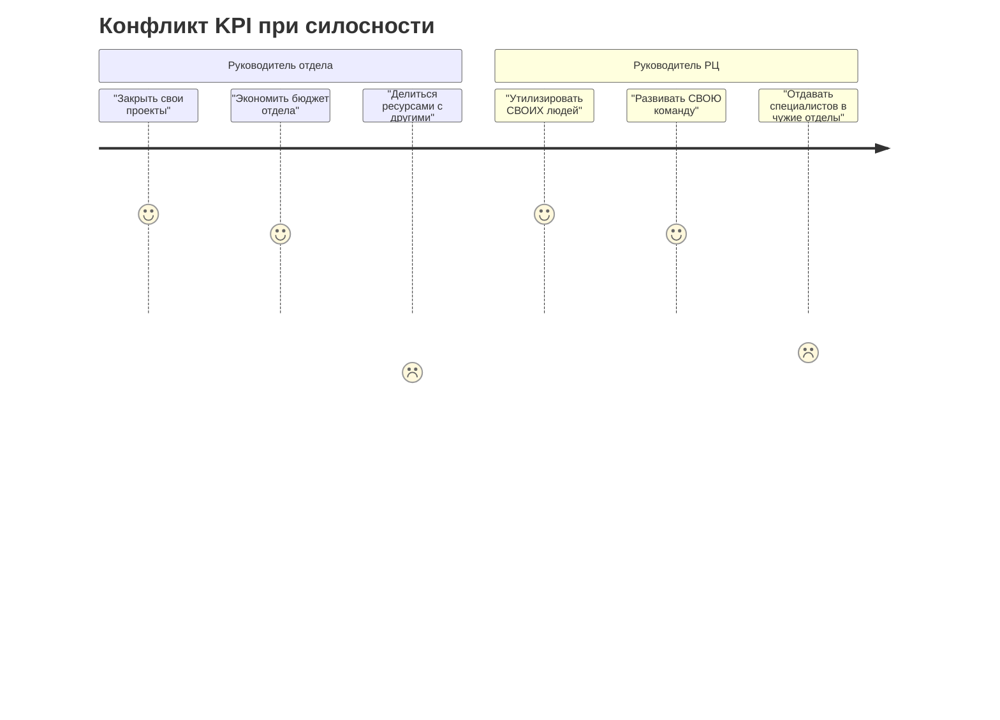

# Управление ресурсами в крупном проектном офисе

Source: QW | Date: 2025-06-17 | Fragments: 9 | ID: ae8fc8fb-d335-4845-905e-642088b86e7f

---

## USER

[0.00s - 13.24s]: Значит, какая ситуация? Мне нужно. Давай так. Есть. я руководитель проектного департамента в Крупном.
[14.34s - 25.51s]: Айти интеграторе— первый бит. У нас проектный офис большой, в этот офис входит много департаментов.
[27.03s - 41.10s]: Многопроектный департамент. Департамент— это примерно там пятьдесят— сто человек. Мы выполняем корпоративные проекты по внедрению, Одиннадцать— проекты разного бюджета, условно от трех до.
[42.02s - 53.07s]: От трех миллионов до трех миллиардов. Очень сильно разная. Ну и понятно, что во всем офисе трудятся тысяча человек. И у нас стоит задача.
[54.13s - 64.22s]: Оптимизации ресурсов того, как утилизируются люди, насколько они хорошо используются, очевидно.
[64.93s - 78.92s]: Что структура департамента? У меня следующее. Ну или да, в принципе единица, боевая единица— это департамент. Внутри департамента у меня есть отделы, так называемые.
[80.37s - 91.00s]: Проектный отдел. У меня три проектных отдела. В каждом из проектных отделов могут выделяться дополнительные группы. Могут не выделяться, но в каждом из отделов есть.
[91.85s - 102.98s]: Руководитель этого отдела, руководитель цифон. И его главная задача— это набор людей.
[103.49s - 117.67s]: И продажа проектов— вот это его главная задача. Он набирает, и он продает. Дальше есть РП. Как правило, РП подчиняются руководителю отдела, напрямую не входят в какую то группу.
[118.36s - 128.45s]: Необязательно, но как правило, вот РП тоже занимается продажей проектов, ну и выполнением проектов. Дальше могут быть.
[129.36s - 146.89s]: Либо все под руководителем отдела, либо уже в составе специализированной группы. Могут быть так называемые группы ресурсного центра. Например, может быть ресурсный центр по разработчикам, и тогда там технические архитекторы и программисты.
[148.30s - 169.20s]: И в случае, если появляется задача, эта задача передается в это подразделение. И задача этого руководителя такой группы— это чтобы все задачи выполнялись, чтобы план индивидуального развития по каждому из его сотрудников, разработчиков велся, они развивались.
[169.78s - 181.10s]: Чтобы удовлетворять заказчиков, которые к нему обращаются, как правило, эта группа работает в интересах этого отдела— Как правило.
[182.48s - 192.57s]: Дальше может быть такая же группа по аналитикам, и во главе стоит также руководитель.
[193.49s - 205.01s]: Группы, задача которого— рост количества таких аналитиков под те проекты, которые думает продавать руководитель отдела и руководители проектов.
[205.67s - 218.88s]: И их, чтобы эти аналитики были круче лучше, правильнее. Вот!
[219.56s - 230.21s]: И задача каждого руководителя ресурсных центров— это максимальная утилизация ресурсов своих.
[231.32s - 241.85s]: То есть у него есть план, сколько ему нужно утилизировать, у него есть какие то проекты, на которые он рассчитывает. Ну, собственно, и все.
[242.95s - 260.99s]: А дальше, если у него есть дефицит, то есть недостаточно, то есть он построил например, план на месяц, он посчитал прикинул, что ему утилизации недостаточно, он делает, он должен идти уже дальше, предлагать своих сотрудников, пристроить их, какие то другие проекты.
[263.90s - 274.98s]: Вот это то, как работает сейчас проектный департамент. Дальше. в чем проблема? Вот.
[275.62s - 292.14s]: Если говорить глобально, по всему офису проблема следующая: мы не знаем про то, какие ресурсы есть в соседних департаментах. Даже внутри департамента один отдел не очень хорошо знает, какие сотрудники есть в соседнем отделе.
[292.75s - 311.02s]: Соответственно, когда возникает какая то задача, он не всегда знает как что, к кому с этой задачей прийти. Есть групповые чаты, куда кидаются резюме или запросы на какие то задачи, но чаты работают не очень хорошо.
[312.22s - 323.46s]: По разным причинам чаты работают не очень хорошо. Вот была задача.
[324.13s - 341.41s]: Подумать, а как бы нам сделать оптимизацию? То есть как как бы нам с оптимизировать использование наших ресурсов, чтобы они утилизировались? Лучше, чтобы мы не снаружи брали какие то ресурсы, а а внутри у себя решали.
[342.97s - 354.83s]: Вот для этого. Поэтому я вспомнил про одного парня. Такой парень Александр Белов. У него компания. Белов— партнеры.
[355.44s - 377.98s]: Он сделал таким образом: он решил задачу по тому, чтобы у него ресурсов было больше. он их набирает с с рынка, то есть у него есть система РМС, и он каким— то образом эти. И он выстроил схему таким образом, что.
[379.23s - 399.46s]: Все запросы, все задачи обязательном порядке описываются письменно. При этом задача- чтобы все ИРП и внедренцы программисты владели так называемым навыком конструктивного письменного общения.
[401.61s - 413.45s]: Вот и тогда получается, что схема у нее следующая: РП, когда уже состоялась продажа проекта, РП должен.
[415.02s - 435.31s]: Разбить на задачи. Причем задачи. Он должен разбить их так, чтобы было понятно, как ее взять одному человеку. То есть он обязательно описывает ее в определенной системе. Он согласует с заказчиком, что вот задача у тебя, заказчик вот такая. и мы ее. Как мы поймем, что она решена, когда мы придем вот в эту точку?
[437.03s - 449.78s]: Когда мы сделаем там некий пользовательский историю так называемую. Когда мы ее тебе сможем продемонстрировать, и ты увидишь, что вот я хотел именно это. Я это и получил.
[450.48s - 462.81s]: Для этого обязательно должна быть изначальная письменная фиксация. Это фиксируется в некой системе, так называемой РМС, система управления требованиями. Вот дальше.
[463.54s - 477.12s]: У него начинает работать так называемая биржа, но только биржа. Биржа не ресурсов, а биржа задач. Эти задачи выставляются на общее обозрение все программисты.
[477.81s - 495.83s]: Или внедренцы, аналитики? Кто, кто у него работает, включен в эту систему, смотрит задачи, находит ту, которую им бы хотелось заняться и.
[496.34s - 518.21s]: Они должны предложить свою концепцию, типа: вот я хочу решить вот эту задачу, я предлагаю ее, вот такое то решение и даже какую то оценку. Соответственно, несколько человек могут взяться за одну задачу, но все должны сказать: я хочу ее решить, вот концепция решения и вот сколько это будет стоить.
[519.21s - 541.67s]: Таким образом, они наиболее адекватную оценку дают обычно. Вот. Короче, я думал, что. А что, если нам сделать такую же систему, но обсудив внутри с этим Александром Беловым, обсудив эту ситуацию внутри, к какому выводу я пришел?
[542.54s - 563.81s]: Я пришел к следующему выводу, что мы так не делаем. У нас так работа не выстраивается— Ну, то есть у нас такой. Во первых, у нас нет. довольно редко мелкие задачи, чтобы эта система работала. Как мне представляется, каждая задача должна быть обязательно.
[564.68s - 577.31s]: Написано именно в том формате, как я сказал, то есть должен быть какой... то пользовательская история, которая должна быть повторяема, должна быть описана, чего там хочется от системы и.
[577.95s - 590.32s]: Должна быть некая система, где все это видят, и кто то ее должен брать. То есть чтобы уже люди сами занимались утилизацией. А у меня получается не так.
[590.96s - 601.66s]: То есть у меня не люди занимаются утилизацией. У меня люди сидят в основном на кладах. Понятно, что у них есть проектная премия, но у них нету задачи самоутилизироваться изо всех сил.
[602.20s - 613.45s]: Поэтому утилизацией занимаются руководители. И это задача руководителей— утилизировать сотрудников, линейных сотрудников, аналитиков и программистов.
[615.02s - 628.76s]: Ну, даже функциональных технических архитекторов и РП тоже надо утилизировать. Вот есть ощущение, что это ну, схема.
[629.74s - 643.96s]: Как у Белова: мне не подойдет. А Белов предложил. Что он говорит? Давай я тебе сделаю консалтинг обучение, еще что, то мы тебя там подтрекаем.
[644.84s - 666.22s]: И в его словах есть правда, потому что что вот во что я верю. Я верю в то, что можно ли, можно ли более оптимально оптимизировать. Более ли более оптимально использовать ресурсы по всему офису, даже просто по департаменту? По моему, как будто бы можно.
[667.08s - 682.51s]: Ну, я точно верю, что можно. Второе. Я считаю, что без некой системы это не решится, просто регламентами не получится. То есть нужна некая схема, система на эту тему.
[683.92s - 696.43s]: Какая— Пока не знаю. Третья. То, что сделано в в Рмейсе, мне не подходит совершенно.
[697.63s - 711.48s]: Тут, наверное, можно покачать. Почему именно? Но вот мои мои. Ощущение следующее, что утилизацией занимается не сотрудник, а руководитель у меня сейчас. Готов ли я изменить схемы? Теоретически готов, но это может быть совсем не просто.
[712.63s - 723.26s]: У нас весь офис, тысяча человек уже так работают, достаточно давно, и мы, в общем то, успешны. Поэтому не думаю, что это хорошая идея.
[728.22s - 749.97s]: У меня же, как правило, как это происходит в моем случае? В моем случае, когда берется проект, руководитель проекта набирает команду, и эта команда будет работать на этом проекте ну ну, практически до конца. То есть там задачи. Мы не знаем заранее, какие будут задачи. Задачи возникают, команда их решает.
[750.68s - 766.07s]: Понятно, РП вместе с функциональным архитектором нарезает на задачи, и цель всей команды— закрыть маржинально этап конкретный и получить премию с этого этапа.
[769.53s - 782.51s]: Вот поэтому никто каждую задачу вот так подробно описывать не будет и выставлять там не будет. У нас есть проблема. Проблема, еще раз повторюсь, заключается в том, что если у меня есть потребность в каком то ресурсе.
[783.03s - 798.77s]: Если я просто напишу, мне нужен программист, который знает там, умеет работать с БИТГОС, мне, может быть, вообще никто не откликнется. По нескольким причинам. По разным причинам их например, может быть.
[799.91s - 818.13s]: Во первых, сам сотрудник не читает. Читает руководитель. Руководитель может плохо знать, что умеет его сотрудник, такие случаи были. Второе, руководитель может сам не владеть этой компетенцией, и тогда для него будет барьер, что бы он.
[819.92s - 841.10s]: Взял эту задачу на своего сотрудника. А что будет, если сотрудник не справится в этой ситуации? По идее, руководитель должен подстраховать. А он его подстраховать не может сотрудника. И тогда у нее начинают быть с этим проблемы. Он начинает говорить, что не могу.
[842.16s - 860.93s]: Такого человека выставить. Какие еще могут быть проблемы— Могут быть проблемы те, что сильная загруженность. Что об этом помнишь? Не всегда. Что когда руководитель реально не знает.
[862.31s - 885.77s]: Объективную загрузку своего сотрудника. То есть он знает в моменте то, что ему сказал его сотрудник. Он мог копнуть, но сотрудник мог сказать: Я занят сильно задачей. А на самом деле у него там из сорока часов в неделю четырнадцать только занято. А он говорит: Нет, я занят, я не могу, я не знаю, как с этим разбираться вообще.
[887.15s - 900.23s]: Ему руководитель верит и он считает, что у него нет свободных сотрудников. И все это выясняется лишь потом, по истечению месяца. Месяц проходит. Смотрим, оказывается, что этот сотрудник разбирался с задачей.
[900.77s - 926.16s]: Или обучением занимался, или еще какими нибудь вещами которые, в общем, можно смело отнести к простою. Я не думаю, что можно изменить схему мотивации с окладной. У нас окладно прямиальная. Вот если у того белого там сдельная зарплата и там понятно, что каждый стремится как можно больше часов заработать, то здесь не так. У нас, У нас.
[926.75s - 942.70s]: Оклады прямиальные, оклады высокие. Вот и сотрудники работают в первую очередь за оклад.
[945.44s - 955.90s]: И, наверное, наши проекты нашего типа по другому делаться не могут, как мне кажется.

---

## AI

Очень интересная и сложная задача! Вы прекрасно описали структуру, проблемы и ключевые ограничения. Давайте разберемся системно.

**Основные Проблемы:**

1.  **Невидимость ресурсов:** Незнание о доступных компетенциях и загрузке сотрудников внутри департамента и между департаментами.
2.  **Неэффективный механизм поиска:** Групповые чаты и ручные запросы не работают из-за информационного шума, низкой ответственности и незнания реальной загрузки.
3.  **Необъективная оценка загрузки:** Руководители ресурсных групп не всегда точно знают реальную загрузку своих сотрудников (сотрудник может преувеличивать занятость или иметь "скрытый" простой).
4.  **Отсутствие мотивации у сотрудников на самоутилизацию:** Окладно-премиальная система не стимулирует сотрудников активно искать задачи для заполнения своего времени. Утилизация - задача руководителя.
5.  **"Клановость" и барьеры:** Отделы и департаменты работают как "силосы". Руководители ресурсных групп неохотно отдают "своих" сотрудников в другие проекты/отделы из-за рисков (не справится, нет подстраховки, потеря контроля, сложность планирования).
6.  **Неприменимость модели "биржи задач" (a la Белов):**
    *   Задачи в ваших проектах редко являются мелкими, независимыми и легко описанными в формате User Story.
    *   Проекты длительные, команды формируются надолго, задачи возникают и решаются внутри команды.
    *   Культура письменного конструктивного общения и формализованного описания *всех* задач может отсутствовать.
    *   Мотивационная система (оклад) не соответствует модели "сделки за задачу".
    *   Масштаб (1000+ человек) и устоявшиеся процессы делают революционный переход крайне рискованным.

**Почему модель Белова не подходит (и вы правы):**

*   **Разная природа проектов:** Белов, судя по описанию, работает с более "дробными" проектами/задачами или выстроил процессы именно под такую модель. Ваши проекты - комплексные внедрения.
*   **Разная мотивация:** У Белова - сдельная или сильно привязанная к выполнению конкретных задач. У вас - стабильный оклад + премия за результат этапа/проекта. Сотрудник не получает прямого бонуса за взятие дополнительной мелкой задачи из "биржи".
*   **Культурный разрыв:** Переход от модели "руководитель утилизирует" к модели "сотрудник сам утилизируется" требует огромной культурной трансформации, переобучения, изменения KPI и системы мотивации. Это многолетний процесс с высокими рисками срыва проектов.
*   **Накладные расходы:** Формализация *каждой* задачи до уровня, пригодного для "биржи", требует огромных трудозатрат РП и аналитиков, что замедлит проекты.

**Куда двигаться (Практические шаги):**

Полностью менять модель утилизации с "руководитель-центричной" на "сотрудник-центричную" (как у Белова) сейчас нецелесообразно и опасно. Нужно **усилить существующую модель, сделав ее более прозрачной и эффективной, с элементами автоматизации.**

1.  **Создать Единый Каталог Ресурсов (на уровне офиса или хотя бы департамента):**
    *   **Что:** Не просто список людей, а база данных с ключевой информацией:
        *   Сотрудник (ID, ФИО, Должность, Уровень)
        *   **Ключевые компетенции и навыки:** (Технологии: SAP, 1С, Java, Python; Методологии: Agile, Waterfall; Домены: Финансы, Логистика, HR; Языки: и т.д.) - **Это критически важно!** Использовать теги.
        *   Текущий основной проект/отдел.
        *   **Текущая расчетная загрузка (% или ч/нед).** Источник - система учета времени.
        *   Руководитель ресурсной группы.
        *   Контакт (рабочая почта/Teams).
    *   **Как:** Простой веб-интерфейс (можно начать даже с SharePoint списка или легкой БД типа Airtable, Notion DB, или модуль в существующей HR/Project системе). Главное - легкость поиска и актуальность.
    *   **Кто ведет:** Ответственность за актуальность навыков лежит на руководителе ресурсной группы и частично на самом сотруднике (регулярный update). Загрузка автоматизируется (см. пункт 2).

2.  **Внедрить/Усилить Систему Учета Рабочего Времени с Аналитикой:**
    *   **Обязательный и точный учет:** Все сотрудники (включая РП и руководителей) должны ежедневно/еженедельно заполнять, на какие проекты/задачи/активности потрачено время. Не для микроменеджмента, а для аналитики.
    *   **Автоматическая консолидация:** Система должна автоматически агрегировать данные и показывать:
        *   Реальную загрузку по сотрудникам, группам, отделам (графики, отчеты).
        *   Простои (время, не отнесенное к проектам/задачам).
        *   Распределение времени по типам работ (разработка, анализ, встречи, администрирование).
    *   **Источник для Каталога:** Расчетная загрузка в Каталоге берется именно отсюда. Это **объективный** показатель, а не мнение сотрудника или руководителя.
    *   **Инструменты:** Множество решений (Jira + Tempo, Microsoft Project/Planner + Timesheets, специализированные TSheets, Harvest, отечественные аналоги). Важно интегрировать с Каталогом Ресурсов.

3.  **Создать Централизованную Систему Запросов на Ресурсы:**
    *   **Что:** Формализованный процесс подачи запроса на ресурс (внутри департамента или междепартаментный). Не чаты, а система (тикет в Jira Service Management, спец. форма в SharePoint, модуль в Project-системе).
    *   **Обязательные поля запроса:**
        *   Проект/Задача (краткое описание)
        *   **Требуемые компетенции/навыки (с приоритетом) - КРИТИЧНО!**
        *   Уровень специалиста (Junior, Middle, Senior)
        *   Необходимый объем (человеко-часы/дни/ % загрузки в неделю)
        *   Период (даты начала/окончания или длительность)
        *   Приоритет
        *   Контактное лицо (РП или руководитель, кому нужен ресурс)
    *   **Процесс:**
        1.  Запрос создается.
        2.  **Автоматическое оповещение** ответственных руководителей ресурсных групп (по навыкам/ролям).
        3.  Руководитель ресурсной группы **обязан дать ответ** в течение N часов/дней (согласен предоставить сотрудника X на условиях Y / предлагаю альтернативу Z / отказ с обоснованием - нет ресурса с навыками, все заняты >X%).
        4.  Если внутри департамента нет - эскалация на уровень руководителя департамента (вас) или в общеофисный пул.
    *   **Прозрачность:** Все запросы и статусы видны уполномоченным лицам (руководителям отделов, РП, вам).

4.  **Ввести Регулярные Оперативные Планировочные Встречи (на уровне департамента):**
    *   **Кто:** Вы (как руководитель департамента), руководители проектных отделов, руководители ключевых ресурсных центров (разработка, аналитика, ТА).
    *   **Когда:** Еженедельно или раз в 2 недели. Коротко (30-60 мин).
    *   **Цель:** Сверка планов на ближайший период (2-4 недели).
    *   **Что обсуждается:**
        *   Ключевые вехи проектов (загрузка команды, риски).
        *   **Планируемая потребность в ресурсах (на основе запросов из п.3).**
        *   **Текущая и прогнозируемая загрузка ресурсных групп (данные из системы учета п.2).**
        *   **Выявление "горячих точек" (дефицит/профицит конкретных навыков).**
        *   Принятие оперативных решений по перераспределению *доступных* ресурсов.
    *   **Результат:** Согласованный план на период, назначенные ответственные за закрытие ресурсных потребностей.

5.  **Скорректировать KPI для Руководителей Ресурсных Групп:**
    *   **Добавить метрики, стимулирующие "делиться" ресурсами:**
        *   **% утилизации сотрудников группы *в рамках всего офиса/департамента* (а не только внутри своего отдела).** Показывает эффективность использования ресурса в масштабах компании.
        *   Количество/качество выполненных запросов на ресурсы из других отделов/департаментов.
        *   Удовлетворенность внутренних "заказчиков" (РП из других отделов) скоростью и качеством предоставления ресурса/решения задачи.
    *   **Сохранить существующие:** План по развитию команды, удовлетворенность заказчиков *проектов*, где работает группа.
    *   **Объяснить выгоду:** Показывать, что эффективное перераспределение снижает простои *их* сотрудников, повышает общую маржинальность д

---

## USER

расскажи про мой департамент as is

---

## AI

На основании вашего подробного описания, вот структурированная картина вашего проектного департамента в текущем состоянии (**As-Is**):

---

### **1. Организационная Структура (Иерархия)**
*   **Департамент (50–100 человек):** Базовая единица управления.
*   **Проектные отделы (3 шт.):** Внутри департамента.  
    *   **Ключевая роль:** Руководитель отдела (Руководитель ЦФО).  
    *   **Основные задачи:**  
        *   Продажа проектов.  
        *   Набор сотрудников.  
*   **Ресурсные центры (группы):** Специализированные подразделения внутри отделов (или кросс-отдельные).  
    *   **Примеры:** Группа разработчиков, группа аналитиков, группа техархитекторов.  
    *   **Ключевая роль:** Руководитель группы ресурсного центра.  
    *   **Основные задачи:**  
        *   Выполнение проектных задач, передаваемых из отделов.  
        *   Развитие сотрудников (индивидуальные планы, повышение компетенций).  
        *   **Максимизация утилизации своих сотрудников.**  
        *   Удовлетворение запросов "внутренних заказчиков" (руководителей отделов/РП).  
*   **Руководители проектов (РП):**  
    *   Подчиняются руководителю отдела.  
    *   **Задачи:** Продажа проектов + управление их исполнением.  
*   **Линейные сотрудники:** Разработчики, аналитики, техархитекторы.  
    *   Закреплены за ресурсными центрами.  
    *   Назначаются на проекты РП.

---

### **2. Ключевые Бизнес-Процессы**
*   **Продажа проекта:** Руководитель отдела/РП → Заключение договора.  
*   **Формирование команды проекта:**  
    *   РП обращается к руководителям ресурсных центров (в своем отделе) за сотрудниками.  
    *   Руководитель РЦ выделяет ресурсы из своей группы.  
*   **Выполнение проекта:**  
    *   Команда работает на проекте длительно (часто до его завершения).  
    *   Задачи решаются внутри команды, РП и Функциональный Архитектор дробят работу.  
    *   **Нет детального публичного описания задач** (как в модели Белова).  
*   **Утилизация ресурсов:**  
    *   **Ответственность:** Руководители ресурсных центров.  
    *   **Процесс:**  
        1.  Руководитель РЦ прогнозирует загрузку своих сотрудников.  
        2.  При выявлении простоя/недостаточной утилизации:  
            *   Активно ищет задачи внутри отдела/департамента.  
            *   Предлагает своих сотрудников в другие проекты (через личные контакты, чаты).  
    *   **Критерий успеха:** Выполнение плана по утилизации.

---

### **3. Мотивационная Модель**
*   **Тип:** Окладно-премиальная.  
*   **Для линейных сотрудников:**  
    *   Стабильный высокий оклад.  
    *   Премия по результатам проекта/этапа (зависит от успеха **команды**).  
    *   **Нет прямой мотивации** к самостоятельному поиску задач для личной утилизации.  
*   **Для руководителей РЦ:**  
    *   KPI включает **утилизацию своих сотрудников**, развитие их компетенций.  
*   **Для РП/Руководителей отделов:**  
    *   Премия за успешную продажу и выполнение проектов (маржинальность).

---

### **4. Ключевые Проблемы (As-Is)**
*   **"Слепота" ресурсов:**  
    *   Нет единой видимости компетенций и реальной загрузки сотрудников **между отделами** и даже внутри департамента.  
    *   Руководители РЦ могут плохо знать глубину навыков своих подчиненных.  
*   **Неэффективный механизм поиска ресурсов:**  
    *   Запросы кидаются в общие чаты → Низкая откликаемость, информационный шум.  
    *   Руководители РЦ не всегда видят запросы или не могут/не хотят на них реагировать.  
*   **Субъективная оценка загрузки:**  
    *   Руководитель РЦ полагается на слова сотрудника ("я занят"), а не на объективные данные.  
    *   Реальные простои (обучение, решение инфраструктурных проблем) выявляются постфактум (по итогам месяца).  
*   **"Силизация" и барьеры:**  
    *   Ресурсные центры работают **в первую очередь на запросы своего отдела**.  
    *   Руководители РЦ **неохотно отдают сотрудников в другие отделы/департаменты:**  
        *   Риск, что сотрудник не справится (руководитель не сможет подстраховать в чужой предметной области).  
        *   Потеря контроля над ресурсом.  
        *   Сложность планирования.  
    *   Нет KPI за кросс-отдельное/кросс-департаментное использование ресурсов.  
*   **Неготовность к модели "биржи задач" (a la Белов):**  
    *   Задачи в проектах не изолированы и редко формализуются до уровня независимых User Stories.  
    *   Долгосрочные проектные команды.  
    *   Культура и процессы не заточены под детальное публичное описание *всех* задач.  
    *   Мотивация сотрудников (оклад) не стимулирует самостоятельный поиск мелких задач.  
    *   Масштаб (1000+ чел в офисе) делает революционные изменения рискованными.

---

### **5. Текущие "Костыли"**
*   **Групповые чаты:** Для запросов на ресурсы/компетенции (работают плохо).  
*   **Ручное отслеживание загрузки:** Руководителями РЦ на основе отчетов сотрудников.  
*   **Личные договоренности:** Между руководителями отделов/РП/РЦ для переброски ресурсов (не масштабируемо, зависит от связей).

---

### **6. Корневая Проблема Утилизации**
**Утилизация — это задача исключительно руководителей (РЦ), а не самих сотрудников.** Система не стимулирует и не дает инструментов для горизонтального саморегулирования загрузки на уровне всего департамента или офиса. Отсутствие прозрачности и формализованных процессов кросс-группового взаимодействия создает "островки" неэффективности.

---

### **Итоговая картина As-Is**
Ваш департамент — это **классическая "матрица" с сильными вертикалями (отделы/ресурсные центры) и слабыми горизонтальными связями**. Процессы продажи и исполнения проектов отлажены внутри "вертикалей", но обмен ресурсами и знаниями *между* ними затруднен из-за отсутствия прозрачности, формализованных процедур, KPI за кооперацию и культуры кросс-группового взаимодействия. Оптимизация утилизации происходит локально (в рамках РЦ), а не глобально (на уровне департамента/офиса).

---

## USER

добавь графического описания,пожалуйста

---

## AI

Отлично, вот графическое описание вашего департамента в текущем состоянии (`As-Is`), основанное на вашем подробном описании. Используем схему и ключевые визуальные метафоры:

---

### **Схема: Проектный Департамент (As-Is)**

```
                           ┌───────────────────────────────────────────────────┐
                           │                   ДЕПАРТАМЕНТ                     │
                           │  (Руководитель департамента | 50-100 человек)     │
                           └───────────────────────────────────────────────────┘
                                         ▲
                                         │ Отчетность / Управление
                                         ▼
               ┌───────────────────┐           ┌───────────────────┐           ┌───────────────────┐
               │  ПРОЕКТНЫЙ ОТДЕЛ 1 │           │  ПРОЕКТНЫЙ ОТДЕЛ 2 │           │  ПРОЕКТНЫЙ ОТДЕЛ 3 │
               │ (Рук. отдела = ЦФО)│           │ (Рук. отдела = ЦФО)│           │ (Рук. отдела = ЦФО)│
               │  ■ Продажи         │           │  ■ Продажи         │           │  ■ Продажи         │
               │  ■ Набор людей     │           │  ■ Набор людей     │           │  ■ Набор людей     │
               └─────────┬──────────┘           └─────────┬──────────┘           └─────────┬──────────┘
                         │                                │                                │
                         ▼                                ▼                                ▼
┌────────────────────────────────┐ ┌────────────────────────────────┐ ┌────────────────────────────────┐
│        РЕСУРСНЫЕ ЦЕНТРЫ        │ │        РЕСУРСНЫЕ ЦЕНТРЫ        │ │        РЕСУРСНЫЕ ЦЕНТРЫ        │
│  Отдела 1 (внутри/при отделе)  │ │  Отдела 2 (внутри/при отделе)  │ │  Отдела 3 (внутри/при отделе)  │
├───────────────┬───────────────┤ ├───────────────┬───────────────┤ ├───────────────┬───────────────┤
│ Группа Аналит.│ Группа Разраб.│ │ Группа Аналит.│ Группа Разраб.│ │ Группа Аналит.│ Группа Разраб.│
│ Рук. Группы   │ Рук. Группы   │ │ Рук. Группы   │ Рук. Группы   │ │ Рук. Группы   │ Рук. Группы   │
│ ■ Утилизация  │ ■ Утилизация  │ │ ■ Утилизация  │ ■ Утилизация  │ │ ■ Утилизация  │ ■ Утилизация  │
│ ■ Развитие    │ ■ Развитие    │ │ ■ Развитие    │ ■ Развитие    │ │ ■ Развитие    │ ■ Развитие    │
└───────┬───────┴───────┬───────┘ └───────┬───────┴───────┬───────┘ └───────┬───────┴───────┬───────┘
        │               │                 │               │                 │               │
        ▼               ▼                 ▼               ▼                 ▼               ▼
┌─────────────┐ ┌─────────────┐ ┌─────────────┐ ┌─────────────┐ ┌─────────────┐ ┌─────────────┐
│ Аналитики   │ │ Разработчики│ │ Аналитики   │ │ Разработчики│ │ Аналитики   │ │ Разработчики│
│ Техархиты   │ │             │ │ Техархиты   │ │             │ │ Техархиты   │ │             │
│             │ │             │ │             │ │             │ │             │ │             │
└─────────────┘ └─────────────┘ └─────────────┘ └─────────────┘ └─────────────┘ └─────────────┘
      ▲               ▲                 ▲               ▲                 ▲               ▲
      │               │                 │               │                 │               │
      └───────┐ ┌─────┘                 └───────┐ ┌─────┘                 └───────┐ ┌─────┘
              │ │                               │ │                               │ │
              ▼ ▼                               ▼ ▼                               ▼ ▼
    ┌───────────────────────┐         ┌───────────────────────┐         ┌───────────────────────┐
    │      ПРОЕКТЫ ОТДЕЛА 1  │         │      ПРОЕКТЫ ОТДЕЛА 2  │         │      ПРОЕКТЫ ОТДЕЛА 3  │
    │  РП1 ◄──► Команда      │         │  РП1 ◄──► Команда      │         │  РП1 ◄──► Команда      │
    │  РП2 ◄──► (Длительная  │         │  РП2 ◄──► (Длительная  │         │  РП2 ◄──► (Длительная  │
    │         │  работа)     │         │         │  работа)     │         │         │  работа)     │
    └─────────┴──────────────┘         └─────────┴──────────────┘         └─────────┴──────────────┘
```

---

### **Ключевые Визуальные Элементы и Проблемы (As-Is)**

1.  **"Столбы" (Silos) Отделов:**
    *   Отделы 1, 2, 3 изображены как вертикальные колонны.
    *   **Проблема:** Сильная изоляция между отделами. Ресурсы и знания заперты внутри своего "столба".

2.  **Ресурсные Центры Принадлежат Отделам:**
    *   Группы аналитиков/разработчиков нарисованы *внутри* границ своих отделов.
    *   **Проблема:** Руководители РЦ фокусируются **только** на утилизации своих ресурсов **внутри своего отдела**. Их KPI не стимулирует делиться ресурсами *между* отделами.

3.  **Отсутствие Горизонтальных Связей:**
    *   **Нет прямых стрелок** между Ресурсными Центрами разных отделов.
    *   **Нет центрального "хаба"** для обмена ресурсами/информацией.
    *   **Проблема:** Невозможность эффективно перебрасывать ресурсы между проектами разных отделов при простоях/пиках нагрузки. Невидимость компетенций.

4.  **Слабая/Неэффективная Связь между Отделами (Пунктир):**
    *   Представлена **отсутствием** явных связей. Мысленно представьте редкие, тонкие, ненадежные линии (чаты, редкие личные договоренности).
    *   **Проблема:** Запросы на ресурсы тонут в чатах, не получают ответа, информация о реальной загрузке недостоверна.

5.  **Команды Проектов как "Черные Ящики":**
    *   Проекты изображены как блоки внизу, привязанные к своим отделам.
    *   Стрелки `РП <--> Команда` подчеркивают **длительную** и **замкнутую** работу.
    *   **Проблема:** Задачи решаются внутри команды, нет детального описания и выставления задач вовне. Ресурсы закреплены за проектом надолго.

6.  **"Слепые Зоны" (Не показаны явно, но подразумеваются):**
    *   **Между отделами:** Никто не знает, какие ресурсы и с какой загрузкой есть у соседей.
    *   **Внутри РЦ:** Руководитель РЦ может плохо знать глубину навыков своих сотрудников или их реальную загрузку (основано на словах, а не на данных).
    *   **У сотрудников:** Нет мотивации/инструментов искать задачи вне своего проекта/отдела.

7.  **Фокус Руководителей РЦ на "Внутреннем" Рынке:**
    *   Стрелки от Руководителя РЦ идут **только вниз** к своим сотрудникам и **внутрь** к проектам своего отдела.
    *   **Проблема:** Поиск задач для утилизации ведется в первую очередь *внутри* своего отдела. Кросс-отдельное взаимодействие — редкость и сложность.

---

### **Итоговая Визуальная Картина**
Ваш департамент — это **набор вертикально интегрированных "мини-фабрик" (отделов)**. Каждая фабрика имеет свои ресурсы (РЦ), своих заказчиков (продажи отдела) и свои производственные линии (проекты). Связи *между* фабриками слабые, неформальные и неэффективные. **Оптимизация утилизации происходит локально в рамках каждой фабрики, а не глобально на уровне всего департамента.** Результат — потенциальные простои в одной "фабрике" и дефицит ресурсов/аутсорсинг в другой, при наличии нужных компетенций внутри компании.

---

## AI

Отлично, вот графическое описание структуры и процессов вашего департамента в текущем состоянии (As-Is), представленное в виде схем и диаграмм:

---

### 1. Организационная структура департамента


**Ключевые элементы:**
- 🟣 **Вертикальное управление:** Четкая иерархия подчинения
- ⚫ **"Силизация":** Отделы работают как изолированные модули
- 💜 **Ресурсные центры:** Специализированные группы внутри отделов

---

### 2. Процесс утилизации ресурсов


**Проблемные зоны:**
- ❌ Запросы "теряются" в чатах
- ❌ Нет объективных данных о загрузке
- ❌ Нет кросс-отдельного взаимодействия

---

### 3. Система мотивации


**Характеристики:**
- 📊 **Доминирующий оклад:** Основная часть дохода гарантирована
- 🎯 **Премия за результат:** Зависит от успеха проекта/команды
- ⚠️ **Отсутствие мотивации:** Нет стимулов для самоутилизации

---

### 4. Проблемы видимости ресурсов


**Эффект "слепоты":**
- 👥 Компетенции сотрудников неизвестны за пределами отдела
- 📉 Реальная загрузка скрыта от руководителей
- 🔍 Поиск ресурсов осуществляется "вслепую"

---

### 5. Барьеры между подразделениями


**Ключевые барьеры:**
- 🛡️ **Риски:** Страх перед неудачным назначением
- 🧩 **Сложность:** Отсутствие механизмов кооперации
- 📉 **Отсутствие стимулов:** Нет выгоды от "дележки" ресурсами

Эти схемы визуализируют основные вызовы, которые вы описали: изолированность подразделений, неэффективные процессы поиска ресурсов, отсутствие объективных данных о загрузке и мотивационные пробелы. Графика помогает увидеть системные взаимосвязи между разными аспектами проблемы утилизации.

---

## USER

слушай, а под "силизацией" ты имел в виду, наверное, специализацию? Если так, то переделай, пожалуйста, описание моего департамента "как есть"

---

## AI

Отличное замечание! Совершенно верно — в контексте организационных барьеров корректнее использовать термин **"силосность" (silo mentality)**, а не "специализация". Специализация — это естественное разделение ролей, а **силосность** — это **организационная болезнь**, когда подразделения изолированы и не делятся ресурсами/информацией. Исправляю описание:

---

### **Уточненное описание департамента As-Is (с заменой "специализации" на "силосность")**



**Ключевые характеристики:**

### 1. **Организационная силосность ("Silo Mentality")**
- 🔒 **Отделы как изолированные "силосы":** 
  - Проектные отделы (1,2,3) и их ресурсные центры работают автономно.
  - Информация о ресурсах, компетенциях и загрузке **не выходит за пределы отдела**.
- 🧱 **Вертикальные барьеры:** 
  - Руководители отделов фокусируются на своих проектах и метриках.
  - Нет механизмов/мотивации для кросс-отдельного обмена ресурсами.

### 2. **Процессы внутри "силоса"**


### 3. **Проблемы, вызванные силосностью**
| Проблема                          | Последствие                                                                 |
|-----------------------------------|-----------------------------------------------------------------------------|
| **Невидимость ресурсов**          | Свободный разработчик в Отделе 2 не виден Отделу 1                          |
| **Дублирование компетенций**      | В каждом отделе свои эксперты по 1С → рост ФОТ                              |
| **Негибкость**                    | Срочный запрос на аналитика в Отдел 3 игнорируется Отделом 1                |
| **Потеря эффективности**          | Простои в одном "силосе" + аутсорсинг в другом при тех же компетенциях      |

### 4. **Управленческие противоречия**


---

### **Итог:**
Ваш департамент — **классический пример силосной структуры**, где:
- 📦 **Отделы работают как изолированные контейнеры** ("силосы") с собственными ресурсами и KPI.
- 🔗 **Горизонтальные связи между отделами отсутствуют** из-за:
  - Оргструктуры (вертикальное подчинение),
  - KPI руководителей (нет метрик за кооперацию),
  - Культуры ("мой ресурс = моя эффективность").
- 📉 **Результат:** Недозагрузка специалистов в одних отделах + перегрузка/аутсорсинг в других при тех же компетенциях в офисе.

**Силосность — главный враг оптимизации ресурсов.** Решение требует:  
1️⃣ Внедрения кросс-отдельных процессов,  
2️⃣ Изменения KPI руководителей,  
3️⃣ Инструментов прозрачности (единый каталог ресурсов).

---

