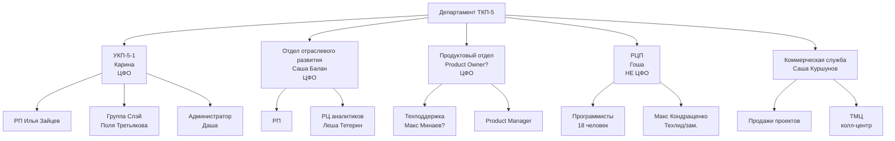
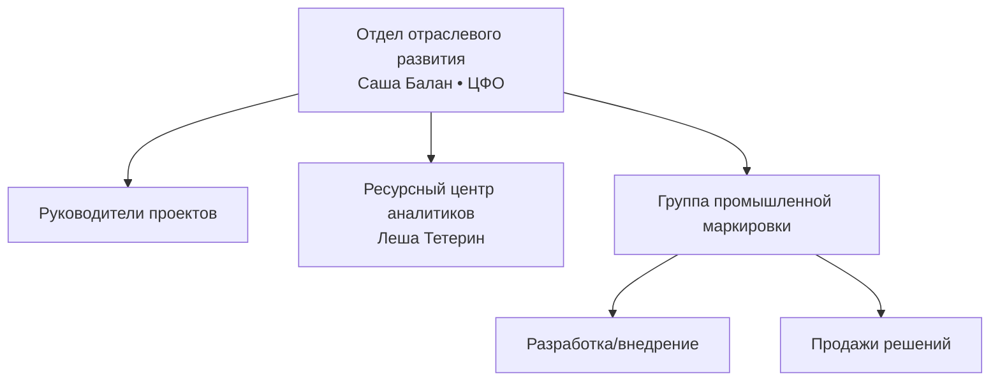
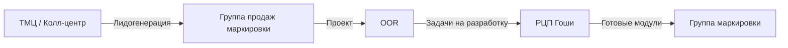

# Реорганизация проектного департамента ТКП-5

Source: QW | Date: 2025-07-01 | Fragments: 6 | ID: 36924fc0-f0e6-454c-9317-5d81aea957d7

---

## USER

[0.00s - 10.80s]: Так описываю ситуацию. У нас я руководитель проектного департамента ТКП пять.
[11.32s - 21.63s]: В этом Проектном департаменте есть соответственно отделы, группы и так далее. Сейчас расскажу более подробно. В Проектном департаменте есть.
[22.25s - 33.56s]: ОКП пять, один— это отдел корпоративных проектов, руководитель Карина. У. внутри этого отдела есть.
[35.11s - 53.26s]: Соответственно, есть. Напрямую карине подчиняются РП. Сейчас там только один РП. Есть такой: Илья Зайцев. и администратор отдела, она же администратор.
[54.05s - 67.58s]: Проектов. Даша, Храмочкина дальше. В этом отделе есть группы. Есть группа Ресурсный центр аналитиков. Руководитель.
[68.59s - 79.19s]: Карпова Катя. Вот в нем его цель и задача— Воспитание.
[79.98s - 91.14s]: Аналитиков— Ну, то есть управление всеми аналитиками, которые работают на проектах.
[91.70s - 102.88s]: Соответственно, цель задачи КАТИ— это утилизация их рабочего времени, чтобы они не простаивали. Чтобы они были все время утилизированы первое. Второе— то, что
[106.22s - 117.31s]: Они должны расти. Они должны расти по количеству люд людей и по компетенциям. И эту задачу Катя уже взяла, она ее исполняет.
[117.85s - 130.37s]: Кроме того, есть второй ресурсный центр внутри отдела Карины, он называется Ресурсный центр программистов, Руководитель— МАКС Кондращенко.
[131.28s - 143.75s]: Там задача точно такая же, как у Карповой, только по программистам. То есть суть и концепция проектного отдела заключается в том, что.
[144.82s - 159.04s]: Задача руководителя отдела— это ЦФО, это прибыль— управлять портфелем проектов. Соответственно, главное задача, которую решает Карина— это продажа проектов.
[160.26s - 171.50s]: Их выполнение— главный показатель эффективности у руководителя проектного отдела— это рост год к году, прибыльность.
[174.05s - 184.19s]: И да, рост выручки и в людях по размеру и то, и то рост. Ну, стандартный считается, сорок процентов в год Надо расти.
[185.06s - 195.53s]: Вот это вот это стандартный сейчас, на сегодняшний момент, проектный отдел.
[197.69s - 208.24s]: Дальше есть у КПП пять, два. Руководитель гоша далич там.
[209.23s - 219.73s]: Цели точно такие же. А нет, вернемся еще к Карине. У Карины еще одна группа есть— Это группа Слэй.
[220.87s - 232.06s]: Руководитель поля Третьякова. Ну и соответственно, задача там по постпроектному сопровождению, то есть брать, развивать.
[233.19s - 244.21s]: Клиентов оставлять их на постпроектном сопровождении. Вот короче, если простыми словами. У Карины такая.
[244.85s - 261.15s]: Типовая структура проектного отдела заключается в том, что там есть три группы: два ресурсных центра и группа СЛЭЙ. Группа слйт там полностью отвечает за постпроектное сопровождение, то есть регулярные клиенты.
[265.63s - 283.30s]: Вот так. Вернемся к УКП: пять— два. У КП пять— два. Слушай дальше. У него цели, задачи примерно те же самые, но структуры у него нету, у него плоская, все люди сейчас, в настоящий момент под ним. Там есть программисты, аналитики.
[283.85s - 293.93s]: Даже РП— руководитель проекта, но структуры ярко выраженной или там точно выраженной, нет.
[295.28s - 307.31s]: Ну, то есть задачи такие же: делать проекты, сопровождать клиентов. Вот надо сказать, что.
[308.07s - 325.48s]: Не очень хорошо получается, что делать и делать проекты, у Гоши не очень хорошо получается. И точно также сопровождением. Вроде как Гоше это нравится, он бы хотел этим заниматься, но не получается.
[327.85s - 342.36s]: Особо. То есть постоянно УКП пять, два. это тоже ЦФО. И постоянно он в минусах. Постоянно недоутилизация. Плохо продаются проекты.
[344.99s - 355.03s]: Такая история. Дальше ситуация сильно сложнее. Дальше есть так называемый отдел отраслевого развития.
[356.67s - 368.88s]: И его руководитель Балан Саша. Вот у этого, в этом отделе отраслевого развития, там очень большое количество подразделений.
[371.33s - 383.70s]: При том, что сейчас структура похоже, не соответствует тому ну, концепции или стратегии этого отдела.
[385.96s - 399.43s]: Наверное, так: давайте переформулирую или не переформулирую, добью. Там получается, следующая история Есть.
[402.11s - 421.52s]: Раньше был отдел внедрения. Они у нас отличаются, проектные отделы. Отдел внедрения— они отличаются. Вот он был, сейчас по факту его нету. Там остались кое какие специалисты, но реально по остаточному принципу там несколько человек внедренцев, которые могут и программистами быть, и.
[422.82s - 433.92s]: Консультантами. Ну, короче, делают мини проекты. Небольшие проекты. есть два руководителя проекта.
[437.46s - 448.05s]: Ну и плюс Саша, баланс. сам тоже как руководитель может выступать руководителем проекта. Вот дальше там, внутри.
[448.92s - 459.35s]: Этого отдела отраслевого развития. есть в том числе группа ТМЦ. ТМЦ— это трейд, маркетинговый центр ну, колл центр, короче.
[460.04s - 471.94s]: Которые звонят в холодку, есть отдел продаж— В отделе продаж есть. Структуры прямой нет, но есть те, кто специализируется.
[473.97s - 492.55s]: других историях. Ну, то есть там продажники которые, часть продажников, занимаются проектными продажами, они продают в первую очередь в интересах отдела отраслевого развития. По остаточному принципу могут передавать ряды проекты на другие подразделения. На другие отделы.
[493.84s - 505.54s]: Также есть! Также есть.
[506.20s - 524.81s]: Два сопровода, которые занимаются сопровождением, и по факту они продают продукт. Наш продукт, бит. Управление маркетплейсами в первую очередь, но не только. Его сопутствующие продажи там тоже вполне себе делают. То есть сопроводы— это продавцы по факту.
[525.47s - 537.13s]: Это продавцы, которые должны продавать текущую базу. Но они кроме продажи текущую продление подписок. Они также сидят на входе.
[537.65s - 548.52s]: Отрабатывают вот эти дюды. Их два человека. Есть еще один человек— Саша Калиман. Он занимается тем, что.
[550.75s - 561.31s]: Он качает продажи в новой теме. Новая тема— это маркировка, Промышленная маркировка. Вот.
[563.52s - 573.61s]: Про нее поговорим отдельно. Дальше. Кроме вот этих остатков отдела внедрения.
[576.23s - 591.60s]: Есть еще один отдел на уровне департамента, который называется Отдел по разработке и продвижению типовых отраслевых решений. Ну, то есть тиражные решения делаются.
[592.66s - 610.38s]: То есть это программисты вместе с архитекторами, которые пелят продукты. Продуктов немного, по сути, три. Самое большое внимание уделяется битуправление маркплейсами, там полный цикл развития, там и аналитики есть.
[610.97s - 627.58s]: И программисты довольно много. Вот. И там же, внутри этого отдела, есть техподдержка. Техподдержки— четыре человека.
[628.22s - 650.78s]: Три аналитика ну консультанта, которые отвечают на вопросы, и руководители техподдержки, МАКС, Минаев вот. То есть и того получается, у нас четыре отдела.
[651.32s - 677.50s]: Два, двумя из которых руководит Саша, была.
[681.43s - 696.33s]: В реальности оно уже происходит не так. Мы видим эти проблемы. Главные проблемы— это неуспешность, неоптимальность. И провели стратессию по итогам страцессии приняли некоторые решения.
[698.03s - 710.74s]: Такие решения— Самое, наверное, такое большое. Давайте так: два больших решения. Первое— то, что у Гоши, мы убираем.
[712.04s - 724.61s]: Слэй. И передаем его предположительно, Карине. Она объединяет со своим Слей свой Услей там расширяет, укрепляет. Первая часть.
[725.88s - 736.78s]: Также гоша отдает своих аналитиков которые очевидно, пойдут той же Карине в группу Кати Карповой— Ресурсный центр аналитиков.
[739.36s - 754.97s]: Дальше. А к Гоше мы решили: Гоша вместо ЦФО становится общим ресурсным центром на весь департамент, ресурсным центром программистов.
[755.51s - 768.18s]: РЦП— вот и все. Программисты будут наниматься только исключительно под Гоши. Его задача будет.
[768.97s - 780.35s]: Соответственно, расти по количеству, по компетенциям. Но расти он самостоятельно не может, поскольку не является ЦФ. Он должен соответствовать амбициозным планам.
[781.01s - 791.42s]: Других отделов вот в том числе.
[792.14s - 804.19s]: Ведение гоши будут все программисты, которые сегодня в отделе отраслевую вот эту. разработке и продвижения тиражного софта.
[805.96s - 818.87s]: Они тоже будут под ним также отдельно выделяется отдельный отдел.
[819.41s - 829.83s]: И он уже наверное, ЦФО, в котором люди в настоящий момент передаются только.
[830.38s - 841.20s]: Техподдержка. без Макса Минаева. Там новый руководитель должен появиться.
[841.86s - 854.93s]: Ну, сейчас из существующих попытаться из него сделать руководителя. вот и этот отдел будет заказывать работы.
[855.85s - 868.76s]: На РЦП. Ну, по развитию и поддержке продукта. То есть там, где нужны будут программисты. По факту этот отдел будет состоять только исключительно из.
[871.61s - 883.84s]: То есть это цифо, который группирует в себя затраты доходы ну, прибыль от продуктов. Вот, вот!
[884.62s - 895.84s]: Так дальше. Но очевидно дырка, что в этом отделе новом продуктовом, нет.
[898.78s - 910.10s]: Продукты, который отвечал бы за развитие продукта— это проблема.
[911.35s - 922.89s]: Пока нет. Дальше большие изменения получаются по Саше Балану: он снимается с.
[923.50s - 936.04s]: Поста руководителя отдела по разработке тиражного софта. У него его отдел. Пусть он называется точно так же— отдел отраслевого развития, но он становится.
[936.64s - 947.65s]: По концепции чисто таким же, как обычный проектный отдел.
[948.95s - 960.00s]: То есть есть руководитель Саша Балан, под ним, в его прямом подчинении будут РП. Дальше.
[961.94s - 977.38s]: У него открывается Ресурсный центр по аналитикам. Это тот. Его руководителем вот этого Ресурсный центр по аналитикам становится Леша Тетерин— тот, который сейчас отвечает за архитектуру.
[978.63s - 993.38s]: Ну и, по сути дела, сейчас руководит всей разработкой по тиражному софту. Вот, наверное, так.
[994.27s - 1011.28s]: По тиражному софту. Далее. идея, как должен функционировать. Ну вот смотрите, если.
[1012.35s - 1030.91s]: Каждый из отделов является ЦФО. там понятно, есть прибыль убытки ну доходы расходы, соответственно прибыль или убытки, и он отвечает за свой там финансовый результат. То вот РЦП, который подгошей. по крайней мере, на первых порах он будет не ЦФО.
[1034.27s - 1045.49s]: То есть у него есть какое то количество программистов, сейчас восемнадцать человек получается. У него должны быть разные источники доходов.
[1046.53s - 1060.47s]: Ну, первое, его нанимают руководители проектов всех отделов, перечисленных на конкретный проект, передают ему задачи. Его задача— эффективно качественно, в срок решать программистские задачи.
[1063.34s - 1075.80s]: Ему платят соответственно из бюджетов проекта— Соответственно из бюджета проекта. Это будет по себестоимости сотрудника плюс семь процентов.
[1077.80s - 1088.84s]: Семь процентов— это доходная часть, которая идет должна, по сути дела, и быть ну, неким финансовым результатом Выше.
[1089.46s - 1099.59s]: ВЦП. Вот далее.
[1106.85s - 1118.66s]: Его задача, кроме того что, ну вот источник поступления доходов, для него это понятно. проект— это самая простая, понятная: наняли на проект, он туда сдал, программист отработал, ок.
[1119.57s - 1131.33s]: Следующая задача— он также разрабатывает продукты. Точнее, некий бюджет у нее есть ежемесячный на то, чтобы проводить разработку продуктов, которые у нас есть.
[1132.73s - 1144.46s]: Понятно, что может быть инвестиционная какая то идея история, но нежелательно. Хорошо бы, чтобы это была сходящаяся.
[1146.74s - 1160.14s]: И третье, если он не смог утилизировать, то он на проектах недостаточно загрузки, он должен принимать решение либо об увольнении сотрудников, либо по развитию у них необходимых компетенций.
[1160.90s - 1173.94s]: Либо утилизируют их на сторону другие департаменты офиса Или не только нашего офиса? Может, по всей. По всему. По всей компании.
[1178.39s - 1196.69s]: Так, какие у нас задачи? Попытаемся структурировать. Мы решаем задачу разгрузить Гошу. Он занялся и эффективно решал задачу по утилизации сотрудников. Соответственно, мы.
[1197.24s - 1214.86s]: Кслы с него передаем предположительно на Карину. Возможно, с него, с Гоши, надо снять те проекты, которые он сейчас включен либо в присей, либо как руководитель проекты.
[1216.16s - 1230.91s]: Потому что вроде как это не бьется с тем, чтобы он был руководителем ресурсного центра. Зачем будет руководителем проекта— непонятно. Дальше.
[1234.02s - 1246.00s]: Соответственно, у нее два проекта. Один— исс, его надо подумать, можно ли передать. И Удаканская меть, которая сейчас, в настоящий момент, в присейле.
[1246.79s - 1257.15s]: И будем передавать— Нет, еще непонятно. Ну, еще и проекта нет. Есть только присылать. Так я.
[1257.89s - 1270.55s]: Не договорил про Гошу— Гоша, Еще какой нюанс— мы решили. поскольку он не цифо, то тех сотрудников, которые он не смог дозагрузить.
[1273.72s - 1284.78s]: Простой, по сути дела, распределяется между ЦФО, а ЦФО у нас два— это КП пять, один— Карина и отдел труслового развития Саши Балана.
[1287.53s - 1299.44s]: Пропорционально людям. Вот еще одна из задач, которая у нас решена. Мы— отдел продаж.
[1300.57s - 1313.01s]: Объединяем с ТМЦ и выносим его на уровень департамента. Его руководителем становится Саша Куршунов.
[1314.27s - 1332.26s]: Объединенный, называем это коммерческой службой, и задача его уже решать задачу по обеспечению. ну, обеспечивать все производство всех, все отделы работой.
[1337.27s - 1351.68s]: Вот. Итого на уровне департамента остаются следующие отделы: УКП— пять— один, как и был УКП— пять— два упраздняется, его нету, становится ЦП.
[1352.65s - 1363.46s]: Он не ЦФО. Дальше отдел отраслевого развития переходит в статус стандартного проектного отдела, у которого есть только РП и аналитики.
[1364.22s - 1374.67s]: Национальный архитектор. Дальше выделяется продуктовый отдел.
[1375.53s - 1387.39s]: Которым у нас техподдержка— три человека. Туда же будут аккумулироваться доходы.
[1388.37s - 1398.48s]: И он же будет заказчиком для РЦП, чтобы программисты РЦП развивали, поддерживали продукт, решали программистские задачи по продукту.
[1411.37s - 1423.35s]: Поскольку ресурсный центр, который сейчас Макса Кондрачен, который сейчас у Карины, передается на уровень выше.
[1424.99s - 1439.65s]: То непонятно, в какой роли становится Макс Кондращенко. Сейчас он руководитель группы, и этот вопрос нерешенный. Думается, что он может пострадать от потери статуса.
[1444.50s - 1459.55s]: Непонятно, кем он должен быть и какая у него должна быть мотивация. Теперь сейчас у него мотивация зависит от уровня тех специалистов, которые у нее есть, и процент утилизации по факту, ну и качество выполнения работ.
[1461.09s - 1471.21s]: Ну вот наверное, главное.
[1471.78s - 1482.37s]: Наверное, главное— Да, у нас нет продукта. По продуктам— это правда. Наверное, ее как то искусственно надо будет формулировать.
[1489.54s - 1491.41s]: Наверное, вот так. Наверное, все.

---

## AI

Основываясь на вашем подробном описании, вот структурированный анализ ситуации и ключевые выводы по реорганизации проектного департамента:

---

### **Текущие проблемы**
1. **Низкая эффективность УКП-5-2 (Гоша):**  
   - Постоянные убытки, недоутилизация, плохие продажи проектов и сопровождения.
   - Отсутствие четкой структуры (плоская иерархия, смешение ролей).

2. **Дисбаланс в отделе отраслевого развития (Саша Балан):**  
   - Несоответствие структуры стратегии: объединены продажи, внедрение, разработка продуктов, техподдержка.
   - Отсутствие фокуса на проектной работе как ЦФО.

3. **Проблемы с продуктами:**  
   - Нет выделенного Product Owner для управления развитием тиражных решений (БИТ, маркировка).
   - Размытая ответственность за прибыльность продуктов.

4. **Неэффективное использование ресурсов:**  
   - Программисты и аналитики разбросаны по отделам без централизованного управления загрузкой и развитием компетенций.

---

### **Ключевые решения по реорганизации**
#### **1. Изменение структуры отделов:**
- **Упразднение УКП-5-2 как ЦФО:**  
  - Гоша возглавляет **Ресурсный центр программистов (РЦП)**.  
  - **Задачи РЦП:**  
    - Утилизация программистов (загрузка на проекты, разработку продуктов, внешние задачи).  
    - Рост численности и компетенций команды.  
    - Финансирование: оплата проектами (себестоимость + 7%) + бюджет на развитие продуктов.  
  - **Не ЦФО:** Убытки от простоя распределяются между ЦФО пропорционально загрузке.

- **Усиление УКП-5-1 (Карина):**  
  - Передача аналитиков и группы Слэй от Гоши.  
  - Объединение сопровождения клиентов в единый поток.  
  - Фокус на рост выручки, прибыли и масштабирование.

- **Преобразование отдела отраслевого развития (Саша Балан):**  
  - Становится **стандартным проектным ЦФО** (аналогично УКП-5-1).  
  - В структуре: РП + Ресурсный центр аналитиков (руководитель — Леша Тетерин).  
  - Задачи: продажа и выполнение проектов, рост финансовых показателей.

- **Создание продуктового отдела:**  
  - Включает техподдержку и ответственных за продукты (БИТ, маркировка).  
  - **Задачи:**  
    - Управление продуктами (развитие, поддержка, P&L).  
    - Заказ работ для РЦП на разработку/доработки.  
  - **Проблема:** Требуется назначение Product Owner (пока вакантно).

#### **2. Изменения на уровне департамента:**
- **Коммерческая служба (Саша Куршунов):**  
  - Объединение отдела продаж и ТМЦ (колл-центра).  
  - Задача: обеспечение загрузки всех производственных отделов проектами.

- **Централизация ресурсных центров:**  
  - **РЦ программистов (Гоша):** Все программисты компании.  
  - **РЦ аналитиков (Карина → Леша Тетерин):** Аналитики переданы в отдел Саши Балана.  
  - **Статус Макса Кондращенко:**  
    - Его группа программистов переходит в РЦП Гоши.  
    - **Решение:** Назначить его заместителем Гоши в РЦП (сохраняет экспертизу, мотивация через KPI утилизации и качества работ).

#### **3. Механизмы работы РЦП:**
- **Источники загрузки:**  
  - Проекты от ЦФО (УКП-5-1, отдел Балана, продукты).  
  - Разработка продуктов (бюджет от продуктового отдела).  
  - Внешние задачи (другие департаменты/компании).  
- **Контроль эффективности:**  
  - KPI: % утилизации, рост компетенций, выполнение сроков.  
  - Простой покрывается ЦФО (распределение пропорционально использованным ресурсам).

---

### **Риски и нерешенные вопросы**
1. **Продуктовый отдел без руководителя:**  
   - Срочно назначить временного ответственного (например, Леша Тетерин) до поиска Product Owner.  
   - Прописать четкий P&L по продуктам (выручка от подписок, продаж, затраты на разработку).

2. **Мотивация Гоши:**  
   - Его KPI должны быть привязаны к утилизации команды, а не прибыли (т.к. РЦП не ЦФО).  
   - Пример: премия за отсутствие простоя + рост квалификации программистов.

3. **Интеграция Слэй в УКП-5-1:**  
   - Карине нужен план объединения процессов сопровождения клиентов.  
   - Риск: перегрузка администратора Даши → расширить ее функции или добавить сотрудника.

4. **Передача проектов Гоши:**  
   - ИСС и Удаканскую медь передать в УКП-5-1 или отдел Балана.  
   - Гоша не должен вести проекты — это конфликт ролей с РЦП.

5. **Статус Макса Кондращенко:**  
   - Четко определить его роль в РЦП (например, техлид или зам. Гоши).  
   - Мотивация: % от дохода РЦП + KPI качества работ.

---

### **Итоговая структура департамента**

---

### **Рекомендации**
1. **Проведите встречу с ключевыми лицами:**  
   - Обсудите новые роли (особенно с Гошей и Максом).  
   - Утвердите KPI для РЦП и немонетизируемых ролей.
2. **Закройте вакансию Product Owner:** Без него продуктовый отдел нежизнеспособен.  
3. **Внедрите систему учета загрузки РЦП:** Например, Jira + биллинг-часы для проектов и продуктов.  
4. **Пропишите RACI-матрицу** для исключения конфликтов в работе РЦП и ЦФО.  

Реорганизация решит проблемы утилизации и фокуса отделов, но требует оперативной проработки мотивации и зон ответственности. Удачи!

---

## USER

ты напутал. Группа Промышленная маркировка создаётся под Сашей Баланом в ООР. В отделе продаж сейчас уже выделенный менеджер, а будут ещё по этой теме.

---

## AI

Спасибо за уточнение! Внесены корректировки в структуру с учетом промышленной маркировки и специализации продаж:

---

### **Актуализированная структура по ООР (Саша Балан)**

---

### **Ключевые изменения:**
1. **Промышленная маркировка:**
   - Выделена **отдельная группа в ООР** (не в продуктовом отделе).
   - Включает:
     - Проектную разработку/внедрение (под РП из ООР)
     - Специализированных продажников (менеджеры по направлению)

2. **Продажи:**
   - В **коммерческой службе (Саша Куршунов)** создается **отдельная группа по маркировке**:
     - Текущий менеджер: Саша Калиман
     - Планируется расширение команды
   - Воронка продаж: ТМЦ (колл-центр) → Менеджеры по маркировке → Передача проектов в ООР

3. **Продуктовый отдел:**
   - **Не включает маркировку** (только "зрелые" продукты: БИТ, тиражные решения).
   - Маркировка развивается как **проектное направление в ООР** до стадии продукта.

---

### **Схема взаимодействия:**

---

### **Что это меняет:**
1. **Для ООР (Саша Балан):**
   - Маркировка — **ключевое направление роста** с собственными P&L.
   - Ответственность за полный цикл: продажи → внедрение → монетизация.

2. **Для РЦП (Гоша):**
   - Программисты загружаются на задачи маркировки через заявки ООР.
   - Утилизация зависит от планов ООР по проектам маркировки.

3. **Для коммерческой службы:**
   - Создается **экспертная продажа**: менеджеры понимают специфику маркировки.
   - ТМЦ фильтрует лиды до передачи специалистам.

---

### **Необходимые действия:**
1. **Для группы маркировки в ООР:**
   - Назначить РП (если нет текущего)
   - Сформировать бюджет на развитие направления
   - Определить KPI: % конверсии лидов, прибыль с проектов

2. **Для продаж:**
   - Перевести Сашу Калимана в группу маркировки коммерческой службы
   - Нанять 1-2 дополнительных менеджеров
   - Настроить слот-менеджмент между ТМЦ и продажниками

3. **Для РЦП (Гоша):**
   - Выделить dedicated-программистов под маркировку
   - Ввести метрики: % загрузки на задачи маркировки, скорость разработки.

**Итог:** Маркировка становится драйвером роста ООР при поддержке специализированных продаж и РЦП. Устраняет риски распыления ответственности!

---

## USER

А как ты думаешь, какими минимальными знаниями должен обладать человек, которого можно рассмотреть на позицию менеджера по продажам в коммерческую службу?

---

## AI

Для позиции **менеджера по продажам в коммерческую службу** (особенно с учетом специализации на промышленной маркировке и B2B-продажах ИТ-решений) кандидат должен обладать **минимальным набором знаний и компетенций**:

---

### **1. Обязательный минимум (база без которой нельзя):**
- **Воронка продаж B2B:**  
  Понимание этапов: генерация лидов → квалификация → презентация → работа с возражениями → закрытие → постпродажное сопровождение.  
- **Техники продаж:**  
  SPIN-продажи, методики выявления потребностей (например, «боль-решение»), управление переговорами.  
- **Продукт:**  
  Общее представление о тиражируемых решениях компании (хотя бы на уровне: «Мы автоматизируем процессы для бизнеса через ПО X»).  
- **Работа с CRM:**  
  Умение вести клиентскую базу, фиксировать этапы сделок, строить отчеты (например, в Bitrix24, Salesforce).  

---

### **2. Для специализации на промышленной маркировке (критично важно):**
- **Базовое понимание законодательства:**  
  Знание, что такое «Честный ЗНАК», для каких товаров обязательна маркировка (например, табак, обувь, шины), штрафы за несоблюдение.  
- **Технический минимум:**  
  Как работает маркировка (коды Data Matrix, этапы: эмиссия → агрегация → выбытие), роль нашего ПО в этом процессе.  
- **Ценность для клиента:**  
  Умение объяснить выгоды: снижение контрафакта, автоматизация отчетности, избежание штрафов.  

---

### **3. Soft Skills (без которых неэффективен):**
- **Активное слушание:** Умение слышать реальные боли клиента, а не продавать шаблоны.  
- **Адаптивность:** Готовность учиться (особенно в динамичной теме маркировки).  
- **Управление возражениями:** Работа с типичными «дорого/не сейчас/у конкурса дешевле».  
- **Самоорганизация:** Планирование звонков, встреч, выполнение KPI (конверсия, средний чек).  

---

### **4. Что можно «доучить» после найма:**
- **Глубокие детали продуктов:** Нюансы интеграции, технические спецификации.  
- **Внутренние процессы компании:** Слот-менеджмент с ТМЦ, передача проектов в ООР.  
- **Экосистему «Честного ЗНАКа»:** Подключение к ГИС МТ, тонкости для разных отраслей.  

---

### **Критерии отсева на собеседовании**
1. **Неумение задавать вопросы** (переходит в монолог о продукте).  
2. **Страх перед возражениями** (например, реакция «Это не ко мне» на вопрос о цене).  
3. **Незнание разницы между B2B и B2C** (например, подход «Давайте купите сейчас со скидкой!»).  
4. **Непонимание, зачем нужна CRM** («Раньше работал без нее — и так сойдет»).  

---

### **Где искать таких людей?**
- **Смежные ниши:** Менеджеры из продаж ERP, CRM, ИТ-инфраструктуры.  
- **Конкуренты:** Специалисты из компаний-партнеров «Честного ЗНАКа» (например, КРИПТО-ПРО, Такском).  
- **Отраслевые мероприятия:** Конференции по маркировке, цифровизации промпредприятий.  

**Важно:** Для маркировки ищите кандидатов с **техническим бэкграундом** (даже минимальным) — им проще объяснить клиентам нюансы Data Matrix или интеграции с 1С.

---

