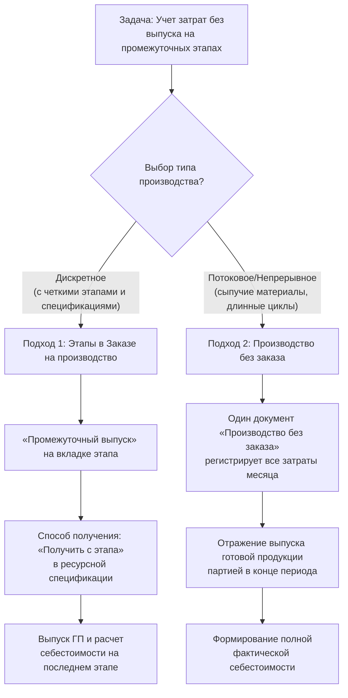

# Учет затрат без выпуска на этапах

Source: QW | Date: 2025-12-16 | Fragments: 4 | ID: 6f76ce11-6097-433c-98f8-dfc47a04ce0b

---

## USER

В 1С:ERP может ли в этапе производства вообще не быть выпуска, но при этом указаны затраты? Например, мы не показываем промежуточные полуфабрикаты, но применяем какие-то работы к заготовке, отмечаем выполнение этапа и выпуск показываем только на последнем этапе?

---

## AI

Да, в 1С:ERP реализовать учет затрат без выпуска на промежуточных этапах возможно. Для этого система предлагает настраиваемые механизмы, которые позволяют учитывать полуфабрикаты внутри маршрута без их отражения в оперативном складском учете.

### ⚙️ Стандартный сценарий и основные настройки

В обычном сценарии этап производства в 1С:ERP привязан к выпуску конкретной номенклатуры. **Система напрямую не позволяет оставить этап без выпущенной продукции** — это обязательный реквизит[citation:8].

На практике этапы выстраиваются так, чтобы выпуск продукции по себестоимости учитывался только на последнем из них[citation:5]. Чтобы исключить промежуточный выпуск в складской учет, используются два основных метода:

1.  **Промежуточный выпуск (Промежуточные продукты)**:
    *   В документе **«Этап производства»** для полуфабрикатов используется специальная закладка **«Промежуточный выпуск»** (а не основная «Выпуск»)[citation:8].
    *   Материалы, из которых изготавливается полуфабрикат, списываются на одном этапе. Затем сам полуфабрикат передается на следующий этап через промежуточный выпуск[citation:8].
    *   Это позволяет формировать его себестоимость «внутри» производственного маршрута, не создавая оперативных остатков на складе.

2.  **Настройка ресурсной спецификации**:
    *   В спецификации для полуфабриката нужно указать способ получения: **«Получить с этапа»**. Это свяжет этап выпуска полуфабриката с этапом его потребления, что особенно важно для правильного отражения межэтапной передачи[citation:8].

### 📝 Как организовать учет: два альтернативных подхода

Вы можете выбрать один из двух основных способов организации учета, в зависимости от типа производства. Второй подход особенно хорошо подходит для вашего сценария.

#### Подход 1: Этапы в "Заказе на производство" (для дискретного производства)
Этот метод подходит, если у вас есть четкие технологические этапы и спецификации. Как следует из статьи компании Assino, все движения материалов привязаны к конкретным этапам, и списание происходит только при их завершении[citation:8]. Основные шаги:
*   Все затраты на материалы и работы фиксируются в каждом этапе.
*   Полуфабрикаты отражаются в разделе **«Промежуточный выпуск»**, а не как обычная продукция[citation:8].
*   Готовая продукция и итоговая себестоимость формируются **только на последнем этапе**.

#### Подход 2: Использование документа "Производство без заказа" (для потокового производства)
Для непрерывных, потоковых или длительных производственных процессов (например, обработка сыпучих материалов) больше подходит этот подход[citation:2][citation:7].

*   Этот документ позволяет единовременно учесть все материальные затраты и работы за период.
*   Фактический выпуск готовой продукции можно отразить одной партией в конце месяца, после чего система рассчитает себестоимость[citation:2].
*   Этот метод изначально **не предполагает создания промежуточных полуфабрикатов** в системе, что идеально соответствует вашему запросу о скрытии их от складского учета. Он проще в использовании, но менее детализирован по операциям[citation:7].

Чтобы определиться с окончательным выбором и провести детальную настройку, необходимо учесть особенности именно вашего техпроцесса.

Для более точной рекомендации уточните, пожалуйста:
1.  Какой у вас тип производства: **дискретная сборка изделий из деталей** или **непрерывный процесс** (как в пищевой, химической или перерабатывающей промышленности)?
2.  Важно ли для вас вести **посменный или подетальный учет** выработки по каждому рабочему центру (станку)?

---

## USER

у нас позаказная металлообработка - на вход какой-то металл и комплектующие, на выходе изделия. этапы - лазерная резка, гибка, сварка, сборка и т.п.

---

## AI

Для позаказной металлообработки с такими этапами (резка, гибка, сварка, сборка) в 1С:ERP оптимален подход с **«Заказом на производство» и настроенным технологическим маршрутом**. Это позволяет точно учитывать затраты по каждому переделу и заказу, не создавая лишних складских движений для полуфабрикатов.

### 🎯 Рекомендуемый способ: Маршрут в Заказе на производство

Этот метод лучше всего соответствует вашей задаче. Вам не нужно физически перемещать заготовки между складами на каждом этапе — они остаются в цехе, но в системе вы видите прогресс и аккумулированные затраты.

1.  **Настройка номенклатуры и спецификаций**:
    *   Для **готового изделия** создается спецификация, где перечислены все исходные материалы (лист металла, комплектующие) и **операции** (ресурсы) маршрута: лазерная резка, гибка и т.д.
    *   Ключевой момент: **не создавайте отдельные номенклатурные позиции для промежуточных полуфабрикатов** (например, «Вырезанная заготовка №1»), если не нужно учитывать их на складе.

2.  **Создание Заказа на производство с маршрутом**:
    *   В заказе система автоматически развернет спецификацию и список операций (этапов) из нее.
    *   В **карточке каждого этапа** (например, «Лазерная резка») указывается:
        *   **Рабочий центр** (станок).
        *   **Норма времени** и **исполнитель** (бригада).
        *   **Важно:** В разделе «**Выпуск**» этого этапа **ничего не указывается**. Выпуск продукции будет только у последнего этапа «Сборка/Окраска».
        *   **Материалы** (лист металла) можно либо сразу отнести на первый этап, либо распределить по всему маршруту.

3.  **Учет выполнения и затрат**:
    *   При завершении работ по этапу мастер вносит документ **«Отчет производства за смену»**, указывая фактически отработанное время и количество обработанных единиц (или просто факт выполнения для одной штуки).
    *   В этот момент система:
        *   **Спишет материалы**, отнесенные на этот этап (если не были списаны ранее).
        *   **Начислит зарплату** рабочим и **учтет затраты** рабочего центра (амортизация, энергия) — все это формирует **незавершенное производство (НЗП)**.
        *   **Не сделает никакого выпуска** на склад, так как этап не настроен на выпуск продукции.

4.  **Финальный выпуск и расчет себестоимости**:
    *   На последнем этапе (например, «Сборка») в документе отчета указывается **выпуск готового изделия**.
    *   После проведения документа все затраты, накопленные по предыдущим этапам, будут **списаны на себестоимость** этой выпущенной партии готовых изделий.

### 🔄 Альтернативный вариант: Работа без подетального маршрута

Если детализация по каждому технологическому переходу избыточна, можно упростить:
*   Создать **один «Заказ на производство»** на конечное изделие.
*   Все операции (резка, гибка, сварка) учесть **одним документом «Отчет производства за смену»**, привязанным к этому заказу. В отчете просто перечисляются все выполненные работы.
*   Материалы списываются на заказ.
*   В конце, другим документом, отражается **выпуск готовой продукции**. Система соберет все затраты заказа на себестоимость.

Этот способ проще в ведении, но дает менее детальную аналитику по себестоимости каждого передела.

### 💡 Практические советы по настройке в 1С:ERP

*   **Статья затрат**: Для каждого типа операций в маршруте задайте правильные **статьи затрат** (например, «Обработка на лазерном станке», «Ручная гибка»). Это критически важно для корректного учета и анализа.
*   **НЗП**: Убедитесь, что в учетной политике производства включен и правильно настроен метод **оценки незавершенного производства** (например, по плановой стоимости операций).
*   **Тестирование**: Перед внедрением обязательно **протестируйте схему на одном учебном заказе** от создания до выпуска, чтобы убедиться, что затраты «перетекают» по этапам и правильно попадают в себестоимость.

**Итог:** Для вашего случая идеально подходит настройка **«Заказа на производство» с многоэтапным маршрутом, где выпуск продукции указан только на последнем этапе**. Это стандартная и хорошо поддерживаемая в 1С:ERP методика для позаказного дискретного производства.

Если потребуется помощь с настройкой конкретных документов или статей затрат, обращайтесь.

---

