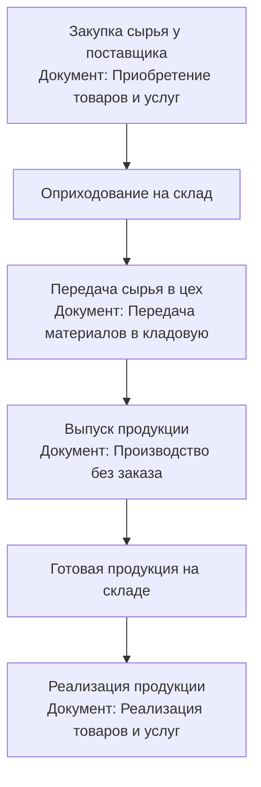

# Схема движений в 1С:ERP производстве

Source: QW | Date: 2026-01-13 | Fragments: 2 | ID: 2b9caad8-ee2e-433f-8074-2bcb98de74c3

---

## USER

помоги мне разобраться со схемой движений по регистрам оперативного учёт в производстве 1С:ERP

---

## AI

В 1С:ERP оперативный учет в производстве строится на **цепочке документов**, каждый из которых формирует движения по своим регистрам[citation:1]. Схема типового производственного цикла выглядит так:

Вот ключевые регистры оперативного учета, которые участвуют в процессе:

| Документ производства | Основные регистры оперативного учета | Суть движений |
| :--- | :--- | :--- |
| **Передача материалов в кладовую / в производство**[citation:1] | **Регистры остатков ТМЦ** | Списывает материалы со склада, приходует в цеховую кладовую или в производственное подразделение. |
| **Производство без заказа**[citation:1] | 1. **Регистры остатков ТМЦ** 2. **Регистры затрат / себестоимости** | 1. Списание материалов, оприходование готовой продукции. 2. Учет трудозатрат и прочих издержек для калькуляции. |
| **Отчет производства за смену** | **Регистры затрат / себестоимости** **Регистры остатков НЗП** | Детальный учет всех ресурсов (материалы, время, операции) на выпуск. Фиксация незавершенного производства. |

### 🔍 Как устроен механизм движений
Типовое проведение документа в ERP происходит в два этапа[citation:3]:
1.  **Подготовка данных (в модуле менеджера документа)**: Формируются таблицы с будущими движениями для каждого регистра.
2.  **Запись и контроль (в общем модуле)**: Движения записываются, после чего выполняется контроль (например, за отрицательными остатками).

**Где искать алгоритмы формирования движений?**
Основная логика находится в **функции `ДанныеДокументаДляПроведения()`** в модуле менеджера конкретного документа[citation:3][citation:5]. Для каждого регистра внутри неё вызываются свои процедуры формирования запросов (например, `ТекстЗапросаТаблица[ИмяРегистра]`).

### 🛠 Как просмотреть или изменить движения
*   **Просмотр движений документа**: Для любого проведенного документа можно открыть отчет **«Движения документа»** (обычно через меню «Отчеты» или кнопку на панели)[citation:6].
*   **Основные отчеты для контроля**: Для анализа используйте:
    *   **«Движение ТМЦ и затрат в производстве по организациям»** — сквозной контроль[citation:1].
    *   **«Ведомость по товарам на складах»** — остатки и движения ТМЦ[citation:1].
*   **Изменение или добавление движений**:
    1.  Определите, в каком документе и по какому регистру нужно изменить движения.
    2.  Найдите в его модуле менеджера функцию `ДанныеДокументаДляПроведения` и соответствующую процедуру формирования запроса для нужного регистра[citation:5].
    3.  Внесите изменения в запрос, сохраняя структуру итоговой таблицы[citation:5].
    4.  **Важно**: Любые изменения типового кода требуют аккуратности. Рекомендуется делать доработки через **расширения**, чтобы не потерять их при обновлении конфигурации.

Если вы работаете над конкретной доработкой (например, нужно добавить движение по новому регистру для документа «Производство без заказа»), опишите задачу подробнее — это поможет дать более точные рекомендации по реализации.

---

