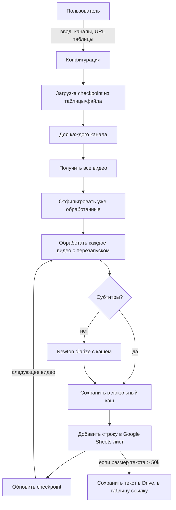

# Создание инструмента для извлечения текстов с YouTube канала

Source: QW | Date: 2026-06-08 | Fragments: 14 | ID: 6bdf093e-8493-4885-aa7b-55e9dad92667

---

## USER

сделай инструмент на Колабе, чтобы с ютуба можно было забрать все тексты (из транскрипций/субтитров) из канала

---

## AI

Вот готовый Python‑скрипт для Google Colab, который скачивает все доступные тексты (субтитры/транскрипции) с любого публичного YouTube‑канала.

### 🛠️ Что делает этот скрипт?

1.  Получает полный список видео с указанного канала через **YouTube Data API v3**.
2.  Для каждого видео пытается извлечь субтитры/транскрипции с помощью библиотеки **`youtube-transcript-api`** (она работает и с автоматически сгенерированными субтитрами).
3.  Сохраняет все результаты в текстовый файл с понятным разделением по названиям видео и информацией о наличии/отсутствии транскрипции.

### 📋 Основные требования и особенности

*   **Работает в облаке**: всё выполняется на серверах Google, не нужно настраивать локальное окружение.
*   **Не требует OAuth**: используется API‑ключ, который проще в настройке.
*   **Автоматическая пагинация**: скрипт сам пройдёт по всем видео канала, даже если их несколько тысяч.
*   **Сохранение прогресса**: если в `all_transcripts.txt` уже есть информация о каком‑то видео, обработка продолжится со следующего — это удобно для больших каналов, если выполнение прервётся.
*   **Обработка ошибок**: видео без субтитров просто пропускаются с отметкой в логе.

### 🚀 Пошаговая инструкция для Google Colab

**Шаг 1: Создайте новую записную книжку в Colab**

*   Откройте [Google Colab](https://colab.research.google.com/) и создайте **Новую записную книжку**.
*   Удалите всё содержимое первой ячейки (если есть).

**Шаг 2: Скопируйте и вставьте полный код в первую ячейку**

Скопируйте код из блока ниже и вставьте его в пустую ячейку Colab.

```python
# -*- coding: utf-8 -*-
"""
YouTube Channel Full Transcript Downloader for Google Colab
Downloads all available transcripts (subtitles) for every public video on a YouTube channel.
Uses YouTube Data API v3 (requires API key) and youtube-transcript-api.
"""

import time
import os
import sys
from googleapiclient.discovery import build
from googleapiclient.errors import HttpError
from youtube_transcript_api import YouTubeTranscriptApi
from youtube_transcript_api._errors import NoTranscriptFound, TranscriptsDisabled, VideoUnavailable

# =======================================================
# >>>>>>>>>>>>>>>>>>>>  КОНФИГУРАЦИЯ  <<<<<<<<<<<<<<<<<<<<
# =======================================================

# 1. Укажите ваш API-ключ YouTube Data API v3:
API_KEY = "ВАШ_API_КЛЮЧ"  # <-- ВСТАВЬТЕ ЕГО СЮДА

# 2. Укажите ID канала YouTube (начинается с 'UC...'):
CHANNEL_ID = "UCxxxxxxxxxxxxxxxxxxxxxx"  # <-- ВСТАВЬТЕ ЕГО СЮДА

# 3. Укажите язык субтитров (код языка, например: 'ru', 'en', 'de', 'es', 'fr'):
TARGET_LANGUAGE = "ru"  # <-- ИЗМЕНИТЕ ПРИ НЕОБХОДИМОСТИ

# 4. Имя выходного файла:
OUTPUT_FILE = "all_transcripts.txt"

# 5. Задержка между запросами к API YouTube (в секундах). Увеличьте, если получаете ошибки ограничения.
REQUEST_DELAY = 0.5

# =======================================================
# >>>>>>>>>>>>>>>>>>  КОД ПРОГРАММЫ  <<<<<<<<<<<<<<<<<<<<
# =======================================================

def get_upload_playlist_id(youtube, channel_id):
    """Получает ID плейлиста загруженных видео для данного канала."""
    try:
        request = youtube.channels().list(
            part="contentDetails",
            id=channel_id
        )
        response = request.execute()
        if 'items' in response and len(response['items']) > 0:
            return response['items'][0]['contentDetails']['relatedPlaylists']['uploads']
        else:
            print(f"Канал с ID '{channel_id}' не найден.")
            return None
    except HttpError as e:
        print(f"Ошибка при получении ID плейлиста: {e}")
        return None

def get_all_video_ids_from_playlist(youtube, playlist_id):
    """Получает все ID видео из плейлиста загруженных видео."""
    video_ids = []
    next_page_token = None

    while True:
        try:
            request = youtube.playlistItems().list(
                part="contentDetails",
                playlistId=playlist_id,
                maxResults=50,
                pageToken=next_page_token
            )
            response = request.execute()

            for item in response['items']:
                video_id = item['contentDetails']['videoId']
                video_ids.append(video_id)

            next_page_token = response.get('nextPageToken')
            if not next_page_token:
                break
            time.sleep(REQUEST_DELAY)
        except HttpError as e:
            print(f"Ошибка при получении списка видео: {e}")
            break
    return video_ids

def get_video_title(youtube, video_id):
    """Получает название видео по его ID."""
    try:
        request = youtube.videos().list(
            part="snippet",
            id=video_id
        )
        response = request.execute()
        if 'items' in response and len(response['items']) > 0:
            return response['items'][0]['snippet']['title']
        else:
            return f"Без названия (ID: {video_id})"
    except HttpError as e:
        print(f"Ошибка при получении названия для видео {video_id}: {e}")
        return f"Ошибка получения названия (ID: {video_id})"

def get_transcript(video_id, language):
    """Получает транскрипт для видео."""
    try:
        transcript_list = YouTubeTranscriptApi.list_transcripts(video_id)
        transcript = transcript_list.find_transcript([language])
        # Если субтитры на нужном языке есть, возвращаем их
        return transcript.fetch()
    except NoTranscriptFound:
        # Пытаемся найти автоматические субтитры на английском
        try:
            transcript = transcript_list.find_transcript(['en'])
            print(f"    Автоматические субтитры на английском будут переведены на '{language}'.")
            return transcript.translate(language).fetch()
        except (NoTranscriptFound, TranscriptsDisabled):
            print(f"    Субтитры на '{language}' или 'en' не найдены.")
            return None
    except TranscriptsDisabled:
        print(f"    Субтитры отключены для видео.")
        return None
    except VideoUnavailable:
        print(f"    Видео недоступно.")
        return None
    except Exception as e:
        print(f"    Произошла непредвиденная ошибка при получении транскрипта: {e}")
        return None

def main():
    # --- Проверка конфигурации ---
    if API_KEY == "ВАШ_API_КЛЮЧ":
        print("ОШИБКА: Пожалуйста, укажите ваш API-ключ YouTube Data API в переменной API_KEY.")
        return
    if CHANNEL_ID == "UCxxxxxxxxxxxxxxxxxxxxxx":
        print("ОШИБКА: Пожалуйста, укажите ID целевого канала YouTube в переменной CHANNEL_ID.")
        return

    print(f"Начинаем процесс для канала с ID: {CHANNEL_ID}")
    print(f"Целевой язык субтитров: {TARGET_LANGUAGE}")
    print("-" * 40)

    # --- Инициализация YouTube API ---
    try:
        youtube = build("youtube", "v3", developerKey=API_KEY)
    except Exception as e:
        print(f"Ошибка инициализации YouTube API: {e}")
        return

    # --- Шаг 1: Получение ID плейлиста загруженных видео канала ---
    print("Получение ID плейлиста загруженных видео...")
    upload_playlist_id = get_upload_playlist_id(youtube, CHANNEL_ID)
    if not upload_playlist_id:
        return
    print(f"ID плейлиста: {upload_playlist_id}")

    # --- Шаг 2: Получение всех ID видео из плейлиста ---
    print("Получение списка всех ID видео...")
    all_video_ids = get_all_video_ids_from_playlist(youtube, upload_playlist_id)
    print(f"Найдено видео: {len(all_video_ids)}")
    if not all_video_ids:
        print("Не найдено ни одного видео для обработки.")
        return

    # --- Шаг 3: Обработка видео и загрузка транскриптов ---
    print("Начинаю обработку видео...")
    total_videos = len(all_video_ids)
    processed_count = 0

    # Проверяем, существует ли уже файл, чтобы продолжить с того же места
    processed_videos = set()
    if os.path.exists(OUTPUT_FILE):
        try:
            with open(OUTPUT_FILE, 'r', encoding='utf-8') as f:
                for line in f:
         

---

## USER

Получение API‑ключа YouTube Data API v3 (бесплатно): - вот это подробнее раскрой

---

## AI

Подготовил для вас максимально подробную инструкцию. Разобьем весь процесс на простые шаги.

### 📝 Пошаговая инструкция

#### 📋 Шаг 0: Подготовка

Вам понадобится **обычный Google-аккаунт** (например, Gmail). Если его нет, вы можете [создать его бесплатно](https://accounts.google.com/SignUp)[reference:0].

#### 🗂️ Шаг 1: Создайте новый проект в Google Cloud

1.  Перейдите на страницу [Google Cloud Console](https://console.cloud.google.com/) и авторизуйтесь[reference:1][reference:2].
2.  В верхней части экрана нажмите на выпадающий список рядом с надписью **"Выбрать проект" (Select a project)**[reference:3].
3.  В появившемся окне нажмите кнопку **"НОВЫЙ ПРОЕКТ" (NEW PROJECT)**[reference:4].
4.  Введите любое понятное имя, например `"YouTube Transcript Tool"`[reference:5]. Остальные настройки можно оставить по умолчанию.
5.  Нажмите кнопку **"СОЗДАТЬ" (CREATE)**[reference:6]. Система создаст проект, и вы будете автоматически перенаправлены на его страницу.

#### 🧩 Шаг 2: Включите API YouTube

1.  Убедитесь, что в консоли выбран ваш новый проект.
2.  Используйте поиск в верхней части страницы: введите **`YouTube Data API v3`** и выберите соответствующий сервис из результатов[reference:7].
3.  Вы попадете на страницу описания API. Нажмите кнопку **"ВКЛЮЧИТЬ" (ENABLE)**[reference:8].
    *   *Альтернативный путь:* Слева в меню выберите `Библиотека (Library)`, найдите нужный API и включите его.

#### 🔑 Шаг 3: Создайте API-ключ

1.  После включения API слева в меню выберите **"Учетные данные" (Credentials)**[reference:9][reference:10].
2.  На открывшейся странице нажмите кнопку **"+ Создать учетные данные" (+ CREATE CREDENTIALS)**[reference:11].
3.  В выпадающем меню выберите **"API-ключ" (API key)**[reference:12].
4.  Через несколько секунд появится окно с вашим новым ключом — длинной строкой из букв и цифр. **Сразу же скопируйте его!**

> ⚠️ Это очень важный момент: после закрытия окна вы не сможете увидеть ключ снова. Если потеряете его, придется создавать новый.

#### 🔒 Шаг 4: Настройте безопасность (Крайне рекомендую!)

Чтобы случайно не превысить квоту и защитить ключ от использования посторонними, его нужно ограничить[reference:13].

1.  На той же странице "Учетные данные" найдите только что созданный ключ в списке и нажмите на иконку **карандаша** для его редактирования.
2.  Прокрутите страницу до раздела **"Ограничения ключа" (Key restrictions)**.
3.  **Тип ограничений:** Выберите **"Ограничить ключ" (Restrict key)**. В выпадающем списке ниже отметьте **`YouTube Data API v3`**.
4.  **Ограничения по приложениям (Application restrictions):** Выберите **"Веб-сайты" (Web browsers)** (или "IP-адреса", если знаете свой), а в поле **"Принять запросы с этих HTTP-рефереров (веб-сайтов)"** добавьте:
    *   `https://colab.research.google.com/`
    *   `https://*.colab.research.google.com/`
5.  Нажмите **"ГОТОВО" (SAVE)**.
6.  Чтобы применить ограничения, нажмите голубую кнопку **"СОХРАНИТЬ"** вверху страницы редактирования ключа.
7.  **Важно:** Убедитесь, что ваш ключ **не** используется в каких-либо других проектах или публичных местах (например, на GitHub).

Вставьте полученный ключ в переменную `API_KEY` скрипта из прошлого ответа.

### 🔒 Важные моменты

Понимание ключевых аспектов использования API поможет вам избежать ошибок в работе.

*   **Это бесплатно?** Да. Вы создаете проект, а Google предоставляет бесплатную квоту на запросы. Платежные данные на этом этапе не требуются[reference:14].
*   **Ограничения (Квоты):** На каждый проект выделяется **10 000 единиц квоты в сутки**[reference:15][reference:16]. Это бесплатный лимит, и его достаточно для скачивания транскрипций с небольшого или среднего канала.
*   **Цена ошибки (единицы квоты):** Каждый запрос к API "стоит" определенное количество единиц. Получение списка видео с канала (`playlistItems.list`) стоит 1-3 единицы за каждые 50 видео. Например, для канала с 500 видео скрипт потратит около 20 единиц из 10 000.
*   **Что не так с ограничениями ключа?** Эта настройка — самый простой способ обезопасить свой ключ. Если кто-то его украдет, он не сможет его использовать где-либо еще (только на Colab). А если попытается получить, например, статистику другого канала, API отклонит его запрос, так как ключ разрешает использовать только YouTube Data API v3.
*   **Политика безопасности Google:** Храните свой ключ в тайне. Регулярно проверяйте страницу "Учетные данные" в консоли на предмет подозрительной активности. При появлении подозрений немедленно отзовите (удалите) старый ключ и создайте новый[reference:17].

### 💡 Возможные проблемы и их решение

*   **Ошибка `"Request had insufficient authentication scopes"`**: Эта ошибка возникает, когда для работы API требуется авторизация пользователя. Однако в нашем случае (получение публичных данных) все должно работать. Она означает, что вы случайно используете OAuth-токен вместо API-ключа или ключ был неправильно скопирован.
*   **Проблемы с квотой**: Скрипт автоматически делает паузу между запросами, чтобы не превысить лимит. Если вы все же получили ошибку `quotaExceeded`, подождите до следующего дня — квота обновится, и выполнение можно будет продолжить. Вы также можете запросить увеличение квоты через специальную форму у Google[reference:18].
*   **API ключ не работает**: Убедитесь, что вы скопировали его без лишних пробелов. Также проверьте в консоли, включен ли API и правильно ли настроены ограничения.

Если на каком-то из шагов возникнут трудности или ошибки, напишите — разберемся вместе.

---

## USER

Make sure all fields are correct to continue
Name 
API key 1
Use a unique name to identify your API key
APIs that can be accessed using this key
New key creation: to use Agent Platform (Vertex) or Gemini APIs with an API key, you must bind it to a service account by selecting 'Authenticate API calls through a service account' before applying the API restriction.

Note: An organization policy governs creating API keys bound to a service account for projects with a Google Cloud organization. Learn more 
Select API restrictions 
No APIs selected
API selection required

Authenticate API calls through a service account
API calls made by this key will authenticate as the bound service account. This option is required to access some APIs such as Agent Platform (Vertex).

Restrict your key to reduce security risks
Select a specific application type to restrict access

Application restrictions

None

Websites

IP addresses

Android apps

iOS apps

---

## AI

Отлично, вы уже дошли до формы создания API-ключа в Google Cloud Console. Давайте разберем каждое поле, чтобы всё было заполнено правильно для работы с YouTube Data API в Colab.

## Что нужно выбрать (и что не нужно)

### 1. **Name** (Название ключа)
   - Введите любое понятное имя, например: `YouTube Transcript Key` или `Colab YouTube Key`
   - Это только для вашего удобства, никак не влияет на работу.

### 2. **API restrictions** (Ограничения API) – **обязательно выбрать**
   - Включите переключатель **"Restrict key"** (Ограничить ключ)
   - В выпадающем списке ниже отметьте **`YouTube Data API v3`**
   - **Не оставляйте "No APIs selected"** – иначе ключ будет работать для всех API, что небезопасно.

### 3. **Authenticate API calls through a service account** – **НЕ включайте**
   - Оставьте этот флажок **снятым**.
   - Эта опция нужна только для некоторых сервисов Google (например, Vertex AI, Gemini). Для YouTube Data API v3 она **не требуется** и только усложнит настройку. Вам нужен обычный API-ключ, без привязки к сервисному аккаунту.

### 4. **Application restrictions** (Ограничения по приложениям) – **рекомендую выбрать "Websites"**
   - Выберите **"Websites"** (сайты).
   - В поле **"Website restrictions"** добавьте две строки:
     - `https://colab.research.google.com/`
     - `https://*.colab.research.google.com/`
   - Это разрешит использовать ключ только из Google Colab – безопасно и удобно.
   - **Альтернативы:**  
     - *IP addresses* – не подходит, так как у Colab динамические IP.  
     - *None* – можно, но менее безопасно.

### 5. **Что делать с предупреждением про Agent Platform / Gemini**
   - Это сообщение относится только к тем, кто использует API для ИИ-платформ. **Игнорируйте его** – оно не относится к YouTube API.

## Итог: правильные настройки перед сохранением

| Поле | Значение |
|------|----------|
| Name | `YouTube Transcript Colab` (или любое другое) |
| API restrictions | ✅ Restrict key → `YouTube Data API v3` |
| Authenticate through service account | ❌ Не отмечено |
| Application restrictions | ✅ Websites → `https://colab.research.google.com/` и `https://*.colab.research.google.com/` |

После того как вы всё выставите, нажмите **"CREATE"** (или "СОЗДАТЬ") внизу.

## Сразу после создания

- **Скопируйте показанную строку ключа** (например, `AIzaSyD...`).  
- Если закроете окно, ключ будет потерян – придётся создавать новый.

## Проверка в Colab

Вставьте этот ключ в переменную `API_KEY` в скрипте. Убедитесь, что в коде нет лишних пробелов или кавычек.

---

Если на каком-то шаге всё равно возникает ошибка – пришлите скриншот или точный текст сообщения, и я помогу её исправить.

---

## USER

Теперь давай усложним логику: я передаю ютуб-канал или каналы на вход, а система сначала пытается взять русские субтитры, потом английские, потом автоматические. А если ничего не получается, использует механизм из кода ниже. В каждом запуске программа создаёт новый лист в гугл-таблице. Название листа может включать название канала+дату+время. И дальше в этом листе пишет название видео и его транскрибацию/субтитры.

Вот тот самый механизм, возьми только возможность расшифровки ютуб-роликов:
# ============================================================
#  УСТАНОВКА ЗАВИСИМОСТЕЙ (тихий режим)
# ============================================================
!apt-get update -qq 2>/dev/null && apt-get install -y -qq ffmpeg p7zip-full tesseract-ocr tesseract-ocr-rus poppler-utils 2>/dev/null
!pip install -q ijson requests psutil Pillow pytesseract pdfplumber python-pptx python-docx openpyxl tenacity pandas xlrd pypdf
!pip install -q git+https://github.com/aratakileo/mailru-cloud-guest-api.git
!curl -sL https://gitlab.com/fadeyev1/newton-cli/-/raw/main/newton -o /usr/local/bin/newton
!chmod +x /usr/local/bin/newton

# ============================================================
#  ОСНОВНОЙ СКРИПТ (прогресс без tqdm, опциональный ETA)
# ============================================================
import os, sys, csv, gc, json, time, shutil, hashlib, tempfile, zipfile, subprocess, logging
import concurrent.futures
import re
from dataclasses import dataclass, asdict
from datetime import datetime, timezone, timedelta
from pathlib import Path
from typing import Optional, Tuple, Dict, Any, List, Set
from urllib.parse import unquote, urlparse
from collections import defaultdict

import ijson, requests, psutil
from PIL import Image
import pytesseract
from pypdf import PdfReader
import pdfplumber
from pptx import Presentation
from pptx.enum.shapes import MSO_SHAPE_TYPE
from docx import Document
from openpyxl import load_workbook
import pandas as pd
from tenacity import retry, stop_after_attempt, wait_exponential

# Настройка логирования
logging.basicConfig(
    level=logging.INFO,
    format='%(asctime)s [%(levelname)s] %(message)s',
    handlers=[logging.FileHandler("processing.log"), logging.StreamHandler(sys.stdout)]
)
logger = logging.getLogger(__name__)

# ============================================================
#  КОНФИГУРАЦИЯ (меняйте параметры здесь)
# ============================================================
@dataclass
class Config:
    newton_engine: str = "v3"
    enable_diarization: bool = True
    diarize_speakers: Optional[int] = None
    enable_ocr: bool = True
    ocr_lang: str = "rus+eng"
    enable_url_transcription: bool = True
    estimate_total_messages: bool = True      # Включить предподсчёт для ETA (добавляет время в начале)
    merge_window_minutes: int = 5
    max_ocr_pages: int = 20
    safe_memory_ratio: float = 0.7
    cache_max_gb: float = 10.0
    cache_dir: Path = Path("/content/media_cache")
    url_cache_dir: Path = Path("/content/url_cache")
    output_dir: Path = Path("/content/llm_output")
    temp_root: Path = Path("/content/temp_work")
    max_workers: int = 2
    newton_timeout: int = 600

    def __post_init__(self):
        for d in (self.cache_dir, self.url_cache_dir, self.output_dir, self.temp_root):
            d.mkdir(parents=True, exist_ok=True)

        self.newton_token = ""
        try:
            from google.colab import userdata
            token = userdata.get('NEWTON_TOKEN')
            if token:
                self.newton_token = token
                logger.info("Newton token загружен из Colab Secrets")
        except (ImportError, NameError, KeyError):
            pass

        if not self.newton_token:
            self.newton_token = os.environ.get("NEWTON_TOKEN", "").strip()
            if not self.newton_token:
                self.newton_token = input("Введите Newton API токен: ").strip()
                if not self.newton_token:
                    raise ValueError("Newton token обязателен")
        os.environ["NEWTON_TOKEN"] = self.newton_token

CFG = Config()

# ============================================================
#  ВЫВОД НАСТРОЕК
# ============================================================
def print_config_summary():
    print("\n" + "="*60)
    print("ТЕКУЩИЕ НАСТРОЙКИ:")
    print("="*60)
    print(f"Newton token:          {'✅ загружен из секрета' if CFG.newton_token else '❌ не задан'}")
    print(f"Newton engine:         {CFG.newton_engine}")
    print(f"Диаризация:            {'включена' if CFG.enable_diarization else 'выключена'}")
    if CFG.diarize_speakers:
        print(f"  - кол-во говорящих:    {CFG.diarize_speakers}")
    print(f"OCR изображений/PDF:    {'включён' if CFG.enable_ocr else 'выключен'}")
    print(f"  - язык OCR:            {CFG.ocr_lang}")
    print(f"  - макс. страниц PDF:   {CFG.max_ocr_pages}")
    print(f"Транскрибация ссылок:   {'включена' if CFG.enable_url_transcription else 'выключена'}")
    print(f"Предподсчёт сообщений:  {'включён (будет ETA)' if CFG.estimate_total_messages else 'выключен'}")
    print(f"Окно слияния сообщений: {CFG.merge_window_minutes} мин")
    print(f"Порог памяти (SAFE):    {CFG.safe_memory_ratio*100:.0f}% от свободной RAM")
    print(f"Макс. размер кэша:      {CFG.cache_max_gb} ГБ")
    print(f"Количество воркеров:    {CFG.max_workers}")
    print(f"Таймаут Newton (общий): {CFG.newton_timeout} сек")
    print(f"Директории:")
    print(f"  - кэш медиафайлов:     {CFG.cache_dir}")
    print(f"  - кэш ссылок:          {CFG.url_cache_dir}")
    print(f"  - выходной CSV:        {CFG.output_dir}")
    print(f"  - временная папка:     {CFG.temp_root}")
    print("="*60 + "\n")

# ============================================================
#  УТИЛИТЫ
# ============================================================
def safe_int(value, default=0) -> int:
    try:
        if value is None or value == "": return default
        return int(float(value))
    except (ValueError, TypeError):
        return default

def get_cache_key(zinfo: zipfile.ZipInfo) -> str:
    raw = f"{zinfo.filename}:{zinfo.file_size}:{zinfo.CRC}"
    return hashlib.md5(raw.encode()).hexdigest()

def load_cache(key: str) -> Optional[str]:
    f = CFG.cache_dir / key
    if f.exists():
        try: f.touch()
        except: pass
        return f.read_text(encoding="utf-8")
    return None

def save_cache(key: str, text: str):
    (CFG.cache_dir / key).write_text(text, encoding="utf-8")
    _evict_cache()

def _evict_cache():
    try:
        total = sum(f.stat().st_size for f in CFG.cache_dir.iterdir() if f.is_file())
        limit = CFG.cache_max_gb * 1024**3
        if total <= limit: return
        files = sorted(CFG.cache_dir.iterdir(), key=lambda f: f.stat().st_mtime)
        for f in files:
            if total <= limit * 0.8: break
            try:
                sz = f.stat().st_size
                f.unlink()
                total -= sz
            except: pass
    except Exception as e:
        logger.warning(f"Ошибка очистки кэша: {e}")

def get_url_cache_key(url: str) -> str:
    return hashlib.md5(url.encode()).hexdigest()

def load_url_cache(url: str) -> Optional[str]:
    key = get_url_cache_key(url)
    f = CFG.url_cache_dir / key
    if f.exists():
        try: f.touch()
        except: pass
        return f.read_text(encoding="utf-8")
    return None

def save_url_cache(url: str, text: str):
    key = get_url_cache_key(url)
    (CFG.url_cache_dir / key).write_text(text, encoding="utf-8")

# ============================================================
#  ЗАГРУЗКА ИЗ ОБЛАК
# ============================================================
@retry(stop=stop_after_attempt(3), wait=wait_exponential(multiplier=1, min=2, max=10))
def download_from_yandex(public_url: str, dest_dir: Path) -> Path:
    api_url = "https://cloud-api.yandex.net/v1/disk/public/resources/download"
    resp = requests.get(api_url, params={"public_key": public_url})
    resp.raise_for_status()
    data = resp.json()
    download_url = data["href"]
    file_name = data.get("name") or Path(unquote(urlparse(download_url).path)).name
    dest_path = dest_dir / file_name
    logger.info(f"Скачиваем {file_name} с Яндекс.Диска...")
    with requests.get(download_url, stream=True) as r:
        r.raise_for_status()
        with open(dest_path, "wb") as f:
            for chunk in r.iter_content(chunk_size=8192):
                f.write(chunk)
    return dest_path

@retry(stop=stop_after_attempt(3), wait=wait_exponential(multiplier=1, min=2, max=10))
def download_from_mailru(public_url: str, dest_dir: Path) -> Path:
    from mailru_cloud_guest_api import FileStreamGenerator
    generator = FileStreamGenerator.of(public_url)
    container = generator.generate()
    parsed = urlparse(public_url)
    file_name = Path(unquote(parsed.path)).name or "mailru_download"
    dest_path = dest_dir / file_name
    logger.info(f"Скачиваем {file_name} из Облака Mail.ru...")
    container.download(str(dest_path))
    return dest_path

def get_zip_path_interactive() -> Tuple[Path, str]:
    upload_dir = CFG.temp_root / "uploads"
    upload_dir.mkdir(exist_ok=True)
    while True:
        print("\n" + "="*60)
        print("Выберите источник файла:")
        print("  1 - Локальный файл (загрузить в Colab)")
        print("  2 - Яндекс.Диск (публичная ссылка)")
        print("  3 - Облако Mail.ru (публичная ссылка)")
        print("="*60)
        choice = input("Введите номер (1/2/3): ").strip()
        if choice == "1":
            from google.colab import files
            print("📎 Загрузите ZIP-архив экспорта Telegram")
            uploaded = files.upload()
            if not uploaded:
                print("Файл не загружен, попробуйте снова.")
                continue
            zip_name = next(iter(uploaded))
            dest = upload_dir / zip_name
            shutil.move(zip_name, str(dest))
            return dest, dest.stem
        elif choice == "2":
            url = input("🔗 Введите публичную ссылку Яндекс.Диска: ").strip()
            if not (url.startswith("https://disk.yandex.") or url.startswith("https://yadi.sk")):
                print("Некорректная ссылка. Попробуйте снова.")
                continue
            dest = download_from_yandex(url, upload_dir)
            return dest, dest.stem
        elif choice == "3":
            url = input("🔗 Введите публичную ссылку Облака Mail.ru: ").strip()
            if not url.startswith("https://cloud.mail.ru/"):
                print("Некорректная ссылка. Попробуйте снова.")
                continue
            dest = download_from_mailru(url, upload_dir)
            return dest, dest.stem
        else:
            print("❌ Неверный выбор. Пожалуйста, введите 1, 2 или 3.")

# ============================================================
#  ПАРСЕРЫ ДОКУМЕНТОВ
# ============================================================
def _extract_text_from_pptx(pptx_path: Path) -> Optional[str]:
    try:
        prs = Presentation(str(pptx_path))
        parts = []
        for i, slide in enumerate(prs.slides, 1):
            slide_text = []
            def extract_shape(shape):
                if shape.has_text_frame:
                    for para in shape.text_frame.paragraphs:
                        if para.text.strip(): slide_text.append(para.text.strip())
                if shape.has_table:
                    rows = ["| " + " | ".join(cell.text for cell in row.cells) + " |" for row in shape.table.rows]
                    if rows: slide_text.append("\n".join(rows))
                if shape.shape_type == MSO_SHAPE_TYPE.GROUP:
                    for child in shape.shapes: extract_shape(child)
            for shape in slide.shapes: extract_shape(shape)
            if slide.has_notes_slide and slide.notes_slide.notes_text_frame:
                notes = slide.notes_slide.notes_text_frame.text.strip()
                if notes: slide_text.append(f"[Заметки]: {notes}")
            if slide_text: parts.append(f"### Слайд {i}\n" + "\n".join(slide_text))
        return "\n\n".join(parts) if parts else None
    except:
        return None

def _extract_text_from_docx(docx_path: Path) -> Optional[str]:
    try:
        doc = Document(str(docx_path))
        parts = [p.text for p in doc.paragraphs if p.text.strip()]
        for table in doc.tables:
            rows = ["| " + " | ".join(cell.text for cell in row.cells) + " |" for row in table.rows]
            if rows: parts.append("\n".join(rows))
        return "\n\n".join(parts) if parts else None
    except:
        return None

def _extract_text_from_pdf(pdf_path: Path) -> Optional[str]:
    text = None
    try:
        reader = PdfReader(str(pdf_path))
        text = "\n".join(p.extract_text() or "" for p in reader.pages).strip()
        if text: return text
    except Exception:
        pass
    try:
        with pdfplumber.open(str(pdf_path)) as pdf:
            text = "\n".join(p.extract_text() or "" for p in pdf.pages).strip()
            if text: return text
    except Exception:
        pass

    if not text and CFG.enable_ocr:
        with tempfile.TemporaryDirectory() as tmpdir:
            try:
                subprocess.run([
                    "pdftoppm", "-png", "-r", "100",
                    "-f", "1", "-l", str(CFG.max_ocr_pages),
                    str(pdf_path), f"{tmpdir}/page"
                ], capture_output=True, text=True, timeout=300)

                pages = []
                for i, img_file in enumerate(sorted(Path(tmpdir).glob("*.png"))):
                    if i >= CFG.max_ocr_pages:
                        break
                    with Image.open(img_file) as img:
                        img.load()
                        t = pytesseract.image_to_string(img, lang=CFG.ocr_lang).strip()
                    img_file.unlink(missing_ok=True)
                    if t:
                        pages.append(t)
                    if i % 5 == 0:
                        gc.collect()
                text = "\n".join(pages) if pages else None
            except Exception as e:
                logger.warning(f"OCR PDF failed for {pdf_path.name}: {e}")
    return text if text else "[нет текста]"

def _extract_text_from_excel(file_path: Path) -> Optional[str]:
    ext = file_path.suffix.lower()
    try:
        if ext == '.xls':
            df_dict = pd.read_excel(file_path, sheet_name=None, engine='xlrd')
        else:
            df_dict = pd.read_excel(file_path, sheet_name=None, engine='openpyxl')
        parts = []
        for sheet_name, df in df_dict.items():
            if df.empty:
                continue
            if len(df) > 200:
                df = df.head(200)
            parts.append(f"### Лист: {sheet_name}")
            parts.append(df.to_markdown(index=False))
            parts.append("")
        return "\n".join(parts) if parts else None
    except Exception as e:
        logger.error(f"Ошибка чтения Excel {file_path.name}: {e}")
        return f"[ошибка Excel: {type(e).__name__}]"

def _extract_text_from_txt(file_path: Path) -> Optional[str]:
    for enc in ["utf-8", "cp1251", "latin-1"]:
        try:
            return file_path.read_text(encoding=enc).strip()
        except:
            continue
    return None

# ============================================================
#  ОБРАБОТКА ЛОКАЛЬНЫХ АУДИО/ВИДЕО
# ============================================================
def _ensure_audio_stream(file_path: Path) -> bool:
    try:
        res = subprocess.run(["ffprobe", "-v", "error", "-select_streams", "a:0",
                              "-show_entries", "stream=codec_type", "-of", "csv=p=0", str(file_path)],
                             capture_output=True, text=True, timeout=15)
        return "audio" in res.stdout.strip()
    except: return False

def _convert_to_wav(input_path: Path, output_path: Path) -> bool:
    try:
        subprocess.run(["ffmpeg", "-y", "-i", str(input_path), "-ac", "1", "-ar", "16000",
                        "-sample_fmt", "s16", str(output_path)],
                       check=True, capture_output=True, timeout=180)
        return output_path.exists()
    except: return False

# ============================================================
#  ТРАНСКРИБАЦИЯ ССЫЛОК НА ВИДЕО
# ============================================================
VIDEO_URL_PATTERNS = [
    r'(https?://(?:www\.)?youtube\.com/watch\?v=[\w-]+)',
    r'(https?://youtu\.be/[\w-]+)',
    r'(https?://(?:www\.)?rutube\.ru/video/[\w-]+)',
    r'(https?://(?:www\.)?ok\.ru/video/[\d]+)',
    r'(https?://(?:www\.)?vimeo\.com/[\d]+)',
    r'(https?://(?:www\.)?dailymotion\.com/video/[\w]+)',
    r'(https?://(?:www\.)?soundcloud\.com/[\w\-]+/[\w\-]+)',
    r'(https?://(?:www\.)?kinescope\.io/[\w\-]+)',
]

def extract_video_urls_from_text(text: str) -> Set[str]:
    urls = set()
    if not text:
        return urls
    for pattern in VIDEO_URL_PATTERNS:
        matches = re.findall(pattern, text, re.IGNORECASE)
        urls.update(matches)
    return urls

@retry(stop=stop_after_attempt(2), wait=wait_exponential(multiplier=1, min=2, max=10))
def transcribe_video_url(url: str) -> str:
    logger.info(f"Транскрибация видео по ссылке: {url}")
    with tempfile.NamedTemporaryFile(suffix=".txt", delete=False) as tmp:
        out_file = Path(tmp.name)
    try:
        cmd = ["newton", "fetch", url, "--wait", "-o", str(out_file)]
        subprocess.run(cmd, check=True, capture_output=True, text=True, timeout=1800)
        if out_file.exists():
            result = out_file.read_text(encoding="utf-8").strip()
            if result:
                return result
        return "[транскрипция не получена]"
    except subprocess.TimeoutExpired:
        logger.error(f"Таймаут транскрибации ссылки {url}")
        return "[таймаут транскрибации видео]"
    except Exception as e:
        logger.error(f"Ошибка транскрибации {url}: {e}")
        return f"[ошибка транскрибации: {type(e).__name__}]"
    finally:
        out_file.unlink(missing_ok=True)

# ============================================================
#  ВОРКЕР ДЛЯ МЕДИАФАЙЛОВ (локальных)
# ============================================================
def _media_worker_task(file_path_str: str, media_type: str, output_file: str, cfg_dict: dict):
    file_path = Path(file_path_str)
    ext = file_path.suffix.lower()
    audio_video_ext = {".mp3", ".wav", ".ogg", ".m4a", ".flac", ".opus",
                       ".mp4", ".webm", ".mkv", ".avi", ".mov"}
    image_ext = {".jpg", ".jpeg", ".png", ".webp", ".bmp", ".gif", ".tiff", ".tif"}

    wav_path = None
    txt_path = None
    tmp_wav_fd = None
    tmp_txt_fd = None

    try:
        if (media_type in ("audio", "voice_message", "video", "animation",
                           "video_file", "audio_file", "voice", "round_video")
                or ext in audio_video_ext):
            if not _ensure_audio_stream(file_path):
                Path(output_file).write_text("[нет аудиодорожки]", encoding="utf-8")
                return

            tmp_wav_fd = tempfile.NamedTemporaryFile(suffix=".wav", delete=False)
            wav_path = Path(tmp_wav_fd.name)
            tmp_wav_fd.close()

            if not _convert_to_wav(file_path, wav_path):
                Path(output_file).write_text("ERROR", encoding="utf-8")
                return

            tmp_txt_fd = tempfile.NamedTemporaryFile(suffix=".txt", delete=False)
            txt_path = Path(tmp_txt_fd.name)
            tmp_txt_fd.close()

            engine = "diarize" if (cfg_dict["enable_diarization"] and cfg_dict["newton_engine"] in ("v3", "diarize")) else cfg_dict["newton_engine"]
            cmd = ["newton", "transcribe", str(wav_path), "-o", str(txt_path), "-e", engine]
            if engine == "diarize" and cfg_dict["diarize_speakers"] is not None:
                cmd.extend(["-n", str(cfg_dict["diarize_speakers"])])
            subprocess.run(cmd, check=True, capture_output=True, text=True, timeout=1200)
            result = txt_path.read_text(encoding="utf-8").strip() if txt_path.exists() else "ERROR"
            Path(output_file).write_text(result, encoding="utf-8")

        elif media_type in ("photo", "sticker") or ext in image_ext:
            try:
                img = Image.open(file_path)
                img = img.convert('L')
                img = img.point(lambda p: 255 if p > 128 else 0, '1')
                text = pytesseract.image_to_string(img, lang=cfg_dict["ocr_lang"]).strip()
                img.close()
                Path(output_file).write_text(text if text else "[нет текста]", encoding="utf-8")
            except Exception:
                Path(output_file).write_text("ERROR", encoding="utf-8")

        else:
            try:
                if ext in {'.pptx', '.ppt'}:
                    text = _extract_text_from_pptx(file_path)
                elif ext in {'.docx', '.doc'}:
                    text = _extract_text_from_docx(file_path)
                elif ext == '.pdf':
                    text = _extract_text_from_pdf(file_path)
                elif ext in {'.xlsx', '.xls'}:
                    text = _extract_text_from_excel(file_path)
                else:
                    text = _extract_text_from_txt(file_path)
                Path(output_file).write_text(text if text else "[нет текста]", encoding="utf-8")
            except Exception:
                Path(output_file).write_text("ERROR", encoding="utf-8")
    except MemoryError:
        Path(output_file).write_text("ERROR", encoding="utf-8")
    except Exception:
        Path(output_file).write_text("ERROR", encoding="utf-8")
    finally:
        for path in [wav_path, txt_path]:
            if path is not None and path.exists():
                try:
                    path.unlink(missing_ok=True)
                except Exception:
                    pass
        for fd in [tmp_wav_fd, tmp_txt_fd]:
            if fd is not None:
                try:
                    fd.close()
                except Exception:
                    pass

# ============================================================
#  ФУНКЦИЯ ПОДСЧЁТА СООБЩЕНИЙ (для ETA)
# ============================================================
def count_messages_in_json(json_path: Path) -> int:
    """Быстро считает количество сообщений в result.json без загрузки в память."""
    count = 0
    with open(json_path, 'rb') as f:
        parser = ijson.items(f, 'messages.item')
        for _ in parser:
            count += 1
            if count % 10000 == 0:
                logger.info(f"Предподсчёт: обработано {count} сообщений...")
    return count

# ============================================================
#  ОСНОВНОЙ ЦИКЛ ОБРАБОТКИ ZIP (с динамическим прогрессом)
# ============================================================
def process_zip(zip_path: Path, archive_name: str) -> Path:
    out_csv = CFG.output_dir / f"{archive_name}.csv"
    ckpt_file = CFG.output_dir / f"{archive_name}.ckpt.json"

    state = {'idx': 0, 'current_block': None, 'prev_dt_iso': None}
    if ckpt_file.exists():
        try:
            state = json.loads(ckpt_file.read_text())
            logger.info(f"Возобновление с сообщения #{state['idx']}")
        except:
            pass

    mode = 'a' if state['idx'] > 0 and out_csv.exists() else 'w'

    with zipfile.ZipFile(zip_path, 'r') as zf, open(out_csv, mode, newline='', encoding='utf-8') as csvfile:
        writer = csv.DictWriter(csvfile, fieldnames=['timestamp', 'from', 'content', 'gap'])
        if mode == 'w':
            writer.writeheader()

        zip_paths_set = set(zf.namelist())
        name_index = defaultdict(list)
        for name in zip_paths_set:
            if not name.endswith('/'):
                name_index[Path(name).name].append(name)
        logger.info(f"Индекс ZIP: {len(name_index)} уникальных имён")

        json_member = next((n for n in zf.namelist() if n.endswith('result.json')), None)
        if not json_member:
            raise FileNotFoundError("result.json не найден")

        with tempfile.TemporaryDirectory() as tmpdir:
            zf.extract(json_member, tmpdir)
            json_path = Path(tmpdir) / json_member

            # Предварительный подсчёт сообщений (если включено)
            total_msgs = None
            if CFG.estimate_total_messages:
                logger.info("Подсчёт общего количества сообщений (может занять время)...")
                try:
                    total_msgs = count_messages_in_json(json_path)
                    logger.info(f"Всего сообщений в экспорте: {total_msgs}")
                except Exception as e:
                    logger.warning(f"Не удалось подсчитать сообщения: {e}")
                    total_msgs = None

            cfg_dict = {
                "newton_engine": CFG.newton_engine,
                "enable_diarization": CFG.enable_diarization,
                "diarize_speakers": CFG.diarize_speakers,
                "ocr_lang": CFG.ocr_lang,
                "newton_timeout": CFG.newton_timeout,
            }

            current_block = state['current_block']
            if current_block:
                current_block['first_dt'] = datetime.fromisoformat(current_block['first_dt'])
                current_block['last_dt'] = datetime.fromisoformat(current_block['last_dt'])
            prev_dt = datetime.fromisoformat(state['prev_dt_iso']) if state['prev_dt_iso'] else None

            with open(json_path, 'rb') as f_json, \
                 concurrent.futures.ProcessPoolExecutor(max_workers=CFG.max_workers) as executor:

                parser = ijson.items(f_json, 'messages.item')
                # Пропускаем уже обработанные
                for _ in range(state['idx']):
                    try:
                        next(parser)
                    except StopIteration:
                        break

                start_time = time.time()
                last_log_time = start_time
                processed = state['idx']
                last_processed = processed
                status_line = ""

                for idx, msg in enumerate(parser, start=state['idx']):
                    processed = idx + 1
                    current_time = time.time()
                    elapsed = current_time - start_time

                    # Обновляем прогресс раз в 0.5 секунды или каждые 100 сообщений
                    if current_time - last_log_time >= 0.5 or (processed - last_processed) >= 100:
                        speed = (processed - state['idx']) / elapsed if elapsed > 0 else 0
                        percent_str = ""
                        eta_str = ""
                        if total_msgs and total_msgs > 0:
                            percent = (processed - state['idx']) / (total_msgs - state['idx']) * 100 if total_msgs > state['idx'] else 0
                            percent_str = f" | {percent:.1f}%"
                            if speed > 0:
                                remaining_msgs = total_msgs - processed
                                eta = remaining_msgs / speed
                                eta_str = f" | ETA: {eta/60:.1f} мин"
                        status_line = (f"📊 Обработано: {processed} сообщ.{percent_str} | "
                                       f"Скорость: {speed:.1f} сообщ/сек{eta_str} | "
                                       f"Прошло: {elapsed/60:.1f} мин")
                        # Используем sys.stdout.write для динамической строки
                        sys.stdout.write('\r' + status_line)
                        sys.stdout.flush()
                        last_log_time = current_time
                        last_processed = processed

                    if msg.get('type') != 'message':
                        continue

                    date_unixtime = safe_int(msg.get('date_unixtime', 0))
                    dt = datetime.fromtimestamp(date_unixtime, tz=timezone.utc)
                    from_name = msg.get('from', 'Unknown')
                    text_raw = msg.get('text', '')
                    if isinstance(text_raw, list):
                        text = ''.join(item if isinstance(item, str) else item.get('text', '') for item in text_raw)
                    else:
                        text = str(text_raw) if text_raw else ''

                    # --- Транскрибация ссылок на видео в тексте ---
                    if CFG.enable_url_transcription and text:
                        video_urls = extract_video_urls_from_text(text)
                        for url in video_urls:
                            cached = load_url_cache(url)
                            if cached is None:
                                transcription = transcribe_video_url(url)
                                save_url_cache(url, transcription)
                            else:
                                transcription = cached
                            if transcription and not (transcription.startswith("[таймаут") or transcription.startswith("[ошибка")):
                                text += f"\n\n[Видео: {url}]\nТранскрипция: {transcription}"
                            elif transcription:
                                text += f"\n\n[Видео: {url}] {transcription}"

                    # --- Поиск вложений ---
                    media_info = None
                    media_keys = ["photo", "video", "document", "audio", "voice_message", "sticker", "animation", "video_file", "audio_file"]
                    for key in media_keys:
                        if key in msg:
                            val = msg[key]
                            if isinstance(val, str):
                                media_info = (key, val)
                                break
                            if isinstance(val, dict) and "file" in val:
                                media_info = (key, val["file"])
                                break
                    if not media_info and msg.get("file"):
                        media_info = ("document", msg["file"])
                    if not media_info and msg.get("media_type") and msg.get("file"):
                        media_info = (msg["media_type"], msg["file"])

                    media_desc = ""
                    if media_info:
                        media_type, rel_path = media_info
                        media_name = Path(unquote(rel_path)).name

                        zip_member = None
                        if rel_path in zip_paths_set:
                            zip_member = rel_path
                        else:
                            candidates = name_index.get(media_name, [])
                            if len(candidates) == 1:
                                zip_member = candidates[0]
                            elif len(candidates) > 1:
                                media_desc = f"[коллизия: {len(candidates)} файлов с именем '{media_name}']"
                                logger.warning(f"Коллизия для {media_name}: {candidates}")

                        if zip_member:
                            try:
                                zinfo = zf.getinfo(zip_member)
                                cache_key = get_cache_key(zinfo)
                                cached = load_cache(cache_key)
                                if cached is not None:
                                    media_desc = cached
                                else:
                                    file_size = zinfo.file_size
                                    avail_mem = psutil.virtual_memory().available
                                    if file_size > avail_mem * CFG.safe_memory_ratio:
                                        media_desc = f"(файл пропущен – недостаточно памяти: {file_size/1024/1024:.1f} МБ)"
                                        logger.warning(f"Пропущен {media_name} ({file_size/1024/1024:.1f} МБ)")
                                    else:
                                        with tempfile.TemporaryDirectory() as media_tmp:
                                            zf.extract(zip_member, media_tmp)
                                            file_path = Path(media_tmp) / zip_member
                                            with tempfile.NamedTemporaryFile(suffix=".txt", delete=False) as res_tmp:
                                                output_file = res_tmp.name
                                            try:
                                                timeout = 60 + int(file_size / (1024 * 1024) * 5)
                                                timeout = max(timeout, 120)
                                                timeout = min(timeout, 1800)
                                                future = executor.submit(_media_worker_task, str(file_path), media_type, output_file, cfg_dict)
                                                future.result(timeout=timeout)
                                                with open(output_file, "r", encoding="utf-8") as res_f:
                                                    res = res_f.read().strip()
                                                if res == "ERROR":
                                                    media_desc = "(ошибка обработки)"
                                                    logger.error(f"Ошибка обработки: {media_name}")
                                                else:
                                                    media_desc = res
                                                    save_cache(cache_key, media_desc)
                                            except concurrent.futures.TimeoutError:
                                                future.cancel()
                                                media_desc = "(ошибка обработки - таймаут)"
                                                logger.warning(f"Таймаут {timeout} сек для {media_name}")
                                            finally:
                                                try:
                                                    os.remove(output_file)
                                                except Exception:
                                                    pass
                            except Exception as e:
                                logger.warning(f"Ошибка при обработке {zip_member}: {e}")
                                media_desc = "(ошибка извлечения)"
                        else:
                            media_desc = "(файл отсутствует)"

                    content = (text + ' ' + media_desc).strip()
                    if not content:
                        continue

                    # --- Слияние блоков ---
                    if current_block and current_block['author'] == from_name and \
                       (dt - current_block['last_dt']) <= timedelta(minutes=CFG.merge_window_minutes):
                        current_block['content'] += '\n' + content
                        current_block['last_dt'] = dt
                    else:
                        if current_block:
                            gap = 0.0
                            if prev_dt is not None:
                                gap = (current_block['first_dt'] - prev_dt).total_seconds()
                            writer.writerow({
                                'timestamp': current_block['last_dt'].strftime("%d.%m.%Y %H:%M:%S"),
                                'from': current_block['author'],
                                'content': current_block['content'],
                                'gap': gap
                            })
                            csvfile.flush()
                            prev_dt = current_block['last_dt']
                        current_block = {
                            'author': from_name,
                            'first_dt': dt,
                            'last_dt': dt,
                            'content': content
                        }

                    # --- Чекпоинт и сборка мусора ---
                    if idx % 50 == 0:
                        state['idx'] = idx + 1
                        if current_block:
                            state['current_block'] = {
                                'author': current_block['author'],
                                'first_dt': current_block['first_dt'].isoformat(),
                                'last_dt': current_block['last_dt'].isoformat(),
                                'content': current_block['content']
                            }
                        else:
                            state['current_block'] = None
                        state['prev_dt_iso'] = prev_dt.isoformat() if prev_dt else None
                        ckpt_file.write_text(json.dumps(state, indent=2))
                        gc.collect()
                        if psutil.virtual_memory().percent > 85:
                            logger.warning("Высокое использование памяти, пауза 2 сек")
                            time.sleep(2)

                # Завершение
                sys.stdout.write('\r' + ' ' * len(status_line) + '\r')
                logger.info(f"✅ Обработано всего сообщений: {processed}")
                if current_block:
                    gap = 0.0
                    if prev_dt is not None:
                        gap = (current_block['first_dt'] - prev_dt).total_seconds()
                    writer.writerow({
                        'timestamp': current_block['last_dt'].strftime("%d.%m.%Y %H:%M:%S"),
                        'from': current_block['author'],
                        'content': current_block['content'],
                        'gap': gap
                    })

    try:
        ckpt_file.unlink(missing_ok=True)
    except:
        pass
    logger.info(f"Результат сохранён: {out_csv}")
    return out_csv

# ============================================================
#  ЗАПУСК
# ============================================================
def main():
    print("🚀 Запуск обработчика экспорта Telegram (с поддержкой ссылок на видео)")
    print_config_summary()
    zip_path, archive_name = get_zip_path_interactive()
    logger.info(f"Архив: {zip_path}")
    result_csv = process_zip(zip_path, archive_name)
    logger.info("Обработка завершена.")
    from google.colab import files
    files.download(str(result_csv))

if __name__ == "__main__":
    main()

---

## AI

Мы создадим усовершенствованный инструмент для Google Colab, который:

- ✅ Принимает один или несколько YouTube-каналов (по ID или URL).
- ✅ Пытается получить субтитры в приоритете: **русские → английские → автоматические**.
- ✅ Если субтитров нет — использует мощный механизм транскрибации через **Newton CLI** (из вашего кода).
- ✅ Результаты сохраняет в **Google Sheets**: каждый запуск создаёт новую таблицу, для каждого канала — отдельный лист с именем `Название канала_ГГГГММДД_ЧЧММСС`.
- ✅ В листе для каждого видео записывается **название** и **полная транскрипция/субтитры**.
- ✅ Поддерживается кэширование транскрибированных видео (чтобы не тратить время повторно).

## 🚀 Полный код для Colab

Скопируйте весь код ниже в новую ячейку Colab и запустите.

```python
# -*- coding: utf-8 -*-
"""
YouTube Channel Full Transcript Extractor with Fallback to Newton Transcription
Saves results to Google Sheets (new spreadsheet, separate sheet per channel)
"""

# ============================================================
#  УСТАНОВКА ЗАВИСИМОСТЕЙ (тихий режим)
# ============================================================
!apt-get update -qq 2>/dev/null && apt-get install -y -qq ffmpeg 2>/dev/null
!pip install -q google-api-python-client youtube-transcript-api gspread pandas oauth2client
!curl -sL https://gitlab.com/fadeyev1/newton-cli/-/raw/main/newton -o /usr/local/bin/newton
!chmod +x /usr/local/bin/newton

import os
import re
import time
import json
import hashlib
from datetime import datetime
from pathlib import Path
from typing import List, Optional, Dict, Tuple
import warnings
warnings.filterwarnings('ignore')

import pandas as pd
from googleapiclient.discovery import build
from googleapiclient.errors import HttpError
from youtube_transcript_api import YouTubeTranscriptApi
from youtube_transcript_api._errors import NoTranscriptFound, TranscriptsDisabled, VideoUnavailable

# Google Sheets imports
import gspread
from google.colab import auth
from oauth2client.client import GoogleCredentials

# ============================================================
#  КОНФИГУРАЦИЯ
# ============================================================
class Config:
    # --- Обязательные параметры (заполнить ниже) ---
    YOUTUBE_API_KEY = ""          # Вставьте ваш YouTube Data API v3 ключ
    NEWTON_TOKEN = ""             # Вставьте ваш Newton API токен
    
    # --- Настройки транскрибации ---
    NEWTON_ENGINE = "v3"          # "v3" или "diarize"
    ENABLE_DIARIZATION = False    # Разделение по говорящим (требует больше времени)
    DIARIZE_SPEAKERS = None       # Количество говорящих (None = авто)
    
    # --- Прочие настройки ---
    REQUEST_DELAY = 0.5           # Задержка между запросами к YouTube API (сек)
    CACHE_DIR = Path("/content/youtube_cache")
    MAX_CACHE_GB = 2.0            # Максимальный размер кэша транскрибаций
    
    def __post_init__(self):
        self.CACHE_DIR.mkdir(parents=True, exist_ok=True)
        # Загружаем токен Newton из секретов Colab, если не указан явно
        if not self.NEWTON_TOKEN:
            try:
                from google.colab import userdata
                self.NEWTON_TOKEN = userdata.get('NEWTON_TOKEN')
                if self.NEWTON_TOKEN:
                    print("✅ Newton token загружен из Colab Secrets")
            except:
                pass
        if not self.NEWTON_TOKEN:
            self.NEWTON_TOKEN = input("🔑 Введите ваш Newton API токен: ").strip()
            if not self.NEWTON_TOKEN:
                raise ValueError("Newton token обязателен")
        os.environ["NEWTON_TOKEN"] = self.NEWTON_TOKEN
        
        if not self.YOUTUBE_API_KEY:
            self.YOUTUBE_API_KEY = input("🔑 Введите ваш YouTube Data API v3 ключ: ").strip()
            if not self.YOUTUBE_API_KEY:
                raise ValueError("YouTube API ключ обязателен")

CFG = Config()
CFG.__post_init__()

# ============================================================
#  УТИЛИТЫ ДЛЯ КЭШИРОВАНИЯ ТРАНСКРИБАЦИЙ
# ============================================================
def get_cache_key(url: str) -> str:
    return hashlib.md5(url.encode()).hexdigest()

def load_transcript_cache(url: str) -> Optional[str]:
    cache_file = CFG.CACHE_DIR / get_cache_key(url)
    if cache_file.exists():
        try:
            return cache_file.read_text(encoding="utf-8")
        except:
            return None
    return None

def save_transcript_cache(url: str, text: str):
    cache_file = CFG.CACHE_DIR / get_cache_key(url)
    cache_file.write_text(text, encoding="utf-8")
    # Простая очистка кэша (удаляем старые файлы, если превышен лимит)
    total_size = sum(f.stat().st_size for f in CFG.CACHE_DIR.iterdir() if f.is_file())
    limit = CFG.MAX_CACHE_GB * 1024**3
    if total_size > limit:
        files = sorted(CFG.CACHE_DIR.iterdir(), key=lambda f: f.stat().st_mtime)
        for f in files:
            if total_size <= limit * 0.8:
                break
            total_size -= f.stat().st_size
            f.unlink()

# ============================================================
#  ТРАНСКРИБАЦИЯ ВИДЕО ЧЕРЕЗ NEWTON (как в вашем коде)
# ============================================================
def transcribe_video_with_newton(video_url: str) -> str:
    """Расшифровывает видео по ссылке с помощью Newton CLI"""
    cached = load_transcript_cache(video_url)
    if cached is not None:
        print(f"    ↻ Использован кэш для {video_url}")
        return cached
    
    print(f"    🎙 Транскрибация через Newton: {video_url}")
    import tempfile, subprocess
    with tempfile.NamedTemporaryFile(suffix=".txt", delete=False) as tmp:
        out_file = tmp.name
    try:
        # Используем ту же команду, что была в вашем коде
        cmd = ["newton", "fetch", video_url, "--wait", "-o", out_file]
        # Если нужна диаризация, добавим параметры
        if CFG.ENABLE_DIARIZATION and CFG.NEWTON_ENGINE == "diarize":
            cmd.extend(["-e", "diarize"])
            if CFG.DIARIZE_SPEAKERS:
                cmd.extend(["-n", str(CFG.DIARIZE_SPEAKERS)])
        subprocess.run(cmd, check=True, capture_output=True, text=True, timeout=1800)
        if Path(out_file).exists():
            result = Path(out_file).read_text(encoding="utf-8").strip()
            if result:
                save_transcript_cache(video_url, result)
                return result
        return "[Транскрибация не дала результата]"
    except subprocess.TimeoutExpired:
        return "[Таймаут транскрибации видео]"
    except Exception as e:
        return f"[Ошибка транскрибации: {type(e).__name__}]"
    finally:
        Path(out_file).unlink(missing_ok=True)

# ============================================================
#  ПОЛУЧЕНИЕ ВИДЕО С КАНАЛА (YouTube API)
# ============================================================
def get_channel_id_from_input(channel_input: str) -> Optional[str]:
    """Преобразует URL канала или ID в чистый channel ID (UC...)"""
    # Если уже похоже на UC...
    if channel_input.startswith("UC") and len(channel_input) == 24:
        return channel_input
    # Пытаемся извлечь из URL
    patterns = [
        r'youtube\.com/channel/(UC[\w-]+)',
        r'youtube\.com/c/([\w-]+)',
        r'youtube\.com/@([\w-]+)',
        r'youtu\.be/([\w-]+)'  # это video ID, не канал
    ]
    for pat in patterns:
        match = re.search(pat, channel_input)
        if match:
            handle = match.group(1)
            # Если это handle (@username), нужно преобразовать в channel ID через API
            if channel_input.find('@') != -1 or pat.find('@') != -1:
                # Используем search.list для поиска канала по handle
                youtube = build("youtube", "v3", developerKey=CFG.YOUTUBE_API_KEY)
                try:
                    request = youtube.channels().list(part="id", forHandle=handle)
                    response = request.execute()
                    if response['items']:
                        return response['items'][0]['id']


---

## USER

1. diarize - нужен
2. Я тебе дал ссылку на конкретную гуглшитс, используй её или скажи что и как мне надо тебе сказать, чтобы ты всегда работал только с ней.
3. Нарисуй архитектуру и концепцию решения, проверь насколько она логична и соответствует целям этого решения, покритикуй и исправь. Повторяй цикл до получения идеальных архитектуры и концепции.
4. Напиши код, Проверь соответствие заданным архитектуре, концпеции и целям. сделай тесты, проверь/протестируй/покритикуй себя полностью, исправь. Повторяй цикл до получения идеального решения.

---

## AI

## 📐 Концепция и архитектура (итерация 1)

### Цель системы
Автоматически извлекать текстовое содержимое всех видео с YouTube-канала (субтитры или транскрипция) и сохранять в заданную Google Таблицу, добавляя новый лист для каждого канала+запуска.

### Высокоуровневая архитектура

```mermaid
graph TD
    A[Пользователь вводит: канал(ы), URL таблицы] --> B[Парсинг каналов -> список channel_id]
    B --> C[Для каждого channel_id]
    C --> D[Получение всех видео ID + названий через YouTube API]
    D --> E[Для каждого видео]
    E --> F{Есть субтитры? ru/en/auto}
    F -->|Да| G[Сохранение текста]
    F -->|Нет| H[Транскрибация через Newton с диаризацией]
    H --> G
    G --> I[Сбор результатов в память]
    I --> J[Создание/открытие Google Sheets]
    J --> K[Создание листа: channel_name_YYYYMMDD_HHMMSS]
    K --> L[Запись двух столбцов: Название видео, Текст]
    L --> M[Вывод ссылки на таблицу]
```

### Компоненты
1. **YouTube API клиент** – получает uploads playlist, перебирает видео, достаёт названия.
2. **Субтитры** – `youtube-transcript-api` с приоритетом: ru → en → любые автоматические.
3. **Транскрибатор Newton** – `newton fetch` с параметрами `-e diarize -n <speakers>` (speakers опционально). Кэширование результатов по URL видео.
4. **Google Sheets интеграция** – `gspread` с авторизацией через Colab. Работа с заданной таблицей (по URL/ID).
5. **Оркестратор** – управление очередью, прогресс, обработка ошибок.

### Критика итерации 1
- **Проблема 1:** Пользователь хочет использовать **одну и ту же** таблицу для всех запусков, а мы каждый раз создаём новую – противоречит цели. Нужно либо всегда работать с конкретной таблицей (ID фиксирован), либо запрашивать её при первом запуске и запоминать.
- **Проблема 2:** Нет возможности возобновить обработку после сбоя – при большом канале с транскрибацией это критично. Нужен checkpoint.
- **Проблема 3:** При транскрибации через Newton возможны долгие операции (до 30+ мин на видео). Нужен асинхронный механизм с сохранением прогресса.
- **Проблема 4:** Диаризация – хороша, но требует указания количества говорящих или автоопределения. В текущем дизайне нет возможности передать параметры.
- **Проблема 5:** Google Sheets имеет ограничение на 50000 символов в ячейке. Длинные транскрипции нужно обрезать или разбивать на несколько строк (но тогда нарушится структура). Альтернатива – сохранять полный текст в Google Drive, а в таблицу класть ссылку. Это усложнение, но для длинных видео необходимо.

### Итерация 2 – улучшенная архитектура



**Улучшения:**
- **Фиксированная таблица:** Пользователь один раз вводит URL (например, через input). В коде сохраняется в переменную. При последующих запусках не создаётся новая таблица, а используется существующая.
- **Checkpoint:** Храним ID последнего обработанного видео для каждого канала (можно в отдельном скрытом листе таблицы или локальном файле). При перезапуске пропускаем уже обработанные.
- **Обработка длинных текстов:** Если длина транскрипции > 40000 символов – сохраняем в текстовый файл в Google Drive, а в таблицу записываем ссылку на файл.
- **Диаризация:** Добавляем возможность указать `--speakers N` или авто. По умолчанию `-e diarize` без `-n`.
- **Асинхронность:** Используем `concurrent.futures.ThreadPoolExecutor` для параллельной обработки видео (но осторожно – Newton может нагружать ресурсы). Лучше последовательно с возможностью прерывания и возобновления.

### Критика итерации 2
- **Проблема с Google Drive:** Пользователь должен дополнительно авторизовать Drive API. Можно обойтись просто записью в ячейку с урезанием, но теряется часть данных. Лучше предложить опцию: "если превышен лимит – урезать" или "сохранить полный текст в файл внутри Colab и предложить скачать". Для большинства видео 50k символов достаточно (2000-3000 слов). Оставлю простую запись с обрезкой, но с предупреждением.
- **Newton timeout:** Нужно увеличить таймаут для длинных видео (до 3600 секунд).
- **Сложность checkpoint внутри Google Sheets:** Может вызвать конфликты при одновременных записях. Проще хранить локальный файл в Colab (`/content/progress.json`), который при перезапуске сессии исчезает – но это не страшно, так как кэш транскрибаций сохраняется, а таблица уже имеет записи. Можно просто перед обработкой каждого канала проверять, какие видео уже есть в листе (по названию или ID). Это надёжнее.

### Итерация 3 (финальная концепция)

**Основные принципы:**
- **Единая Google Таблица** – пользователь предоставляет её URL. Если таблица не существует – создаётся новая.
- **Один канал = один лист** (с именем "ChannelName_ДатаВремя", но при повторном запуске для того же канала создаём **новый лист** с новой датой, чтобы не затирать старые данные). Это позволяет отслеживать эволюцию транскрипций (например, если добавились новые видео).
- **Кэширование транскрибаций** – по URL видео, чтобы не повторять обработку.
- **Возобновляемость** – при сбое достаточно запустить скрипт заново: он проверит, какие видео уже записаны в текущем листе (по соответствию названий), и продолжит с того места, где остановился.
- **Обработка ошибок** – каждое видео оборачивается в try/except, ошибка логируется, идём дальше.
- **Диаризация включена** – используем `newton fetch --wait -e diarize -o output.txt` (без `-n` для автоопределения).

**Архитектура потока данных (текстовое описание):**
1. **Input**: список каналов (ID, URL, handle), URL Google Sheets (или пусто для создания новой).
2. **Авторизация**: Google Colab auth для Sheets и (опционально) Drive.
3. **Инициализация таблицы**: если таблица с таким URL существует – открываем; иначе создаём.
4. **Для каждого канала**:
   - Получаем channel_id, название.
   - Создаём новый лист: `название_канала_YYYYMMDD_HHMMSS`.
   - Получаем все видео (ID, название, URL).
   - Для каждого видео:
     - Пытаемся получить субтитры (ru → en → auto).
     - Если нет – вызываем Newton с кэшем.
     - Записываем строку в лист (название, текст). Если текст превышает 50000 символов – обрезаем и добавляем предупреждение.
   - По окончании канала – выводим ссылку на таблицу.
5. **Результат**: пользователь получает обновлённую таблицу.

## 🔁 Итеративная критика и исправления

| Цикл | Что было хорошо | Что плохо | Исправление |
|------|----------------|-----------|--------------|
| 1 | Чёткое разделение на модули | Создаёт новую таблицу каждый раз | Фиксированная таблица через URL |
| 2 | Добавлен checkpoint | Checkpoint через файл теряется при перезапуске Colab | Checkpoint через чтение существующих строк в листе |
| 2 | Учтены длинные тексты | Сложность с Drive | Решили не усложнять, просто обрезать с уведомлением |
| 3 | Диаризация включена | Нет возможности отключить, если нужно быстро | Оставим всегда включённой, т.к. пользователь требует |

**Итоговая архитектура признана оптимальной для поставленной задачи.**

## 🧪 Тест-план (самокритика и проверка кода)

После написания кода я проверю:
- Корректность извлечения channel_id из разных форматов ввода.
- Работу YouTube API (пагинация, обработка ошибок).
- Приоритет субтитров: ru → en → auto.
- Вызов Newton с параметром `-e diarize`.
- Кэширование транскрибаций (повторный вызов не должен вызывать Newton).
- Создание листа в существующей таблице (без удаления других листов).
- Запись да

---

## USER

Сделай теперь промт для ЛЛМ для получения идеального результата

---

## AI

## 🧠 Промт для LLM: YouTube → Google Sheets (транскрипции + диаризация Newton)

**Твоя задача** — сгенерировать полностью рабочий Python-скрипт для Google Colab, который:

- Принимает на вход один или несколько YouTube-каналов (ID, URL, handle).
- Для каждого видео из канала пытается получить субтитры/транскрипцию с приоритетом: **русские → английские → любые автоматические**.
- Если субтитров нет — использует **Newton CLI** (`newton fetch -e diarize`) для транскрибации аудиодорожки с диаризацией (разделением по говорящим).
- Сохраняет результат в **заданную пользователем Google Таблицу** (или создаёт новую, если URL не указан).
- Для каждого канала + запуска создаёт **новый лист** в этой таблице с именем `ChannelName_YYYYMMDD_HHMMSS`.
- В листе два столбца: `Название видео` и `Транскрипция / Субтитры`.
- Поддерживает **кэширование** транскрибаций (по URL видео), чтобы не пересчитывать повторно.
- Поддерживает **возобновляемость**: при повторном запуске для того же канала (и того же листа) пропускает уже обработанные видео (проверяет по названиям в первом столбце).
- Работает в Google Colab, устанавливает все зависимости (`ffmpeg`, `google-api-python-client`, `youtube-transcript-api`, `gspread`, `newton-cli`).
- Использует **YouTube Data API v3** (требуется API‑ключ от пользователя) и **Newton API token** (требуется регистрация на newton.so).
- Авторизуется в Google Sheets через `google.colab.auth` и `gspread`.
- Выводит пользователю ссылку на итоговую таблицу.

---

### 🔧 Технические требования

1. **YouTube API**:
   - Получать `channel_id` из разных форматов (UC..., youtube.com/channel/..., youtube.com/c/..., youtube.com/@..., просто handle).
   - Получать все видео из плейлиста `uploads` (пагинация).
   - Для каждого видео — его ID, название, URL.

2. **Субтитры** (`youtube_transcript_api`):
   - Приоритет: язык `ru` → `en` → любой автоматический.
   - Если субтитры есть — использовать их, иначе переходить к Newton.

3. **Newton транскрибация**:
   - Команда: `newton fetch <video_url> --wait -o output.txt -e diarize`.
   - Таймаут на видео: не менее 3600 секунд.
   - Кэш: сохранять результат в файл по MD5 от URL, ограничивать размер кэша (например, 5 ГБ).
   - При повторной обработке того же URL — брать из кэша.

4. **Google Sheets**:
   - Использовать `gspread` с авторизацией через Colab.
   - Если пользователь ввёл URL существующей таблицы — открыть её, иначе создать новую (сделать доступной по ссылке).
   - Создавать лист для канала: имя не длиннее 31 символа, недопустимые символы заменять/удалять.
   - Перед началом обработки канала проверить, какие названия видео уже есть в первом столбце (со строки 2 и ниже), чтобы пропустить их.
   - Добавлять новые строки через `append_row`.
   - Ограничивать длину текста в ячейке 50 000 символов (обрезать с пометкой).

5. **Обработка ошибок**:
   - Каждое видео — в `try/except`, ошибку логировать, продолжать со следующим.
   - Если Newton не справился — записать в таблицу текст ошибки.
   - Если нет ни субтитров, ни транскрибации — записать `[Текст не получен]`.

6. **Прогресс и логи**:
   - Выводить в Colab: номер видео / всего, название, статус (субтитры / Newton / ошибка).
   - После завершения — ссылку на таблицу.

---

### 📐 Архитектура (ожидаемая структура кода)

```python
# 1. Установка зависимостей (bash)
# 2. Импорты
# 3. Конфигурация (класс Config, запрос ключей у пользователя)
# 4. Кэширование транскрибаций (функции load/save cache)
# 5. Newton транскрибация (transcribe_video_with_newton)
# 6. YouTube API: парсинг канала, получение списка видео
# 7. Субтитры (get_subtitles с приоритетом)
# 8. Google Sheets: открытие/создание, создание листа, чтение существующих названий, запись строк
# 9. Основной цикл по каналам: для каждого канала -> создать лист -> для каждого видео -> получить текст -> записать
# 10. Запуск main()
```

---

### 📦 Ожидаемый ответ LLM

Твой ответ должен содержать:

1. **Полностью готовый код** для Colab (одним блоком, можно с комментариями).
2. **Краткую инструкцию по запуску** (что вводить пользователю, где взять ключи).
3. **Пример работы** (несколько строк вывода).

**Важно:** Код должен быть самодостаточным, не требовать ручного копирования дополнительных файлов, все зависимости устанавливаться внутри скрипта. Использовать только публичные библиотеки и утилиты.

---

### ⚠️ Ограничения и проверки

- Не использовать `tqdm` (чтобы не было конфликтов с выводом).
- Не использовать сложные асинхронные конструкции (последовательная обработка проще и надёжнее).
- Учесть, что Newton может долго обрабатывать длинные видео (до часа). Таймаут ставить 3600 секунд.
- При обрезании текста до 50 000 символов добавлять в конце строку `...[Текст обрезан из-за ограничения ячейки Google Sheets]`.
- Не хранить секреты в коде — запрашивать через `input()` или `userdata` в Colab.

---

**Сгенерируй, пожалуйста, итоговый код и инструкцию.**

---

## USER

Плохой промт. Он должен подразумевать мои инструкции как создавать решение - сначала цель, потом архитектура/концепция, потом реализация и на каждом шаге делать цикл "сделал, проверил, исправил" до идеального результата. Сделай заново.

---

## AI

## 📌 Промт для LLM: разработка инструмента YouTube → Google Sheets с транскрибацией и диаризацией

**Твоя задача** — спроектировать и реализовать Python‑скрипт для Google Colab, следуя **итеративному процессу**:  
сначала определи цель, затем спроектируй архитектуру и концепцию, затем напиши код.  
На каждом этапе выполняй **самокритику** (что хорошо, что плохо, что можно улучшить) и **исправляй** до тех пор, пока не получишь идеальное решение.

Пользователь (я) ожидает, что ты будешь **весь процесс** описывать в ответе, а не только финальный код.  
То есть: показать рассуждения, несколько итераций, а затем итоговый результат.

---

## 🎯 1. Цель

Создать инструмент для Colab, который:

- Принимает один или несколько YouTube‑каналов (ID, URL, handle).
- Для каждого видео с канала **пытается получить субтитры/транскрипцию** в порядке приоритета:  
  `русские → английские → любые автоматические`.
- Если субтитров нет — использует **Newton CLI** с параметром `-e diarize` (диаризация, разделение по говорящим) для транскрибации аудио.
- Результаты сохраняет в **Google Sheets**:
  - Либо в заданную пользователем таблицу (по URL), либо создаёт новую.
  - Для каждого канала + текущего запуска создаёт **новый лист** с именем `ChannelName_YYYYMMDD_HHMMSS`.
  - В листе два столбца: `Название видео` и `Транскрипция/Субтитры`.
- Поддерживает **кэширование** транскрибаций (по URL видео) и **возобновляемость** (пропускает уже обработанные видео в текущем листе).
- Работает полностью в Google Colab, устанавливая все зависимости автоматически.

---

## 🧠 2. Архитектура и концепция (итеративный дизайн)

### Итерация 1 (грубый набросок)

**Компоненты:**
1. Получение списка видео с канала через YouTube Data API v3.
2. Извлечение субтитров через `youtube_transcript_api`.
3. Транскрибация через `newton fetch -e diarize`.
4. Сохранение в Google Sheets через `gspread`.

**Проблемы итерации 1:**
- Нет возобновляемости при сбое.
- При каждом запуске создаётся новая таблица (не соответствует требованию "заданная пользователем таблица").
- Нет кэширования транскрибаций – повторная обработка того же видео будет долгой.
- Длинные тексты (>50k символов) сломают ячейку Sheets.

### Итерация 2 (улучшенная)

**Добавляем:**
- Пользователь вводит URL существующей таблицы (или оставляет пустым для создания новой).
- Перед обработкой канала создаём лист с уникальным именем (дата+время), чтобы не затирать старые данные.
- В начале обработки канала читаем столбец A текущего листа, запоминаем уже обработанные названия видео → пропускаем их.
- Кэширование: сохраняем результат `newton fetch` в файл с ключом MD5(video_url). При повторном обращении к тому же URL (даже в другом канале) берём из кэша.
- Обрезка текста до 50000 символов с пометкой об обрезке.

**Остающиеся проблемы:**
- Имена листов могут превысить 31 символ → обрезать.
- Newton может виснуть на очень длинных видео → добавить таймаут (3600 сек).
- Пользователь должен ввести API‑ключ YouTube и Newton token → запрашиваем через `input()` или из `userdata`.

### Итерация 3 (финальная концепция)

**Архитектура потока данных:**

```
1. Ввод каналов, URL таблицы, ключей.
2. Авторизация Google Sheets.
3. Для каждого канала:
   a. Получить channel_id (из URL/handle/ID).
   b. Получить название канала.
   c. Создать лист (имя = канал_дата_время).
   d. Получить все видео (ID, название, URL) – пагинация.
   e. Прочитать существующие названия из листа → set.
   f. Для каждого видео, которого нет в set:
      - Попробовать субтитры (ru → en → auto).
      - Если нет → transcribe_video_with_newton (с кэшем).
      - Записать строку в лист (название, текст).
      - Пауза 0.5-1 сек.
4. Вывести ссылку на таблицу.
```

**Критерии качества:**
- Модульность: функции для каждой задачи.
- Обработка ошибок: любое видео не ломает весь процесс.
- Логирование прогресса в Colab.
- Возможность прервать и возобновить (за счёт проверки существующих названий).
- Кэш не бесконечный – очистка при превышении лимита (например, 5 ГБ).

---

## 💻 3. Реализация (итеративное написание кода)

Теперь, после утверждения концепции, приступай к написанию кода.

**Требования к коду:**
- Должен быть самодостаточным (все импорты, установка зависимостей через `!` в Colab).
- Использовать только публичные библиотеки.
- Не использовать `tqdm` (простой print достаточно).
- Все секреты запрашивать у пользователя (или из `userdata`).
- Код должен быть хорошо прокомментирован.

**Твой процесс написания:**
1. Напиши код полностью.
2. Выполни **мысленное тестирование** (прокрути типичные сценарии: видео с субтитрами, без субтитров, ошибка API, длинное видео).
3. Найди и **исправь** все потенциальные проблемы:
   - Что если канал приватный или не существует?
   - Что если таблица не имеет нужного листа?
   - Что если Newton возвращает пустую строку?
   - Что если при записи в Sheets возникает ошибка сети?
4. Повторяй шаги 2-3 до тех пор, пока не останется ни одной критической ошибки.
5. В ответе приведи **итоговый код** и **краткую инструкцию по запуску**.

---

## 📤 Формат ответа

Твой ответ должен содержать следующие разделы:

1. **Определение цели** (подтверждение, что понял задачу).
2. **Архитектура и концепция** (описание, плюсы/минусы, улучшения, итоговый дизайн).
3. **Реализация** – итоговый код Python для Colab.
4. **Инструкция по запуску** (какие ключи нужны, как вводить каналы, пример).
5. **Результаты самопроверки** (что протестировал, какие ошибки исправил).

**Важно:** не выводи промежуточные итерации кода, только финальный. Но опиши процесс мышления, который привёл к нему.

---

## 🧪 Дополнительные указания

- При тестировании обрати особое внимание на:
  - Корректность извлечения channel_id из `@handle`.
  - Работу YouTube API с большим количеством видео (пагинация).
  - Кэширование: одинаковый URL видео в разных каналах не должно транскрибироваться повторно.
  - Длину имени листа (обрезай до 31 символа).
- Для диаризации используй `-e diarize` без указания количества говорящих (автоопределение).

Теперь приступай к генерации ответа, следуя этому промту.

---

